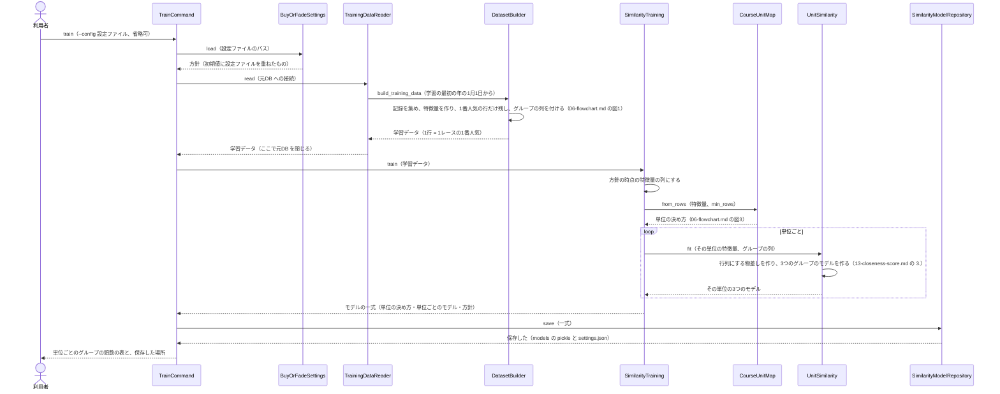
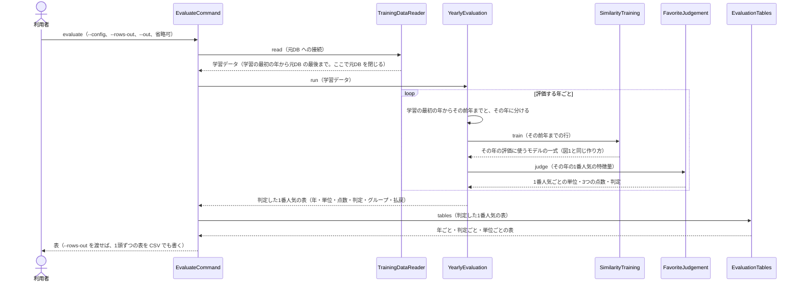
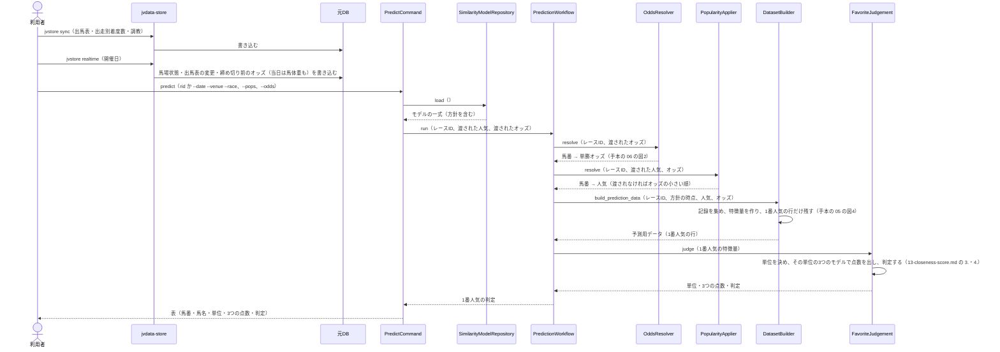

# 05 学習・評価・予測のやりとり（シーケンス図）

**この文書で示すこと:** 学習・1年ごとの評価・予測のとき、利用者・jvdata-store・元DB と、[04-classes.md](04-classes.md) のクラスが、どの順に、どのメソッドを呼ぶか。

**結論: 流れは「学習」「1年ごとの評価」「予測」の3つに分かれる。** どれもコマンド（`train`・`evaluate`・`predict`）から始まる。学習は `SimilarityTraining` が進め、単位を決めてから、単位ごとに3つのグループのモデルを作る。1年ごとの評価は `YearlyEvaluation` が進め、評価する年ごとに学習し直して、その年の1番人気を判定する。予測は `PredictionWorkflow` が進め、保存したモデルの一式で1レースの1番人気を判定する。

- 図に出てくるもの（利用者・jvdata-store・元DB・クラス・保存したファイル）と、図の読み方（凡例）は [手本の 05 の「図に出てくるもの」](../近走と適性から3着以内を予想/05-sequence.md#図に出てくるもの) と [「図の読み方」](../近走と適性から3着以内を予想/05-sequence.md#図の読み方) を参照。ライブラリ（`NearestNeighbors`）の呼び出しは [13-closeness-score.md](13-closeness-score.md#3-点数を出すやりとりシーケンス図) に描く。
- public メソッドの中の判断（if 文による分かれ道）は [06-flowchart.md](06-flowchart.md) を参照。2種類の図の使い分けは [01-overview.md](01-overview.md#図の使い分け) を参照。
- **リポジトリとのやりとりは、手本とまったく同じである。** 学習データを集める流れは [手本の 05 の図3](../近走と適性から3着以内を予想/05-sequence.md#図3-記録を集めるリポジトリとのやりとり)、1レースの記録を集めて速報を反映する流れは [手本の 05 の図4](../近走と適性から3着以内を予想/05-sequence.md#図4-1レースの記録を集める速報の反映) を参照。この文書では描き直さない。

## 図1. 学習

`train` コマンドで、本番の予測に使うモデルの一式を作るときの流れ。

**説明。** 学習データは、方針の「学習の最初の年」（2017年）の1月1日から、元DB の最後の開催日までの1番人気である。その前の年はウォームアップ（過去走の特徴量の計算にだけ使う）。元DB を使うのは学習データを読む段だけで、コマンドはそこで元DB を閉じてから学習する（手本と同じ）。

**この予想の「学習」とは、次の3つを作って保存することである。** k近傍法には、LightGBM のような「木を足していく」学習は無い。

1. 単位の決め方（どの芝ダ・距離をどの単位にするか）。
2. 単位ごとに、距離に使う行列の作り方（中央値・標準化の物差し・カテゴリの値の一覧・重み）。単位の3つのグループを合わせた全頭から作る。
3. 単位ごと・グループごとに、そのグループの馬だけを覚えた k近傍のモデルと、点数の物差し（単位の1番人気全員の距離の並び）。

## 図2. 1年ごとの評価

`evaluate` コマンドで、評価する年（2019〜2026年）ごとに学習し直して判定し、成績の表を出すときの流れ。

**説明。** 評価する年のデータは、その年の学習に入らない。単位の決め方も、評価の年ごとに、その年の学習データの頭数で決め直す。表の見方は [16-evaluation.md](16-evaluation.md#3-表の見方) を参照。1頭ずつの表は JV-Data から作ったものなので、`reports/` の下に置く。

## 図3. 予測

前日か当日に、1レースの1番人気を判定するときの流れ。時点と判定の線は、学習したときの方針を使う。

**説明。** 人気は、利用者が `--pops 馬番:人気` で渡すか、`--odds 馬番:オッズ` で渡したオッズの小さい順か、元DB の締め切り前のオッズで決まる（[07-prediction-timing.md](07-prediction-timing.md#予測のときの1番人気の決め方)）。予測用データの作り方は学習と同じ `DatasetBuilder` なので、学習と予測で特徴量の中身がずれない。判定は、評価と同じ `FavoriteJudgement` で行う。

## 文書情報

| 項目 | 内容 |
|---|---|
| 作成日 | 2026-09-25 |
| 更新 | 2026-09-25: k近傍法の設計に作り直した。同日、実装したクラスとコマンドに合わせて書き直した（評価を1年ごとの評価にした） |
