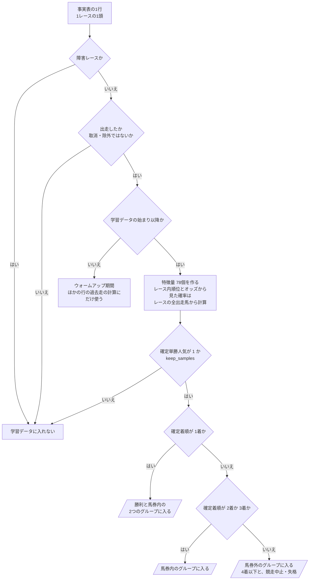
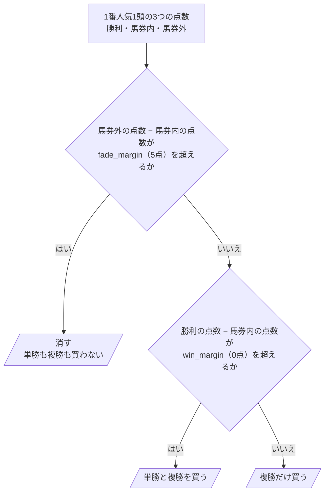
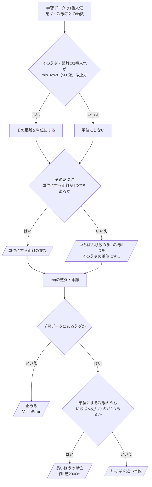

# 06 判断の手順（フローチャート）

**この文書で示すこと:** 学習データを作るとき、1番人気の買い方を決めるとき、使う単位を決めるときの、条件によって分かれる判断の手順。

**結論: 条件によって分かれる判断は3つある。「学習データに入れる行の選び方」（1番人気かどうかと、どのグループに入るか）、「1番人気の買い方を決める」（点数の差と判定の線・同点の扱い）、「使う単位を決める」（頭数の少ない距離のまとめ方）である。**

- この文書は、1つの public メソッドの中で、条件で分かれる判断の手順を示す。クラスどうしのやりとりは [05-sequence.md](05-sequence.md) を参照。2種類の図の使い分けは [01-overview.md](01-overview.md#図の使い分け) を参照。
- 図の読み方（凡例）は [手本の 06 の「図の読み方」](../近走と適性から3着以内を予想/06-flowchart.md#図の読み方) を参照。四角が作業、ひし形が if 文1つ、平行四辺形ができあがるものである。
- 予測に使う単勝オッズの決め方（`--odds` → 締め切り前のオッズ → 元DB のオッズ）は、手本とまったく同じで、[手本の 06 の図2](../近走と適性から3着以内を予想/06-flowchart.md#図2-予測に使うオッズの決め方) を参照。
- 特徴量の1列を、距離に使う数字の列に直す判断は [12-neighbor-distance.md の「1.」](12-neighbor-distance.md#1-距離に使う列の作り方) にある。

## 図1. 学習データに入れる行の選び方

`FavoriteOnlySelector.training_samples()`・`FavoriteOnlySelector.keep_samples()`・`FinishGroupLabeler.build()`（どれも `DatasetBuilder.build_training_data()` から呼ばれる）の中で行う判断と、その間の段。事実表の1行（1レースの1頭）が、学習データの1行になり、グループに入るまで。

**説明。** 1番人気でない行も、いったんは残して特徴量を作る。まとまり G のレース内順位と、まとまり K のオッズから見た勝率・3着以内率を、そのレースの全出走馬から計算するためである（[08-training-data.md](08-training-data.md#3-どのサンプルを入れるか)）。特徴量ができたあと、4つ目の問い（`keep_samples()`）で1番人気の行だけを残し、5・6つ目の問いでグループの列を付ける（[10-target.md](10-target.md#グループの分け方)）。

- 1着の馬は、勝利と馬券内の2つのグループに入る（利用者の指定。馬券内モデルは、勝った馬も含めて作る）。
- 確定単勝人気が 1 の馬が2頭いる（同じオッズで並んだ）レースは、2頭とも行にする。
- 単位は、ここでは付けない。学習の流れ（`SimilarityTraining`）が、学習データ全体を見てから決める（図3）。
- 予測用データを作るときも、4つ目の問いまでは同じ手順を通る。ただし、4つ目の問いの人気は、予測に使う人気である（[07-prediction-timing.md](07-prediction-timing.md#予測のときの1番人気の決め方)）。結果はまだ無いので、5つ目からの問いは無い。

## 図2. 1番人気の買い方を決める

`BuyDecision.decide()`（`FavoriteJudgement.judge()` から呼ばれる。評価と予測で同じ）の中の判断。1番人気1頭の3つの点数から、判定を1つ決める。

**説明。** 利用者の決めた順に、先に「馬券外と馬券内のどちらに近いか」で消すかを決め、消さなかった馬だけ「勝利と馬券内のどちらに近いか」で単勝も買うかを決める。点数の出し方は [13-closeness-score.md](13-closeness-score.md#2-点数のそろえ方) を参照。

- **消しの線を 5点にした理由。** 線を 0 にする（少しでも馬券外に近ければ消す）と、1番人気のおよそ半分を消すことになる。はっきり馬券外に近い馬だけを消すために 5点にした（[15-decisions.md の 7](15-decisions.md#7-判定の線)）。
- **同点の扱い。** 問いは「超えるか」なので、差が線ちょうどなら「いいえ」に進む。つまり、消さない・単勝を足さない（何でもかんでも切らないため）。
- 線は設定ファイルで変えられる（[14-hyperparameter-settings.md](14-hyperparameter-settings.md)）。判定ごとの掛け金は [16-evaluation.md](16-evaluation.md#4-買い方と掛け金) を参照。

## 図3. 使う単位を決める

`CourseUnitMap.from_rows()`（学習のとき、単位にする距離を決める）と `CourseUnitMap.unit_of()`（学習・評価・予測で、1頭の単位を決める）の中の判断。

**説明。** 単位の決め方は、学習データの1番人気の頭数だけから作る（[11-leak-prevention.md](11-leak-prevention.md#決まり) の 7）。1年ごとの評価では、評価の年ごとに、その年の学習データで決め直す。学習データに無い距離（コースの改修で新しくできた距離など）も、いちばん近い単位になる。

- 単位の名前は、芝ダと単位の距離をつないだもの（例: 「芝2000m」）。まとめられた距離も、この名前の単位に入る。
- どの単位にどの距離が入ったかは、`train` の出力の「単位ごとのグループの頭数」の表の「含む距離」の列で分かる。

## 文書情報

| 項目 | 内容 |
|---|---|
| 作成日 | 2026-09-25 |
| 更新 | 2026-09-25: k近傍法の設計に作り直した。同日、実装に合わせて、判定の線と単位の決め方を直した |
