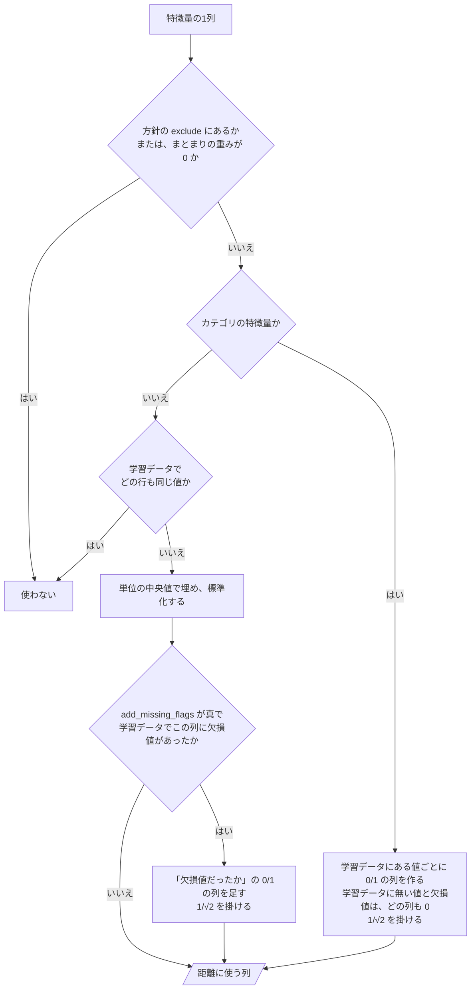

# 12 近さの測り方（k近傍・標準化・欠損値・カテゴリの列）

**この文書で決めること:** 特徴量を、k近傍法で距離を測れる数の行列にどう直すか。欠損値をどう埋め、尺度をどうそろえ、列の重みをどうするか。似た馬をどう探すか。何を保存するか。ほかの予想では、この番号に LightGBM の設計を置く。この予想は LightGBM を使わないので、その代わりに近さの測り方を置く（[01-overview.md](01-overview.md#設計書の一覧)）。

| 決めること | 結論（実装は `FeatureMatrix`・`GroupSimilarity`） |
|---|---|
| 1. 距離に使う列の作り方 | 数の列はそのまま使う。カテゴリの列は値ごとの 0/1 の列（one-hot）にする。騎手・調教師・父・父の父・母の父の名前と人気順位は使わない（方針の `exclude`） |
| 2. 欠損値の埋め方 | 数の列は単位の中央値で埋め、「欠損値だったか」の 0/1 の列を足す。カテゴリの欠損値は、どの 0/1 の列も 0 |
| 3. 尺度をそろえる | 数の列を標準化する。平均と標準偏差は、単位ごとに、3つのグループを合わせた学習データから求める。どの行も同じ値の列は使わない。0/1 の列は標準化せず 1/√2 を掛ける |
| 4. 特徴量の重み | まとまり A〜K の重みを掛ける。A〜J は 1.0、K（単勝オッズから見た評価）は 0。オッズなしで予想するため。重み 0 のまとまりは使わない |
| 5. 似た馬の探し方 | `NearestNeighbors` で、ユークリッド距離の近い k頭（10頭）を探す。k はグループの頭数 − 1 を超えない |
| 6. 保存 | 学習したモデルの一式を pickle で、方針を `settings.json` で、`reports/favorite_buy_or_fade/models/` に書く |

- 用語の意味（k近傍法・距離・標準化・ワンホットエンコーディング）は [02-glossary.md](02-glossary.md) を参照。
- 道具の使い方の基本は [03-library-basics.md](03-library-basics.md) を参照。
- 点数のそろえ方と判定は [13-closeness-score.md](13-closeness-score.md) を参照。
- 変えられる値（除く特徴量・欠損値の印・重み・k）は設定ファイルにある（[14-hyperparameter-settings.md](14-hyperparameter-settings.md)）。

## 1. 距離に使う列の作り方

k近傍法は、列ごとの差を足して距離を測る。そのため、全部の列を数にする必要がある。`FeatureMatrix` が、単位ごとに、学習データで `fit()` して作り方を覚え、同じ作り方で学習・評価・予測の特徴量を `transform()` する。

| 特徴量の種類 | 例 | 距離に使う形 | 理由 |
|---|---|---|---|
| 数の特徴量 | 斤量、前走の人気、前走の着順、騎手の近1年の3着以内の割合 | 欠損値を埋め、標準化する（下の 2.・3.） | 大小に意味がある |
| カテゴリの特徴量 | 競馬場、コース、馬場状態、性別、推定脚質、直近の調教のコース | 値ごとの 0/1 の列にする（one-hot） | 「良」と「重」の間に大小は無いので、番号にすると距離がでたらめになる |
| 名前のカテゴリ特徴量 | 騎手、調教師、父、父の父、母の父 | **使わない**（方針の `exclude`） | 名前は何百種類もあり、0/1 の列にすると、名前が違うだけで遠くなる。同じ騎手の馬がほとんどいない単位では、名前の一致は偶然である |
| 人気順位 | 1 | **使わない**（方針の `exclude`） | どの行も 1 なので、距離に差を生まない |

**騎手・調教師・血統の強さは、数の列で入る。** 名前の代わりに、その人・その血統の成績を表す特徴量が距離に入る。

| 名前 | 距離に入る数の列（特徴量の中にある） |
|---|---|
| 騎手 | 騎手の近1年の3着以内の割合（C）、騎手の3着以内の割合のレース内順位（G） |
| 調教師 | 調教師の近1年の3着以内の割合（C） |
| 父 | 父の産駒の近1年の3着以内の割合、父の産駒の同じ芝ダでの近1年の3着以内の割合（H） |
| 母の父 | 母の父の産駒の近1年の3着以内の割合（H） |
| 父の父 | **今は無い。** 足すのは今後の課題（[09-features.md の「今後の課題」](09-features.md#今後の課題-父の父の数字の列)） |

`FeatureMatrix` が特徴量の1列を直すときの判断は、次のとおりである。

- 最後に、どの列にも、元の特徴量のまとまり（A〜K）の重みを掛ける（下の 4.）。
- 行列の列の名前は、数の列は特徴量の名前のまま、欠損値の列は「〇〇（欠損値）」、0/1 の列は「馬場状態=良」の形である（`FeatureMatrix.column_names`）。

## 2. 欠損値の埋め方

距離は、欠損値のままでは計算できない。前走が無い新馬戦の1番人気や、調教の記録が無い期間の行では、欠損値が出る。

**数の列は、単位の学習データの中央値で埋め、「欠損値だったか」の 0/1 の列を足す**（方針の `add_missing_flags = true`。[15-decisions.md の 4](15-decisions.md#4-欠損値の埋め方)）。

| | 変換前 | 変換後 |
|---|---|---|
| 前走の着順 | 3, （欠損値）, 1 | 3, 4（中央値）, 1 |
| 前走の着順（欠損値） | ― | 0, 1, 0 |

- 中央値だけで埋めると、新馬戦の馬が「前走が平均的だった馬」に見えてしまう。「欠損値だったか」の列があると、前走の無い馬どうしが近くなる。
- 「欠損値だったか」の列は、学習データでその列に欠損値が1つでもあった列にだけ作る。
- 学習データで全部が欠損値だった列は、中央値が決まらないので 0 で埋める（そのあと、どの行も同じ値になるので使われない）。
- カテゴリの欠損値は、どの 0/1 の列も 0 にする。

## 3. 尺度をそろえる（標準化）

**数の列は標準化する（平均を引いて標準偏差で割る）。** 平均と標準偏差は、**単位ごとに、3つのグループを合わせた学習データ**（その単位の1番人気の全頭）から求める。

- 3つのグループで同じ物差しを使うためである。グループごとに物差しを作ると、同じ馬が、グループによって違う値に直され、3つの点数を比べる意味がなくなる。
- 単位ごとに作るのは、単位によって値の散らばり方が違うためである（例: 短距離と長距離では、上がり3F の散らばりが違う）。
- **どの行も同じ値の列は使わない**（標準偏差がほぼ 0）。距離に差を生まず、標準偏差で割れないためである。まとめていない単位の中の「距離」などがこれにあたる。カテゴリの「芝ダ」は、単位の中ではどの行も同じ値の 0/1 の列になるので、距離に差を生まない。

**0/1 の列（欠損値だったか・one-hot）は標準化しない。** 標準化すると、めったに無い値（例: まれな競馬場）の列ほど標準偏差が小さくなり、その値の違いが距離の中で大きく効いてしまう。代わりに 1/√2（約 0.71）を掛ける。

| 列 | 値が違う2頭で | 1/√2 を掛けたあとの、距離への寄与 |
|---|---|---|
| one-hot の列 | 2本の列が 1 ずつ違う | 2 × (1/√2)² = 1。数の列の標準偏差1つ分と同じ |
| 欠損値だったかの列 | 1本の列が 1 違う | (1/√2)² = 0.5。標準偏差1つ分より小さい |

## 4. 特徴量の重み

標準化したあとの列に、その特徴量のまとまり（A〜K）の重みを掛ける（方針の `[features.group_weights]`）。**今は A〜J が 1.0、K が 0** である（[15-decisions.md の 5](15-decisions.md#5-特徴量の重み)）。重みを 0 にしたまとまりは、距離に使わない。

**K を 0 にしたのは、オッズなしで予想するためである（利用者の指示）。** 単勝オッズ・オッズから見た勝率・オッズから見た3着以内率の3個は、学習データには残るが、距離には入らない。K を 1.0 にすると、今回の単勝オッズも近さに入る。J（人気の履歴）と D の「前走の人気」は、過去のレースの人気なので使う。

距離は列ごとの差の2乗の和なので、列が多いまとまりほど距離に強く効く。近走（D・E）は 20個ある。K を使う（1.0 以上にする）と、単勝オッズの近い1番人気どうしが似た馬になりやすい。

## 5. k近傍で似た馬を探す

| 項目 | 決め方 | 理由 |
|---|---|---|
| 道具 | scikit-learn の `NearestNeighbors` | k近傍法の標準の道具。グループの馬を覚え、似た馬と距離を返す（[03-library-basics.md](03-library-basics.md#4-nearestneighbors-の使い方)） |
| 距離の測り方 | ユークリッド距離（`NearestNeighbors` の既定） | 標準化した列どうしで、いちばん分かりやすい測り方である |
| k | 10（方針の `[similarity]` の `k`）。グループの頭数 − 1 を超えない | 1頭だけだと偶然に左右され、多すぎると「似た馬」でない馬まで入る。自分を除いた k頭が取れるよう、頭数 − 1 までにする |
| 近さ | 似た k頭との距離の平均 | 1頭との距離より、偶然に左右されにくい |
| グループの頭数が 2頭に満たないとき | 学習を止める（`ValueError`） | 自分を除いて比べる相手が1頭もいない。単位をまとめれば起きない（[08-training-data.md](08-training-data.md#単位の決め方)） |

## 6. 保存

- 学習したモデルの一式（`SimilarityModelSet`: 単位の決め方・単位ごとの `UnitSimilarity`・方針）を、`SimilarityModelRepository` が pickle で `similarity_models.pkl` に書く。学習に使った方針は、人が読める形で `settings.json` にも書く。
- 置き場所: Git の対象外の `reports/favorite_buy_or_fade/models/`（`--models` で変えられる）。JV-Data から作ったもので、公開しないため。`train` を実行し直すと、前のものを置き換える。
- pickle は、知らないファイルを読むと危ないので、自分で書いたファイルだけを読む。
- 予測（`predict`）は、保存した一式の方針（時点・判定の線）をそのまま使う。

## 決めたこと

[15-decisions.md の 3](15-decisions.md#3-距離に使わない特徴量)・[4](15-decisions.md#4-欠損値の埋め方)・[5](15-decisions.md#5-特徴量の重み)・[6](15-decisions.md#6-k-の値) を参照。

## 文書情報

| 項目 | 内容 |
|---|---|
| 作成日 | 2026-09-25 |
| 更新 | 2026-09-25: LightGBM の設計から、k近傍法の近さの測り方に作り直した。同日、実装（`FeatureMatrix`・`GroupSimilarity`・`SimilarityModelRepository`）に合わせて直した |
