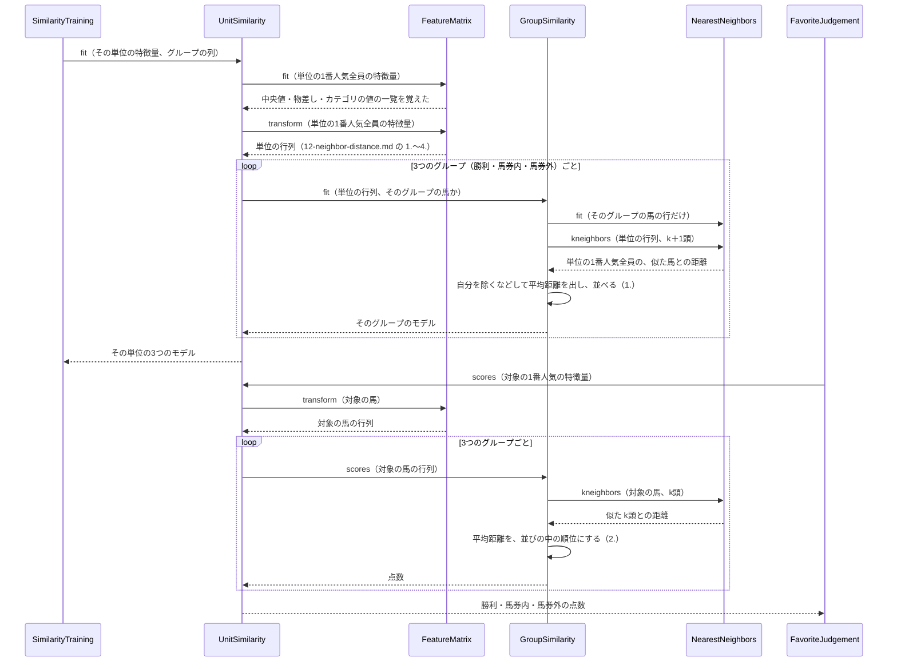

# 13 点数のそろえ方と判定

**この文書で決めること:** k近傍法で出した距離を、頭数の違う3つのグループで比べられる点数（0〜100）にどう直すか。その点数で、どう判定するか。ほかの予想では、この番号に CatBoost の設計を置く。この予想は CatBoost を使わないので、その代わりに点数のそろえ方と判定を置く（[01-overview.md](01-overview.md#設計書の一覧)）。

| 決めること | 結論（実装は `GroupSimilarity`・`BuyDecision`） |
|---|---|
| 1. 比べる相手 | 同じ単位の1番人気全員（3つのグループを合わせた学習データ）について、そのグループの似た k頭との平均距離を出しておく。グループの馬は、自分自身を除いて出す |
| 2. 点数 | 対象の馬の平均距離が、その並びの中でどこに来るかを点数（0〜100）にする。単位の1番人気のうち、対象の馬と同じか、より遠い馬の割合（%）。近いほど高い |
| 3. 判定 | ①馬券外の点数 − 馬券内の点数 が 5 を超えたら消す → ②勝利の点数 − 馬券内の点数 が 0 を超えたら単勝と複勝、そうでなければ複勝だけ |

- 用語の意味（百分位・単位の1番人気全員と比べた順位・判定の線）は [02-glossary.md](02-glossary.md) を参照。
- 距離の測り方は [12-neighbor-distance.md](12-neighbor-distance.md) を参照。

## 1. 比べる相手の距離

**モデルが覚えるのは、そのグループの馬だけである。** 近さは、そのグループの中で似ている k頭との平均の距離で測る。

**距離のままでは、3つのグループを比べられない。** 馬の多いグループほど、どんな馬にも近い馬が見つかりやすく、距離が小さく出る。1番人気では、馬券内のグループが馬券外より大きく、勝利のグループがいちばん小さい（[10-target.md](10-target.md#理由)）。

そこで、グループごとに、**同じ単位の1番人気全員**について、そのグループの似た k頭との平均距離を出して並べておく（`GroupSimilarity.fit()`）。

| 単位の1番人気のうち | そのグループの似た k頭との平均距離の出し方 |
|---|---|
| そのグループの馬 | いちばん近いのは自分自身（距離 0）なので、自分を除いた k頭で出す（`n_neighbors=k + 1` で探し、1頭目を捨てる） |
| そのグループの外の馬 | いちばん近い k頭で出す |

こうして、3つのグループのどれも、**同じ顔ぶれ（単位の1番人気全員）**についての距離の並びを持つ。

## 2. 点数のそろえ方

対象の馬（評価する年の1番人気や、予測したい1番人気）について、そのグループの似た k頭との平均距離 d を出し、上の並びの中で比べる（`GroupSimilarity.scores()`）。

**点数 = 100 × （単位の1番人気のうち、平均距離が d 以上の馬の割合）**

| 対象の馬の平均距離 d が | 点数 | 意味 |
|---|---|---|
| 単位のどの1番人気の距離よりも小さい | 100 | この単位の1番人気の誰よりも、このグループに近い |
| 単位の1番人気の距離の真ん中くらい | 50 | この単位のふつうの1番人気と同じくらい、このグループに近い |
| 単位のどの1番人気の距離よりも大きい | 0 | この単位の1番人気の誰よりも、このグループから遠い |

例（架空）: 芝1600m の1番人気が学習データに 1,000頭いて、対象の馬と馬券外のグループの似た 10頭との平均距離 d が 3.1 だったとする。1,000頭の「馬券外のグループの似た 10頭との平均距離」のうち、3.1 以上のものが 720頭なら、馬券外の点数は 100 × 720 ÷ 1,000 = **72点** になる。「この単位の1番人気の 72% より、馬券外のグループに近い」という意味である。

- 3つのグループの点数は、どれも同じ顔ぶれ（単位の1番人気全員）と比べた順位なので、そのまま比べられる。
- 点数は整数に丸めず、小数のまま比べる。

**点数のそろえ方を「グループ自身の距離の並び」から変えた理由（2026-09-25、実装のとき）。** 設計書の前の版では、グループの馬どうしの距離の並び（そのグループの馬自身の分布）と比べていた。実データで確かめたところ、そのやり方では、頭数の少ないグループ（馬券外）ほど点数が甘くなり、1番人気の大半を消していた。グループごとに違う顔ぶれと比べるので、点数の意味がグループによってずれるためである。同じ単位の1番人気全員と比べるやり方に変えると、この偏りが無くなった（数値は PR と `reports/` にある）。

## 3. 点数を出すやりとり（シーケンス図）

`UnitSimilarity` が、1つの単位の3つのモデルを作り（`fit`）、対象の馬の点数を出す（`scores`）ときのやりとり。図の読み方は [手本の 05 の「図の読み方」](../近走と適性から3着以内を予想/05-sequence.md#図の読み方) を参照。

**説明。** 物差し（`FeatureMatrix`）は、3つのグループを合わせた単位の全頭で1つだけ作り、3つのグループで同じものを使う（[12-neighbor-distance.md の「3.」](12-neighbor-distance.md#3-尺度をそろえる標準化)）。グループごとに分かれるのは `GroupSimilarity` からである。`FavoriteJudgement` は、評価（`YearlyEvaluation`）と予測（`PredictionWorkflow`）の両方から呼ばれる（[05-sequence.md](05-sequence.md)）。実際には `FavoriteJudgement` は `SimilarityModelSet.scores()` を呼び、`SimilarityModelSet` が単位を決めてから、その単位の `UnitSimilarity` を呼ぶ。

## 4. 判定

3つの点数から、次の順で判定する（`BuyDecision`。判断の図は [06-flowchart.md の「図2.」](06-flowchart.md#図2-1番人気の買い方を決める)）。

1. 馬券外の点数 − 馬券内の点数 が `fade_margin`（5点）を超えたら、**消す**（単勝も複勝も買わない）。
2. 消さなかった馬は、勝利の点数 − 馬券内の点数 が `win_margin`（0点）を超えたら **単勝と複勝**、そうでなければ **複勝だけ**。

| 架空の1番人気 | 勝利 | 馬券内 | 馬券外 | 判定 |
|---|---|---|---|---|
| 01 の例の馬 | 30 | 45 | 72 | 消す（72 − 45 = 27 が 5 を超える） |
| 架空の馬B | 81 | 64 | 67 | 単勝と複勝（67 − 64 = 3 は 5 以下なので消さない。81 − 64 = 17 が 0 を超える） |
| 架空の馬C | 52 | 66 | 35 | 複勝だけ（馬券外は馬券内より低い。52 − 66 は 0 以下） |

- 差が線ちょうどなら、消さない・単勝を足さない（何でもかんでも切らないため）。
- 3つの点数は、予測の表にもそのまま出す（判定だけでなく、差がどれくらいあったかを見られるように）。
- 線の決め方は [15-decisions.md の 7](15-decisions.md#7-判定の線) を参照。

## 5. 点数の読み方と注意

| 注意 | 何が起きるか | どう確かめるか |
|---|---|---|
| 馬券内と馬券外の1番人気は似ている | どちらも「1番人気に推された馬」なので、特徴量が近い。2つの点数の差が小さくなりやすく、わずかな差で判定が決まる。消しの線を 5点にしたのは、このためである | 評価の「判定ごとの成績」の表で、消した馬の馬券外率を見る（[16-evaluation.md](16-evaluation.md#3-表の見方)） |
| 点数には、そのグループの起きやすさが入らない | 点数は「そのグループの馬に、単位の1番人気の中でどれだけ近いか」だけを表す。1番人気が馬券内に入りやすいことは、点数に入らない | 同上。消した数が多すぎないかも見る |
| 勝利のグループは、馬券内のグループに含まれる | 勝った馬は両方に入るので、勝利と馬券内の点数は似た値になりやすい | 評価の表で、「単勝と複勝」にした馬の勝率を、全体の勝率と比べる |
| 列が多いと、距離の差がつきにくい | 列が数十本あると、どの2頭の距離も似た値になりやすい（高い次元の距離の性質） | 重み（[15-decisions.md の 5](15-decisions.md#5-特徴量の重み)）で効かせる列を絞って、評価し直す |

## 文書情報

| 項目 | 内容 |
|---|---|
| 作成日 | 2026-09-25 |
| 更新 | 2026-09-25: CatBoost の設計から、点数のそろえ方と判定に作り直した。同日、実装に合わせて、点数を「単位の1番人気全員と比べた順位」にし、判定の線を足した |
