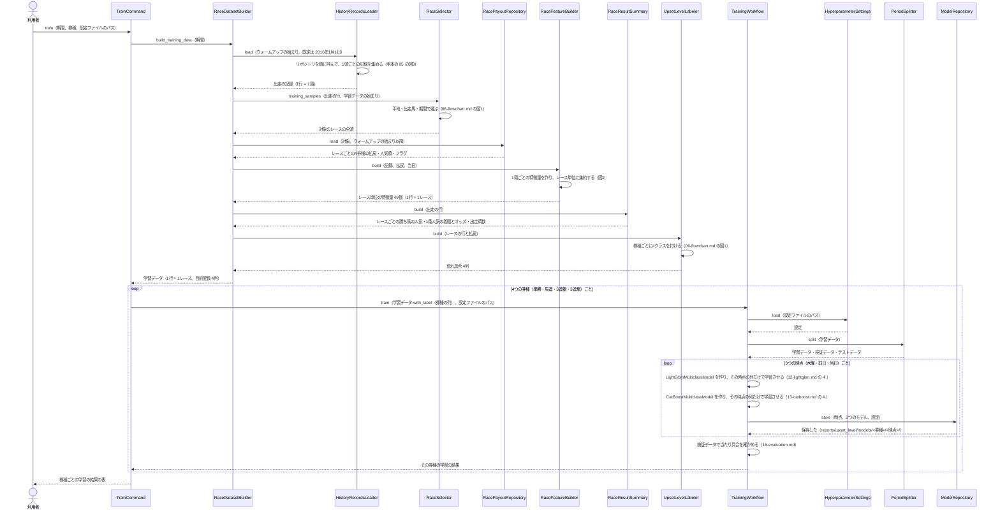
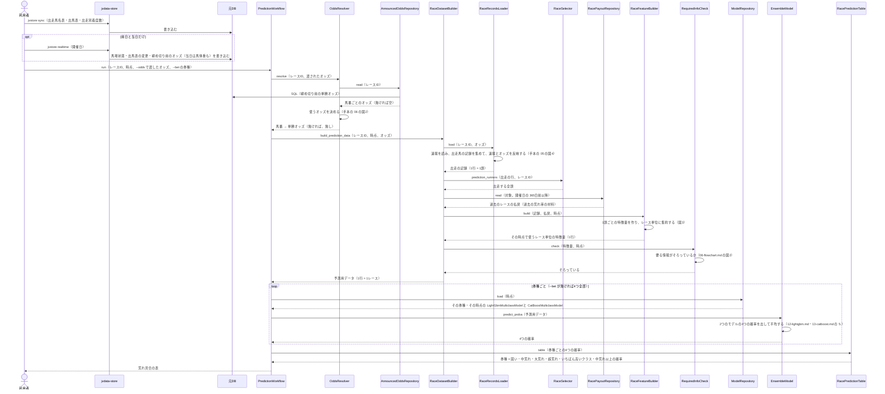
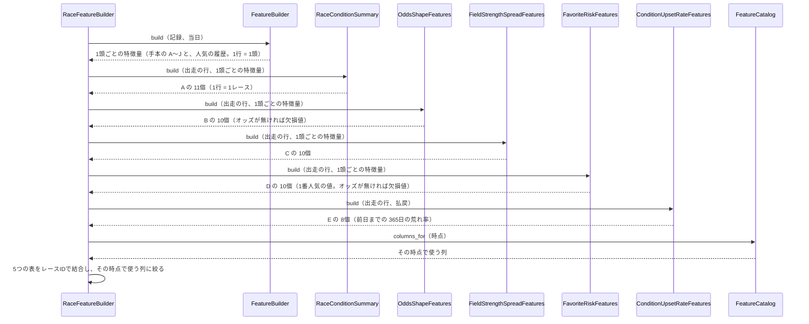

# 05 学習と予測のやりとり（シーケンス図）

**この文書で示すこと:** 学習と予測のとき、利用者・jvdata-store・元DB と、[04-classes.md](04-classes.md) のクラスが、どの順に、どのメソッドを呼ぶか。

**結論: 流れは「学習」と「予測」の2つに分かれる。** 学習は `TrainCommand` が学習データを1回作らせ、券種ごとに共通の `TrainingWorkflow` を回して、3つの時点ごとに多クラス分類の LightGBM と CatBoost を学習させて保存する。予測は `PredictionWorkflow` が進め、予測に使うオッズを決めてから、1行（1レース）の予測用データを作り、券種ごとに保存した2つのモデルで4つの確率を出して平均し、券種 × 4確率の表にする。学習でも予測でも、1頭ごとの特徴量を作ってからレース単位に集約するところ（図3）が、手本と違う。

- 図に出てくるものと、図の読み方（凡例）は [手本の 05 の「図に出てくるもの」](../近走と適性から3着以内を予想/05-sequence.md#図に出てくるもの) と [「図の読み方」](../近走と適性から3着以内を予想/05-sequence.md#図の読み方) を参照。この予想で増えるのは、`RaceDatasetBuilder`・`RaceFeatureBuilder`・まとまり A〜E のクラス・`RacePayoutRepository`・`RaceResultSummary`・`UpsetLevelLabeler`・多クラス分類のモデル2つ・`RacePredictionTable` である（[04-classes.md](04-classes.md#2-共通の部品に足すもの変えるもの)）。
- public メソッドの中の判断（if 文による分かれ道）は [06-flowchart.md](06-flowchart.md) を参照。2種類の図の使い分けは [01-overview.md](01-overview.md#図の使い分け) を参照。
- **リポジトリとのやりとりは、手本とほぼ同じである。** 1頭ごとの記録を集める流れは [手本の 05 の図3](../近走と適性から3着以内を予想/05-sequence.md#図3-記録を集めるリポジトリとのやりとり)、1レースの記録を集めて速報とオッズを反映する流れは [手本の 05 の図4](../近走と適性から3着以内を予想/05-sequence.md#図4-1レースの記録を集める速報の反映) を参照。この予想で増える2つのリポジトリ（払戻とレースの結果）は、下の図1・図2に描く。

## 図1. 学習

**説明。** 利用者が `train` を実行する。`TrainCommand` は、まず共通の `RaceDatasetBuilder` に学習データを1回だけ作らせる。`RaceDatasetBuilder` は、1頭ごとの記録を集める（`HistoryRecordsLoader`。手本の図3）・レースを選ぶ（`RaceSelector`。行は減らさない）・払戻を読む（`RacePayoutRepository`。過去の荒れ率の材料でもあるので、特徴量の前に読む）・レース単位の特徴量を作る（`RaceFeatureBuilder`。図3）・レースの結果をまとめる（`RaceResultSummary`。評価用の列）・荒れ具合を付ける（`UpsetLevelLabeler`）を順に呼ぶだけである（[04-classes.md](04-classes.md#1-レース単位の学習データを作る仕組み)）。

学習データは、当日の時点の特徴量 49個と、券種ごとの荒れ具合 4列で作る。**券種ごとに、共通の `TrainingWorkflow` を1回ずつ回す。** `TrainCommand` は、その券種の保存先を持つ `ModelRepository` と多クラス分類のモデルの並び（`CLASS_MEMBER_TYPES`）・多クラス用の評価（`ClassModelEvaluator`）を渡して `TrainingWorkflow` を作り、`with_label()` で目的変数の列を持ち替えた学習データを渡す。目的変数が欠損値の行（発売の無い券種）は、`with_label()` が除く。木曜・前日のモデルには、その時点で使う列だけを渡す（[07-prediction-timing.md](07-prediction-timing.md#時点ごとに使う特徴量)）。モデルは 4券種 × 3時点 × 2 = 24個になる。

## 図2. 予測

木曜・前日・当日のどれかの時点で、1レースを予測するときの流れ。

**説明。** 利用者は、まず jvdata-store の `jvstore sync` で、出走馬名表（木曜）か出馬表（前日から）と出走別着度数を取り込む。前日と当日は、`jvstore realtime` で速報（締め切り前のオッズを含む）も取り込む。次に、レースIDと時点（前日・当日なら、必要に応じて `--odds` の全頭のオッズも。絞るなら `--bet` の券種も）を付けて `PredictionWorkflow.run()` を呼ぶ。`PredictionWorkflow` は、まず共通の `OddsResolver` に予測に使うオッズを決めさせる（渡されたオッズ → `AnnouncedOddsRepository` が読む締め切り前のオッズ → 無し、の順。手本と同じ。[07-prediction-timing.md](07-prediction-timing.md#予測のときのオッズの与え方)）。次に `RaceDatasetBuilder` に予測用データを作らせる。予測用データも、学習と同じ `RaceDatasetBuilder` と `RaceFeatureBuilder` で作る（[11-leak-prevention.md](11-leak-prevention.md#決まり) の 4）。過去の荒れ率のために、開催日の 365日前以降の払戻も読む。

**券種ごとに、その券種の置き場所の `ModelRepository` からモデルを読み、`EnsembleModel` で4つの確率を平均する。** `EnsembleModel` は、確率が1列でも4列でも同じ形で平均する（[04-classes.md](04-classes.md#2-共通の部品に足すもの変えるもの)）。最後に `RacePredictionTable` が、券種 × 4確率の表に、いちばん高いクラスと中荒れ以上の確率を付けて返す（[01-overview.md](01-overview.md#1レースの例)）。木曜は馬番もオッズも無いので、`OddsResolver` の結果は使われず、B・D の無いモデルで予測する。

## 図3. 1頭ごとの特徴量をレース単位に集約する

図1・図2の「1頭ごとの特徴量を作り、レース単位に集約する」の中の呼び出しを示す。学習でも予測でも同じである。

**説明。** 共通の `FeatureBuilder` は、時点によらず当日の全部の列で1頭ごとの特徴量を作る。先に列を絞ると、D の「1番人気の馬体重の増減」のように、集約する元の列が無くなるためである。まとまり A〜E のクラスは、どれも `RaceFeatureGroup` を守り、出走の行と1頭ごとの特徴量（E は払戻）を受け取って、1行 = 1レースの表を返す（集約のしかたは [09-features.md](09-features.md#表の見方)）。最後に、レース用の特徴量の一覧（`CATALOG`）で、その時点で使う列に絞る（[07-prediction-timing.md](07-prediction-timing.md#時点ごとに使う特徴量)）。

## 今は無く、これから作るところ

| 図の中の部分 | 今の状態 |
|---|---|
| 共通の部品に足すもの（`RaceDatasetBuilder`・`RaceFeatureBuilder`・多クラス分類のモデル2つ・払戻のリポジトリ・`RaceResultSummary`・多クラス用の評価と表）と、変えるもの（`EnsembleModel` の平均、`TrainingWorkflow`・`TrainingData`・`RequiredInfoCheck` の差し替え口） | 作った（`src/yosou/shared/`。[04-classes.md](04-classes.md#2-共通の部品に足すもの変えるもの)） |
| 手本の予想から `shared` に移すもの（`MarketFeatures`・`OddsInput`・`OddsResolver`） | 移した。手本の予想も移した形に直した |
| この予想のクラス（`RaceSelector`・`UpsetLevelRule`・`UpsetLevelLabeler`・まとまり A〜E・`PredictionWorkflow`・コマンド） | 作った（`src/yosou/upset_level/`） |
| 合成DB（`tools/合成DB/synth.py`）と `shared/tests/synthetic_season` の払戻 | `hr`（フラグ）・`hr__馬連払戻`・`hr__3連複払戻`・`hr__3連単払戻` の表と、人気から決めた架空の払戻を足した。締め切り前のオッズ（`o1__単勝オッズ`）は無いままで、テストは `--odds` で渡す経路を通る |
| `AnnouncedOddsRepository` が読むオッズ | 手本と同じ。今の元DB には断面がごく少数しか無く、取り込んでいないレースは `--odds` で全頭ぶん渡す |
| 学習データ・検証データ・テストデータの期間の分け方と、評価指標 | [16-evaluation.md](16-evaluation.md) で決め、`ClassModelEvaluator` と `UserRuleBaseline` で測る。実データでの値は `reports/upset_level/` |
| アンサンブルの平均のしかた | 手本と同じく単純な平均。重みを付ける案は、当たり具合を見てから |

## 文書情報

| 項目 | 内容 |
|---|---|
| 作成日 | 2026-09-23 |
