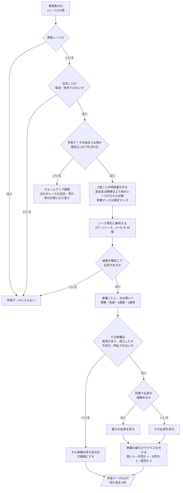
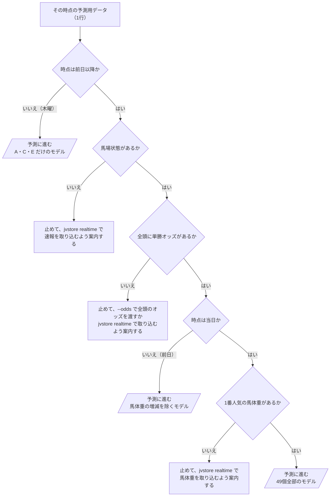

# 06 判断の手順（フローチャート）

**この文書で示すこと:** 学習データを作るときと、予測に要る情報を確かめるときの、条件によって分かれる判断の手順。

**結論: 条件によって分かれる判断は2つある。「学習データに入れるレースの選び方と、券種ごとの4クラスの付け方」（図1）と、「予測に要る情報の確かめ方」（全頭のオッズがそろっているかの判断を含む。図2）である。予測に使うオッズの決め方は手本と同じで、描き直さない。**

- この文書は、1つの public メソッドの中で、条件で分かれる判断の手順を示す。クラスどうしのやりとりは [05-sequence.md](05-sequence.md) を参照。2種類の図の使い分けは [01-overview.md](01-overview.md#図の使い分け) を参照。
- 図の読み方（凡例）は [手本の 06 の「図の読み方」](../近走と適性から3着以内を予想/06-flowchart.md#図の読み方) を参照。四角が作業、ひし形が if 文1つ、平行四辺形ができあがるものである。
- 予測に使うオッズの決め方（`OddsResolver.resolve()`）は手本と同じで、[手本の 06 の図2](../近走と適性から3着以内を予想/06-flowchart.md#図2-予測に使うオッズの決め方) を参照。
- モデルごとの判断の手順（カテゴリ特徴量の値の変え方）は、[12-lightgbm.md](12-lightgbm.md#3-カテゴリ特徴量の値の変え方フローチャート)・[13-catboost.md](13-catboost.md#3-カテゴリ特徴量の値の変え方フローチャート) を参照。
- 用語の意味は [02-glossary.md](02-glossary.md) を参照。

## 図1. 学習データに入れるレースの選び方と、4クラスの付け方

前半（1つ目から3つ目の問い）は `RaceSelector.training_samples()`、後半（4つ目から6つ目の問い）は `UpsetLevelLabeler.build()` の中で行う判断で、どちらも `RaceDatasetBuilder.build_training_data()` から呼ばれる。事実表の行（1レースの出走馬）が、学習データの1行（1レース）になるまで。

**説明。** 1つ目から3つ目の問いは手本と同じで、1頭ごとの行を選ぶ。手本と違い、**この予想では行を馬で減らさない。** 4つ目の問いから先は、レース単位に集約したあとの、1レースにつき1回の判断である。5つ目と6つ目の問いは券種ごとに行い、4つの荒れ具合の列を付ける。

- 線引きは [10-target.md](10-target.md#券種ごとの線引き)、発売なし・不成立・特払・同着の扱いは [10-target.md](10-target.md#作り方)、入れるレースの規則は [08-training-data.md](08-training-data.md#3-どのサンプルを入れるか)、特徴量は [09-features.md](09-features.md) を参照。
- 3つ目の問いの日は、`train` の引数 `--train-from` で変えられる（[08-training-data.md](08-training-data.md#4-期間の指定)）。
- 「その券種の荒れ具合を欠損値にする」行は、その券種のモデルの学習からは外れるが、ほかの券種の学習には使われる（`TrainingData.with_label()` が、その列の欠損値の行を除く。[04-classes.md](04-classes.md#2-共通の部品に足すもの変えるもの)）。
- 予測用データを作るときも、1つ目から3つ目の問いと集約を通る。ただし、これから走るレースなので3つ目の問いは常に「はい」になり、4つ目から先（荒れ具合を付ける段）は無い。作る特徴量は、その時点で使うものだけである（[07-prediction-timing.md](07-prediction-timing.md#時点ごとに使う特徴量)）。

## 図2. 予測に要る情報の確かめ方

`RequiredInfoCheck.check()`（`RaceDatasetBuilder.build_prediction_data()` から、予測用データを返す前に呼ばれる）の中で行う判断。手本と違い、前日・当日には**全頭の単勝オッズ**が要る（[11-leak-prevention.md](11-leak-prevention.md#決まり) の 8）。

**説明。** 手本の `RequiredInfoCheck` は「馬番・馬場状態・馬体重・オッズ」の4つを確かめ、オッズは渡された馬だけで計算する。この予想では、まとまり B が全頭のオッズから作る値（10倍未満の頭数、市場勝率の合計）なので、1頭でも欠けると値の意味が変わる。そのため、3つ目の問いで全頭ぶんを確かめ、欠けていれば止める。案内文は、作られるときに受け取る（[04-classes.md](04-classes.md#2-共通の部品に足すもの変えるもの)）。馬体重は、D の「1番人気の馬体重の増減」にだけ使うので、1番人気の分だけを確かめる。

- オッズの与え方は [07-prediction-timing.md](07-prediction-timing.md#予測のときのオッズの与え方) を参照。
- 終わったレースを予測し直すときは、出走の行に確定オッズと馬体重が入っているので、そのまま通る。

## 文書情報

| 項目 | 内容 |
|---|---|
| 作成日 | 2026-09-23 |
