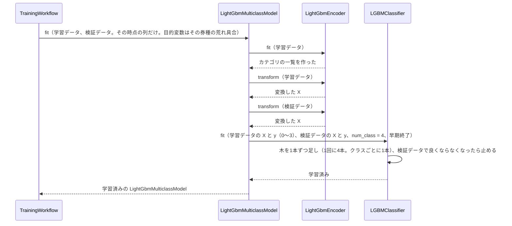
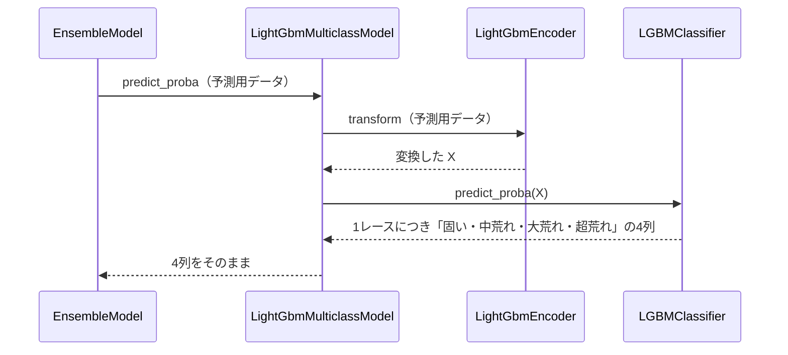

# 12 LightGBM で学習・予測するための設計

**この文書で決めること:** 07〜10 で決めた学習データ（特徴量と目的変数）を、LightGBM で学習・予測するために、LightGBM だけに必要なことを決める。**節の番号と題名は、手本の 12 とそろえてある。**

| 決めること | 結論 |
|---|---|
| 1. 学習データの渡し方 | 手本と同じ（数値はそのまま、カテゴリは `category` 型）。この予想のカテゴリ特徴量は値の種類が少ないので、「その他」にまとめる段は実質通らない。目的変数は学習する券種の列（0〜3）だけを渡す |
| 2. ハイパーパラメータの初期値 | 目的関数は多クラス分類（`multiclass`、`num_class` は 4）。ほかは手本と同じ値から始める |
| 3. カテゴリ特徴量の値の変え方 | 手本と同じ手順（`LightGbmEncoder`）。まとめる対象の名前の列が無いので、欠損値の判断だけが働く |
| 4.〜6. 学習・予測・保存の手順 | 券種ごとに、3つの時点（[07-prediction-timing.md](07-prediction-timing.md)）につき1つずつ、計 12 のモデルを学習する。`predict_proba` は4列を返す。保存先は `reports/upset_level/models/<券種>/<時点>/` |

- 用語の意味は [02-glossary.md](02-glossary.md) を参照。
- 学習データ・特徴量・目的変数は CatBoost と共通で、[08-training-data.md](08-training-data.md)・[09-features.md](09-features.md)・[10-target.md](10-target.md) を参照。
- CatBoost の設計は [13-catboost.md](13-catboost.md) を参照。
- 多クラス分類での LightGBM の使い方は [03-library-basics.md](03-library-basics.md#この予想で違う点) を、基本は [手本の 03 の「4. LightGBM の使い方」](../近走と適性から3着以内を予想/03-library-basics.md#4-lightgbm-の使い方) を参照。
- 図の読み方は、フローチャートは [手本の 06](../近走と適性から3着以内を予想/06-flowchart.md#図の読み方)、シーケンス図は [手本の 05](../近走と適性から3着以内を予想/05-sequence.md#図の読み方) の「図の読み方」を参照。

## 1. 学習データの渡し方

列ごとの渡し方（数値はそのまま、カテゴリは `category` 型、ID 列と評価用の列は渡さない）は手本と同じで、[手本の 12 の「1. 学習データの渡し方」](../近走と適性から3着以内を予想/12-lightgbm.md#1-学習データの渡し方) を参照。この予想で違う点は次のとおり。

| 列 | 渡し方 | 理由 |
|---|---|---|
| 目的変数 | 学習する券種の「荒れ具合」の列（0〜3 の整数）だけを `y` に渡す。欠損値の行は渡さない | 多クラス分類の `y` は、0 から始まる整数のクラス番号である。欠損値（発売の無い券種）は学習できない（[10-target.md](10-target.md#作り方)） |
| ほかの券種の目的変数 | 渡さない | 目的変数どうしは同じレースの結果で、特徴量にするとリークになる（[11-leak-prevention.md](11-leak-prevention.md#決まり) の 6） |
| カテゴリ特徴量（10個。競馬場・芝ダ・コース・馬場状態・牡馬と牝馬が一緒に走るか・特別戦か・ハンデ戦か・1番人気の乗り替わり・距離の変更・クラスの変更） | `category` 型にして、そのまま渡す | どれも値の種類が数個〜十数個で、出走の少ない値を「その他」にまとめる必要が無い。騎手・調教師・父のような名前の列は、この予想には無い（[09-features.md](09-features.md#カテゴリ特徴量の渡し方)） |
| 評価用の列（4券種の払戻など） | 渡さない | [08-training-data.md](08-training-data.md#2-列の種類) |

## 2. ハイパーパラメータの初期値

`lightgbm.LGBMClassifier` の引数名で書く。手本と同じ引数は同じ値から始め、設定ファイルで変えられる（[14-hyperparameter-settings.md](14-hyperparameter-settings.md)）。手本の表は [手本の 12 の「2. ハイパーパラメータの初期値」](../近走と適性から3着以内を予想/12-lightgbm.md#2-ハイパーパラメータの初期値) を参照。この予想で違う点は次のとおり。

| 引数 | 初期値 | 意味 | 理由 |
|---|---|---|---|
| `objective` | `multiclass` | 目的関数。多クラス分類 | `predict_proba` が4つのクラスの確率を返すようにする。設定ファイルでは変えられない |
| `num_class` | 4 | クラスの数 | 学習データの `class_labels`（0〜3）から決める。設定ファイルには書かない |
| 早期終了の指標 | `multi_logloss`（多クラスのログ損失） | 検証データの当たり具合を測る指標 | `objective` を `multiclass` にすると、LightGBM がこれを既定にする |
| `min_child_samples` | 100（手本と同じ） | 1枚の葉に入るサンプルの最小数 | 手本の値から始める。ただし、この予想は行数が約 3.2 万で手本の 7分の1、超荒れは 5〜12% しか無いので、100 では超荒れの葉ができにくい可能性がある。学習後に検証データで 50・30 と比べる |
| `min_category_count` | 2000（手本と同じ） | 「その他」にまとめる出走数 | この予想のカテゴリ特徴量は値の種類が少なく、この設定は実質働かない。共通の設定ファイルの形をそろえるために残す |

クラスの数の偏りを直す設定（`class_weight`）は使わない（[10-target.md](10-target.md#クラスの数の偏り)）。

## 3. カテゴリ特徴量の値の変え方（フローチャート）

**手順は手本と同じである。** `LightGbmEncoder` が、欠損値は NaN のまま、一覧にある値はそのまま、一覧に無い値は「その他」にする手順は、[手本の 12 の「3. カテゴリ特徴量の値の変え方（フローチャート）」](../近走と適性から3着以内を予想/12-lightgbm.md#3-カテゴリ特徴量の値の変え方フローチャート) を参照。

この予想では、まとめる対象（騎手・調教師・父・父の父・母の父）の列が無い。10個のカテゴリ特徴量は、どれも手本の「競馬場・芝ダのように値の種類が少ないカテゴリ特徴量」と同じ扱いで、そのまま `category` 型になる。学習のあとに出てきた値（新しい競馬場など）は、実際にはほぼ起きない。

## 4. 学習のやりとり（シーケンス図）

[05-sequence.md](05-sequence.md#図1-学習) の図1の「LightGbmMulticlassModel を作り、その時点の列だけで学習させる」の中の呼び出しを示す。券種ごとに3つの時点で1回ずつ、計 12回この流れを行う。手本と違うのは、`y` が 0〜3 のクラス番号で、`num_class` を渡すところである。

**説明。** 多クラス分類の LightGBM は、1回の反復でクラスの数だけ木を作る。`n_estimators` 2000 は反復の上限で、木の本数はその4倍になる。早期終了の数え方は反復の回数である。

## 5. 予測のやりとり（シーケンス図）

[05-sequence.md](05-sequence.md#図2-予測) の図2の「2つのモデルの4つの確率を出して平均する」のうち、LightGBM の分の呼び出しを示す。

**説明。** 手本の `LightGbmModel` は2列目だけを返すが、`LightGbmMulticlassModel` は4列をそのまま返す。`EnsembleModel` は、2つのモデルの4列の表を重ねて平均する（[03-library-basics.md](03-library-basics.md#この予想で違う点)）。

## 6. 保存

- 保存のしかた（`joblib.dump()` で、学習済みの `LGBMClassifier` とカテゴリの一覧を書き込み、`joblib.load()` で読む）は、[手本の 12 の「6. 保存」](../近走と適性から3着以内を予想/12-lightgbm.md#6-保存) と同じである。
- 保存するのは、券種ごと・時点ごとのモデル（12個）と、学習に使った設定である。
- 保存先: Git の対象外の `reports/upset_level/models/<券種>/<時点>/`（[04-classes.md](04-classes.md#4-パッケージ構成)）。券種ごとに `ModelRepository` を1つ作り、置き場所だけを変える。モデルは JV-Data から作ったもので、公開しないため。

## 文書情報

| 項目 | 内容 |
|---|---|
| 作成日 | 2026-09-23 |
