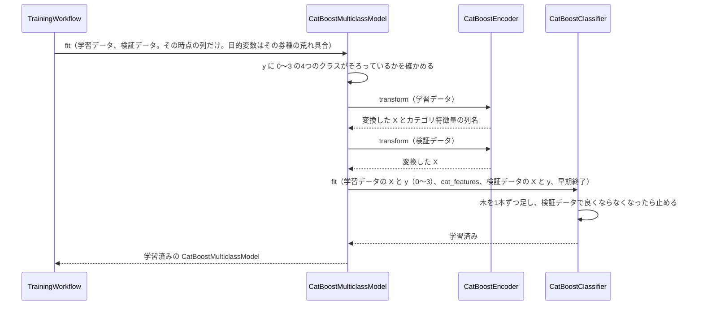
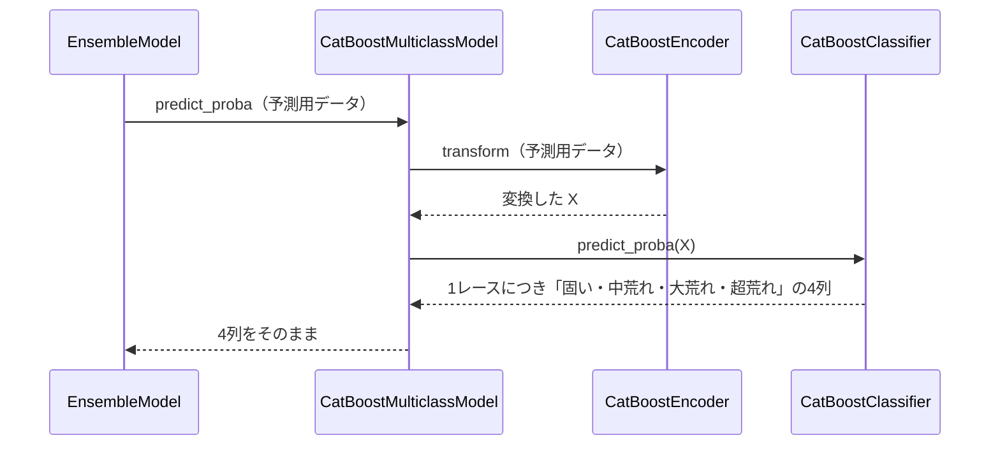

# 13 CatBoost で学習・予測するための設計

**この文書で決めること:** 07〜10 で決めた学習データ（特徴量と目的変数）を、CatBoost で学習・予測するために、CatBoost だけに必要なことを決める。**節の番号と題名は、手本の 13 とそろえてある。**

| 決めること | 結論 |
|---|---|
| 1. 学習データの渡し方 | 手本と同じ（数値はそのまま、カテゴリは文字列のまま `cat_features` に指定、カテゴリの欠損値は文字列「不明」）。目的変数は学習する券種の列（0〜3）だけを渡す |
| 2. ハイパーパラメータの初期値 | 目的関数は多クラス分類（`MultiClass`）。ほかは手本と同じ値から始める |
| 3. カテゴリ特徴量の値の変え方 | 手本と同じ |
| 4.〜6. 学習・予測・保存の手順 | 券種ごとに、3つの時点（[07-prediction-timing.md](07-prediction-timing.md)）につき1つずつ、計 12 のモデルを学習する。`predict_proba` は4列を返す。保存先は `reports/upset_level/models/<券種>/<時点>/` |

- 用語の意味は [02-glossary.md](02-glossary.md) を参照。
- 学習データ・特徴量・目的変数は LightGBM と共通で、[08-training-data.md](08-training-data.md)・[09-features.md](09-features.md)・[10-target.md](10-target.md) を参照。
- LightGBM の設計は [12-lightgbm.md](12-lightgbm.md) を参照。
- 多クラス分類での CatBoost の使い方は [03-library-basics.md](03-library-basics.md#この予想で違う点) を、基本は [手本の 03 の「5. CatBoost の使い方」](../近走と適性から3着以内を予想/03-library-basics.md#5-catboost-の使い方) を参照。
- 図の読み方は、フローチャートは [手本の 06](../近走と適性から3着以内を予想/06-flowchart.md#図の読み方)、シーケンス図は [手本の 05](../近走と適性から3着以内を予想/05-sequence.md#図の読み方) の「図の読み方」を参照。

## 1. 学習データの渡し方

列ごとの渡し方（数値はそのまま、カテゴリは文字列のまま `cat_features` に指定、カテゴリの欠損値は文字列「不明」、出走の少ない値はまとめない、ID 列と評価用の列は渡さない）は手本と同じで、[手本の 13 の「1. 学習データの渡し方」](../近走と適性から3着以内を予想/13-catboost.md#1-学習データの渡し方) を参照。この予想で違う点は次のとおり。

| 列 | 渡し方 | 理由 |
|---|---|---|
| 目的変数 | 学習する券種の「荒れ具合」の列（0〜3 の整数）だけを `y` に渡す。欠損値の行は渡さない | CatBoost の `MultiClass` は、`y` に出てきた値をクラスとして扱う。4つのクラスがそろっていることを、学習の前に確かめる（超荒れが1つも無い学習データでは、クラスが3つになってしまう） |
| ほかの券種の目的変数 | 渡さない | [12-lightgbm.md](12-lightgbm.md#1-学習データの渡し方) と同じ |
| カテゴリ特徴量（10個） | 文字列にして `cat_features` に並べる | 手本と同じ。順序付きターゲット統計は多クラスでもそのまま使える（クラスごとの割合になる） |

## 2. ハイパーパラメータの初期値

`catboost.CatBoostClassifier` の引数名で書く。手本と同じ引数は同じ値から始め、設定ファイルで変えられる（[14-hyperparameter-settings.md](14-hyperparameter-settings.md)）。手本の表は [手本の 13 の「2. ハイパーパラメータの初期値」](../近走と適性から3着以内を予想/13-catboost.md#2-ハイパーパラメータの初期値) を参照。この予想で違う点は次のとおり。

| 引数 | 初期値 | 意味 | 理由 |
|---|---|---|---|
| `loss_function` | `MultiClass` | 目的関数。多クラス分類 | `predict_proba` が4つのクラスの確率を返すようにする。設定ファイルでは変えられない |
| 早期終了の指標 | `MultiClass`（多クラスのログ損失） | 検証データの当たり具合を測る指標 | `loss_function` と同じものを CatBoost が既定で使う |
| `depth`・`l2_leaf_reg` | 6・3（手本と同じ） | 木の深さ、葉の値を抑える強さ | 手本の値から始める。行数が少ないので、学習後に検証データで `depth` 4 と比べる |

クラスの数の偏りを直す設定（`auto_class_weights`）は使わない（[10-target.md](10-target.md#クラスの数の偏り)）。

## 3. カテゴリ特徴量の値の変え方（フローチャート）

**手本と同じである。** `CatBoostEncoder.transform()` が、欠損値を文字列「不明」にし、それ以外を文字列にする手順は、[手本の 13 の「3. カテゴリ特徴量の値の変え方（フローチャート）」](../近走と適性から3着以内を予想/13-catboost.md#3-カテゴリ特徴量の値の変え方フローチャート) を参照。この予想のカテゴリ特徴量 10個に、欠損値になりうるのは「馬場状態」（木曜。ただし木曜のモデルには渡さない）と、1番人気の乗り替わり・距離の変更・クラスの変更（前走が無いとき）である。

## 4. 学習のやりとり（シーケンス図）

[05-sequence.md](05-sequence.md#図1-学習) の図1の「CatBoostMulticlassModel を作り、その時点の列だけで学習させる」の中の呼び出しを示す。券種ごとに3つの時点で1回ずつ、計 12回この流れを行う。

**説明。** CatBoost の `MultiClass` は、1本の木で4つのクラスの値をまとめて出す（LightGBM のように1回に4本作ることはしない）。`iterations` 2000 は木の本数の上限である。

## 5. 予測のやりとり（シーケンス図）

[05-sequence.md](05-sequence.md#図2-予測) の図2の「2つのモデルの4つの確率を出して平均する」のうち、CatBoost の分の呼び出しを示す。

**説明。** 4列の順は `classes_`（0〜3）の順で、LightGBM と同じであることを確かめた（[03-library-basics.md](03-library-basics.md#この予想で違う点)）。

## 6. 保存

- 保存のしかた（`save_model()` で書き込み、`load_model()` で読み込む）は、[手本の 13 の「6. 保存」](../近走と適性から3着以内を予想/13-catboost.md#6-保存) と同じである。
- 保存するのは、券種ごと・時点ごとのモデル（12個）と、学習に使った設定である。
- 保存先: Git の対象外の `reports/upset_level/models/<券種>/<時点>/`（[04-classes.md](04-classes.md#4-パッケージ構成)）。LightGBM のモデルと同じフォルダに置く。

## 文書情報

| 項目 | 内容 |
|---|---|
| 作成日 | 2026-09-23 |
