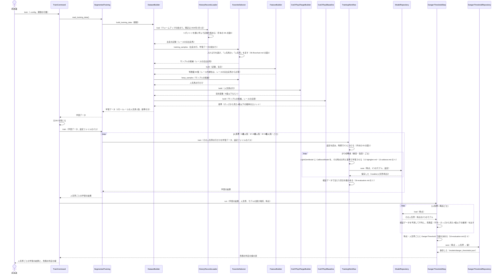
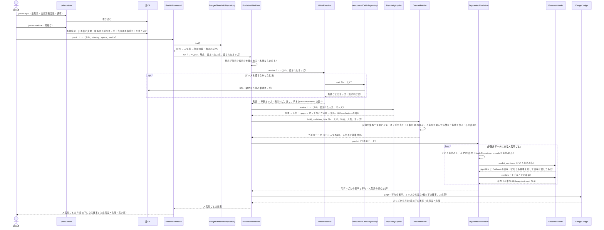

# 05 学習と予測のやりとり（シーケンス図）

**この文書で示すこと:** 学習と予測のとき、利用者・jvdata-store・元DB と、[04-classes.md](04-classes.md) のクラスが、どの順に、どのメソッドを呼ぶか。

**結論: 流れは「学習」と「予測」の2つに分かれる。** 学習は `TrainCommand` から始まり、共通の `SegmentedTraining` が人気帯（1番人気・2〜3番人気・4〜5番人気）ごとに `TrainingWorkflow` を回して、2つの時点（前日・当日）ごとに LightGBM と CatBoost を学習させて保存する。最後に `DangerThresholdStep` が、検証データで「危険」の線を決めて保存する。予測は `PredictionWorkflow` が進め、**オッズと人気を決めて出走の行に当ててから**、人気馬の行だけの予測用データを作り、その馬の人気帯のモデル2つの予測確率を平均し、危険度と「危険」を足す。

2026-09-24 の直し（オッズから作った基準を出発点にする・人気帯で別のモデル・危険度で判定する。[15-decisions.md の 11](15-decisions.md#11-既存モデルの修正計画での直し)）を、2026-09-28 に図に入れた。図は `src/yosou/favorites_out_of_top3/` と `src/yosou/shared/` のコードで確かめた呼び出しの順である。

- 図に出てくるものと、図の読み方（凡例）は [手本の 05 の「図に出てくるもの」](../近走と適性から3着以内を予想/05-sequence.md#図に出てくるもの) と [「図の読み方」](../近走と適性から3着以内を予想/05-sequence.md#図の読み方) を参照。この予想で増えるのは、利用者が渡す人気、人気帯ごとに学習と予測を分ける `SegmentedTraining`・`SegmentedPrediction`、基準を作る `OutOfTop3Baseline`、危険を決める `DangerThresholdStep`・`DangerThresholdRepository`・`DangerJudge` である。
- public メソッドの中の判断（if 文による分かれ道）は [06-flowchart.md](06-flowchart.md) を参照。2種類の図の使い分けは [01-overview.md](01-overview.md#図の使い分け) を参照。
- **リポジトリとのやりとりは、手本とまったく同じである。** 学習データを集める流れは [手本の 05 の図3](../近走と適性から3着以内を予想/05-sequence.md#図3-記録を集めるリポジトリとのやりとり)、1レースの記録を集めて速報を反映する流れは [手本の 05 の図4](../近走と適性から3着以内を予想/05-sequence.md#図4-1レースの記録を集める速報の反映) を参照。この文書では描き直さない。手本と同じく、まとまり L の材料を読む `MarketRunRepository` も呼ぶ（2026-09-30 から）。

## 図1. 学習

**説明。** 利用者が `train` を実行すると、`TrainCommand` は元DB を開き、`SegmentedTraining.read_training_data()` で学習データを1回だけ作る。作り終えたら元DB を閉じ、学習のあいだはロックを持たない。

学習データの作り方は、**人気馬に絞るのが特徴量を作ったあと**になるところが手本と違う。`FavoriteSelector.training_samples()` は、障害・取消・期間でふるったうえで「人気馬か」「人気帯」の列を足すだけで、行は減らさない。レース内順位（まとまり G）を、そのレースの全出走馬から計算するためである（[08-training-data.md](08-training-data.md#3-どのサンプルを入れるか)）。特徴量ができたあと、`keep_samples()` が人気馬の行だけを残し、`OutOfTop3TargetBuilder` が目的変数を付ける。**基準（`OutOfTop3Baseline`）は、人気馬に絞る前のレースの全頭で作ってから、人気馬の行だけにする。** オッズから見た3着以内率は、同じレースのほかの馬のオッズも使って出すためである。

学習は `SegmentedTraining` が人気帯ごとに行を分け、共通の `TrainingWorkflow` を人気帯の数だけ回す（学習データに行が無い人気帯は飛ばす）。`TrainingWorkflow` の中は手本の図1 と同じで、違うのは、モデルが基準を出発点にして上げ下げだけを学ぶことである（LightGBM の `init_score`、CatBoost の `baseline`）。前日のモデルには、82個のうちその時点で使う列だけを渡す（[07-prediction-timing.md](07-prediction-timing.md#時点ごとに使う特徴量)）。モデルは 3つの人気帯 × 2つの時点 × 2つで、12個になる。

最後に `DangerThresholdStep` が、保存したモデルで検証データを予測し直し、時点ごと・人気帯ごとに「危険」の線を決めて保存する。テストデータは使わない。

## 図2. 予測

前日か当日に、1レースの人気馬を予測するときの流れ。

**説明。** 利用者は、まず jvdata-store の `jvstore sync` で出馬表・出走別着度数・調教を、`jvstore realtime --date <開催日>` で速報（馬場状態、締め切り前の単勝オッズ、当日は馬体重も）を取り込む。次に `predict` を実行する。`PredictCommand` は、学習のときに保存した危険の線を読んでから、`PredictionWorkflow.run()` を呼ぶ。

`PredictionWorkflow` は、**先にオッズを決め、次に人気を決める。** オッズは `--odds` → 元DB の締め切り前のオッズ → 無し、の順（手本と同じ `OddsResolver`）。人気は `--pops` → そのオッズの小さい順 → 無し、の順（`PopularityApplier`）。無しのときは、元DB の出走の行に入っている値（終わったレースの確定オッズ・確定単勝人気）がそのまま使われる（[07-prediction-timing.md](07-prediction-timing.md#予測のときの人気の与え方)）。

`DatasetBuilder.build_prediction_data()` の中は、学習と同じ順である。`RaceRecordsLoader` が記録を集めて速報と人気・オッズを当て、`FavoriteSelector.prediction_runners()` が「人気馬か」「人気帯」を足し（人気が1頭も分からなければ止める）、`FeatureBuilder` がその時点の特徴量を作り、`keep_samples()` が人気馬の行だけを残す。`RequiredInfoCheck` が、その時点で要る情報（馬番・馬場状態・単勝オッズ、当日は馬体重も）がそろっているかを確かめ、`OutOfTop3Baseline` がレースの全頭のオッズから基準を作る。予測用データも学習と同じ `DatasetBuilder` と `FeatureBuilder` で作る（[11-leak-prevention.md](11-leak-prevention.md#決まり) の 4）。

予測は `SegmentedPrediction` が人気帯ごとに、その人気帯のモデルで行う。最後に `DangerJudge` が、平均の確率とオッズから見た4着以下の確率の差（危険度）を出し、その人気帯の線以上なら「危険」とする。線が保存されていない人気帯は、危険と判定しない（[16-evaluation.md の 3.](16-evaluation.md#3-危険の線引き)）。

## 今は無く、これから作るところ

| 図の中の部分 | 今の状態 |
|---|---|
| `shared` のクラス | 作った（`src/yosou/shared/`。手本の `src/yosou/form_aptitude_top3/` から移した。[04-classes.md](04-classes.md#1-共通の部品とこの予想だけの部品の分け方)） |
| この予想のクラス（`FavoriteSelector` など） | 作った（`src/yosou/favorites_out_of_top3/`） |
| `AnnouncedOddsRepository` が読むオッズ | 作った。断面は jvdata-store の `jvstore realtime --date <開催日>`（速報オッズ `0B31` → `o1`）で入る。取り忘れたレースは `--pops` で人気を渡す（[07-prediction-timing.md](07-prediction-timing.md#予測のときの人気の与え方)） |
| 学習データ・検証データ・テストデータの期間の分け方と、評価指標 | 決めた（[16-evaluation.md](16-evaluation.md)。区切りと指標は共通。表は人気帯ごとに出る） |
| アンサンブルの平均のしかた | 決めた。手本と同じく、重みを付けない単純な平均（[15-decisions.md の 12](15-decisions.md#12-アンサンブルの平均のしかた)） |
| 予測確率から「危険」と判定する線引き | 作った（2026-09-24）。危険度が、学習のときに検証データで決めた線以上なら「危険」（[16-evaluation.md の 3.](16-evaluation.md#3-危険の線引き)） |

## 文書情報

| 項目 | 内容 |
|---|---|
| 作成日 | 2026-09-22 |
| 更新 | 2026-09-28: 「今は無く、これから作るところ」の期間の分け方・平均のしかた・危険の線引きを、決めた状態に直した |
| 更新 | 2026-09-28: 図1・図2 を、2026-09-24 の直し（基準・人気帯ごとのモデル・危険の判定）を入れた今のコードの呼び出しの順に描き直した |
| 更新 | 2026-09-30: まとまり L（騎手・調教師・血統の市場に対する成績）の4個を足し、図1と説明の特徴量の数を 82個にそろえた。リポジトリのやりとりに `MarketRunRepository` も入ることを書いた |
