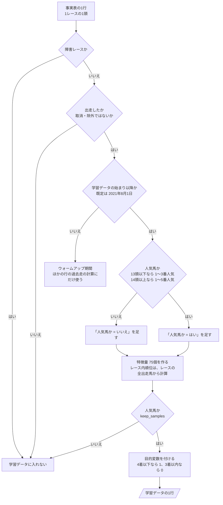
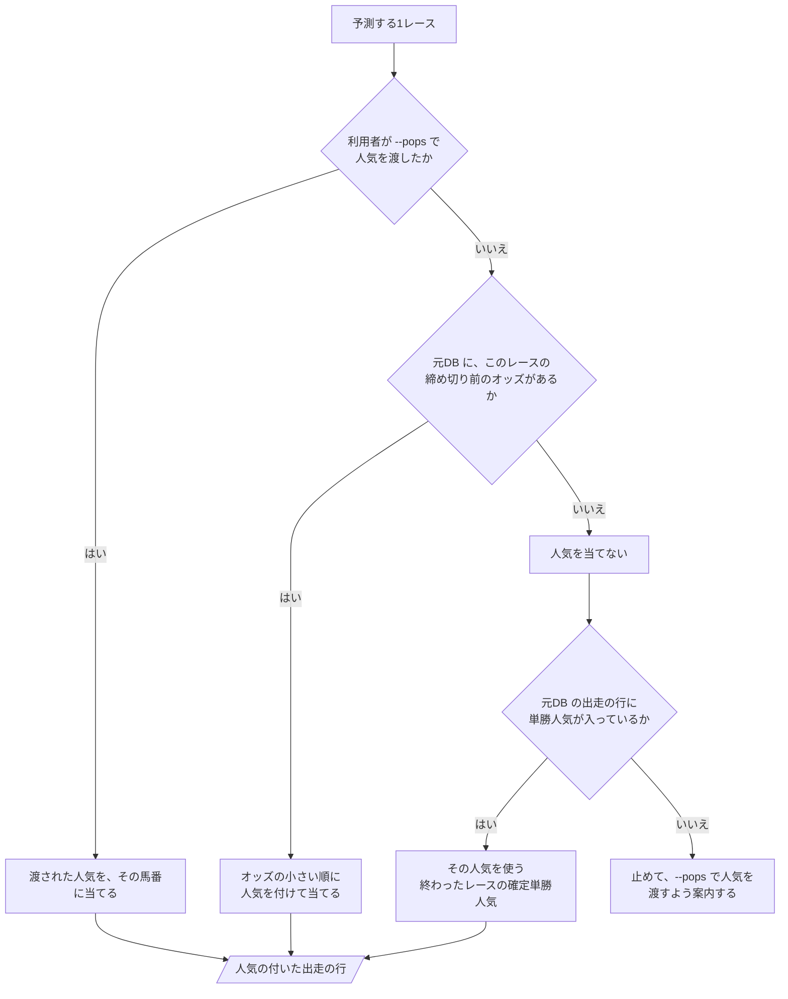

# 06 判断の手順（フローチャート）

**この文書で示すこと:** 学習データを作るときと、予測のときの人気を決めるときの、条件によって分かれる判断の手順。

**結論: 条件によって分かれる判断は2つある。「学習データに入れる行の選び方」（人気馬かどうかの判断を含む）と、「予測用データに人気を当てる手順」である。**

- この文書は、1つの public メソッドの中で、条件で分かれる判断の手順を示す。クラスどうしのやりとりは [05-sequence.md](05-sequence.md) を参照。2種類の図の使い分けは [01-overview.md](01-overview.md#図の使い分け) を参照。
- 図の読み方（凡例）は [手本の 06 の「図の読み方」](../近走と適性から3着以内を予想/06-flowchart.md#図の読み方) を参照。四角が作業、ひし形が if 文1つ、平行四辺形ができあがるものである。
- モデルごとの判断の手順（カテゴリ特徴量の値の変え方）は、手本と同じで、[手本の 12 の 3.](../近走と適性から3着以内を予想/12-lightgbm.md#3-カテゴリ特徴量の値の変え方フローチャート)・[手本の 13 の 3.](../近走と適性から3着以内を予想/13-catboost.md#3-カテゴリ特徴量の値の変え方フローチャート) を参照。
- 用語の意味は [02-glossary.md](02-glossary.md) を参照。

## 図1. 学習データに入れる行の選び方

`FavoriteSelector.training_samples()` と `FavoriteSelector.keep_samples()`（どちらも `DatasetBuilder.build_training_data()` から呼ばれる）の中で行う判断と、その間の段。事実表の1行（1レースの1頭）が、学習データの1行になるまで。

**説明。** 手本の予想との違いは、4つ目と5つ目の問いである。人気馬でない行も、いったんは残して特徴量を作る。まとまり G のレース内順位（近5走の平均着差の順位など）を、そのレースの全出走馬から計算するためである（理由は [08-training-data.md](08-training-data.md#3-どのサンプルを入れるか)）。特徴量ができたあと、5つ目の問い（`keep_samples()`）で人気馬の行だけを残す。

- 人気馬の範囲を決める規則は [08-training-data.md](08-training-data.md#3-どのサンプルを入れるか)、特徴量は [09-features.md](09-features.md)、目的変数は [10-target.md](10-target.md) を参照。
- 「人気馬か」の判断に使う人気は、学習では確定単勝人気、予測では図2で決めた人気である（[11-leak-prevention.md](11-leak-prevention.md#決まり) の 5）。頭数は、学習では実際に走った頭数、予測ではその時点で取消・除外になっていない頭数である。
- 3つ目の問いの日は、`train` の引数 `--train-from` で変えられる（[手本の 08 の「4. 期間の指定」](../近走と適性から3着以内を予想/08-training-data.md#4-期間の指定)）。
- 予測用データを作るときも同じ手順を通る。ただし、これから走るレースなので3つ目の問いは常に「はい」になり、目的変数を付ける段は無い。作る特徴量は、その時点で使うものだけである（[07-prediction-timing.md](07-prediction-timing.md#時点ごとに使う特徴量)）。

## 図2. 予測用データに人気を当てる

予測に使う人気を決める判断。前半（1つ目と2つ目の問い）は `PopularityApplier.resolve()`、後半（3つ目の問い）は `FavoriteSelector.prediction_runners()` の中にある。どちらも `PredictionWorkflow.run()` から呼ばれる。

**説明。** 人気は、レースの前には確定しない。そのため、予測のときは利用者が見た人気を渡してもらう（`--pops 3:1 7:2` のように、馬番と人気の組を並べる）。当日は、元DB に締め切り前のオッズが入っていれば、そこから人気を作れる。

**3つ目の問いは、終わったレースの答え合わせのためにある。** すでに走ったレースなら、元DB の出走の行に確定単勝人気が入っている。そこで、渡された人気もオッズも無いときは、何も当てずにその値を使う。これから走るレースでは、その値が空なので、案内を出して止める。

- 人気の与え方は [07-prediction-timing.md](07-prediction-timing.md#予測のときの人気の与え方) を参照。
- 元DB のオッズの状態は [09-features.md](09-features.md#使うデータの期間) を参照。
- 一部の馬番だけを渡した場合は、渡されていない馬番の人気が決まらない。その馬は人気馬ではないものとして扱い、レース内順位の計算にだけ使う。

## 文書情報

| 項目 | 内容 |
|---|---|
| 作成日 | 2026-09-22 |
