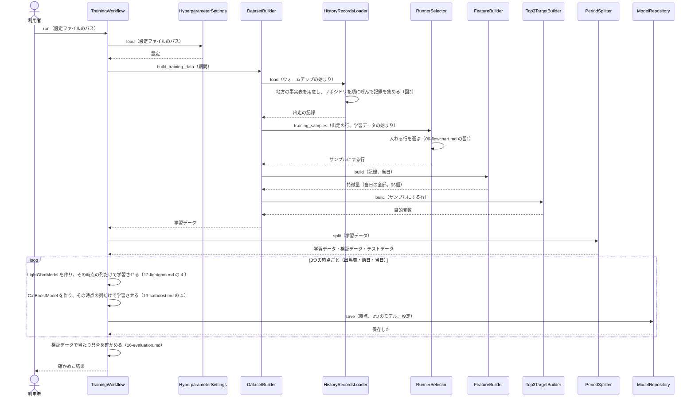
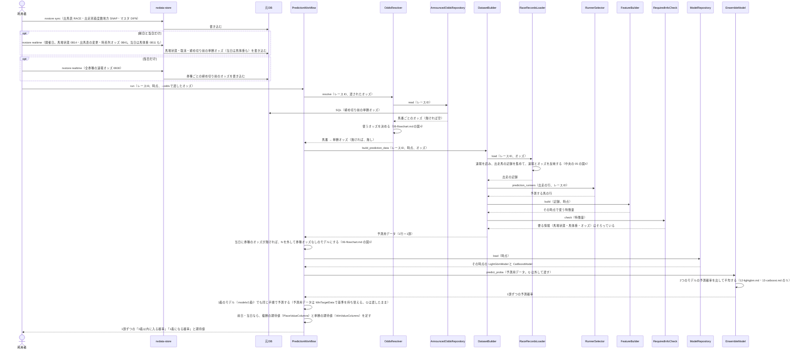
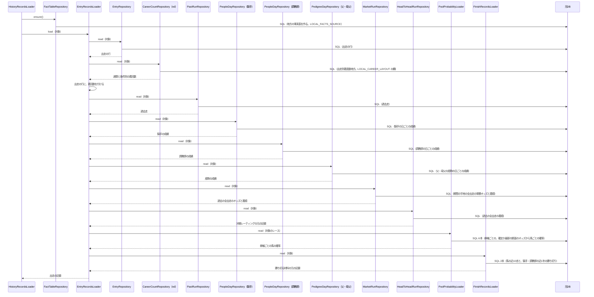
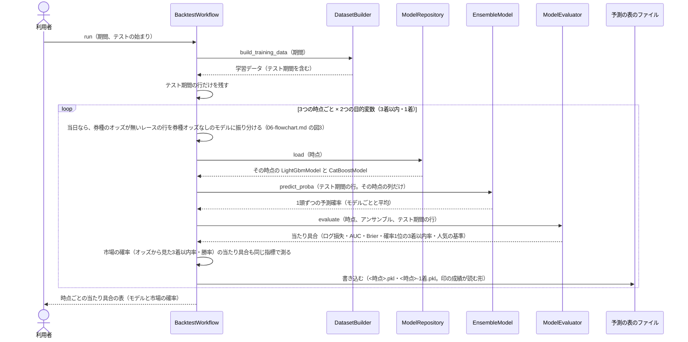

# 05 学習と予測のやりとり（シーケンス図）

**この文書で示すこと:** 学習・予測・テスト期間の確かめのとき、利用者・nvdata-store・元DB と、[04-classes.md](04-classes.md) のクラスが、どの順に、どのメソッドを呼ぶか。

**結論: 流れは「学習」「予測」「テスト期間の確かめ」の3つに分かれる。** 学習は共通の `TrainingWorkflow` が進め、1つの学習データから、3つの時点ごとに LightGBM と CatBoost を学習させて保存する。予測は共通の `PredictionWorkflow` が進め、その時点の予測用データを作り、保存した2つのモデルで予測確率を出して平均する。テスト期間の確かめは `BacktestWorkflow` が進める。中央の予想と違うのは、学習データが1つであること（材料を時点で使い分けない）、取り込みの道具が nvdata-store であること、記録を集めるときに調教を読まず、出走別着度数地方を読むことである。

- public メソッドの中の判断（if 文による分かれ道）は [06-flowchart.md](06-flowchart.md) を参照。2種類の図の使い分けは [01-overview.md](01-overview.md#図の使い分け) を参照。
- 用語の意味は [02-glossary.md](02-glossary.md) を参照。

## 図に出てくるもの

| 名前 | 種類 | 呼ばれ方 | 今あるか |
|---|---|---|---|
| 利用者 | 人 | ― | ― |
| nvdata-store | 隣のリポジトリの道具。地方競馬DATA を取得して、元DB に入れる | コマンド（`nvstore sync` か `nvstore realtime`）を1回実行する | ある |
| 元DB | nvdata-store が作った DuckDB（`nvdata.duckdb`）。この AI は読むだけ | SQL を1回流す | ある |
| `TrainingWorkflow` など | この AI のクラス。一覧と仕事は [04-classes.md](04-classes.md) を参照 | public メソッドを1回呼ぶ | 共通の部品はある。地方の部品はこれから作る |
| `LGBMClassifier`・`CatBoostClassifier` | ライブラリのクラス | `fit()` か `predict_proba()` を1回呼ぶ | ライブラリはある |
| モデルのファイル | 学習済みのモデルを保存したファイル | 1回書き込むか、1回読み込む | `train` を実行すると、`reports/地方競馬の近走と適性から3着以内を予想/models/` にできる |

## 図の読み方

中央の予想の [05 の「図の読み方」](../近走と適性から3着以内を予想/05-sequence.md#図の読み方) と同じ。実線の矢印1本 = 呼び出し1回、点線 = 戻り値、自分に戻る矢印 = メソッドの中で行う作業のうち設計として見せたいもの、`loop` = くり返し、`opt` = 利用者の手順の違い。

## 図1. 学習

**説明。** この図は、1つの目的変数の学習である。`train`（`TrainCommand`）は、`local_dataset_builder` で学習データを1回読み、元DB を閉じてから、同じ学習データで次の4つの学習を順に行う（[04-classes.md](04-classes.md#command--コマンド入口はこの予想部品は-shared)）。

| 学習 | 学習データ | 時点 | 置き場所 |
|---|---|---|---|
| 3着以内のモデル | Q を外したもの（`FinishPowerFreeData`） | 出馬表・前日・当日 | `models/<時点>/` |
| 1着のモデル | 目的変数を「1着」に・基準を「オッズから見た勝率」に持ち替えたもの（`WinTargetData`。Q は残す） | 出馬表・前日・当日 | `models/1着/<時点>/` |
| 券種オッズなしの3着以内のモデル | N と Q を外したもの（`PoolFreeData`・`FinishPowerFreeData`） | 当日 | `models/券種オッズなし/race_day/` |
| 券種オッズなしの1着のモデル | N を外して1着に持ち替えたもの | 当日 | `models/券種オッズなし/1着/race_day/` |

学習データは、当日の時点の特徴量の全部で作る（単勝オッズと券種オッズは確定オッズ）。各時点のモデルには、そのうち、その時点で使う列だけを渡す（[07-prediction-timing.md の「時点ごとに使う特徴量」](07-prediction-timing.md#時点ごとに使う特徴量)）。モデルは、3つの時点 × 2つの目的変数 と、券種オッズなしの当日 × 2つの目的変数 で、合わせて 8組（LightGBM と CatBoost で 16個）になる。学習のあとに、複勝の見込みの倍率（`PlacePriceStep`）を保存する。

## 図2. 予測

出馬表・前日・当日のどれかの時点で、1レースを予測するときの流れ。

**説明。** 利用者は、まず nvdata-store の `nvstore sync` で、出馬表（`RACE`）・出走別着度数地方（`SNAP`）・マスタ（`DIFN`）を取り込む。前日と当日は、`nvstore realtime` で速報（馬場状態・取消・締め切り前のオッズ。当日は馬体重も）を取り込む。次に、レースIDと時点（前日・当日なら、必要に応じて `--odds` のオッズも）を付けて `PredictionWorkflow.run()` を呼ぶ。流れは中央の予想の [05 の図2](../近走と適性から3着以内を予想/05-sequence.md#図2-予測) と同じで、違いは、どの時点でも同じ `local_dataset_builder` を使うこと（材料を時点で切り替えない）と、展開の予想の結果（P）を足す段が無いことである。1レースの記録を集めて速報を反映する中の呼び出し（`RaceRecordsLoader` → `AnnouncedGoingRepository` → `RaceEntryTableRepository` → `EntryRecordsLoader` → 速報の反映）は、中央の予想の [05 の図4](../近走と適性から3着以内を予想/05-sequence.md#図4-1レースの記録を集める速報の反映) と同じである（`RaceEntryTableRepository` に `LOCAL_FACTS_SOURCE` を渡す点だけ違う）。

## 図3. 記録を集める（リポジトリとのやりとり）

図1の「地方の事実表を用意し、リポジトリを順に呼んで記録を集める」の中の呼び出しを示す。中央の予想の [05 の図3](../近走と適性から3着以内を予想/05-sequence.md#図3-記録を集めるリポジトリとのやりとり) と比べて、馬の力の材料（`AbilitySourcesLoader`）を呼ばず、出走別着度数は `nd` を読む `CareerCountRepository` を呼び、対戦レーティング（`HeadToHeadRunRepository`）と勝ち切る材料（`FinishRecordsLoader`）を呼ぶ。調教のリポジトリ（`WorkoutRepository`・`WorkoutCoverageRepository`）は共通の読み込みの中で呼ばれるが、地方の元DB に調教の表（`hc`・`wc`）が無いので空の表が返る（図では省く）。

**説明。** 学習でも予測でも、同じリポジトリを同じ順に呼ぶ。違うのは「対象」（`TargetScope`）だけで、学習では「ウォームアップの始まり（既定は 2016年1月1日）以降の全部の出走」、予測では「1レースの出走馬」になる。事実表は `LOCAL_FACTS_SOURCE` で作るので、行は地方 14場の確定成績（ばんえいを除く）、血統は `nu__3代血統情報`、クラスは競走条件名称から読んだものになる（[04-classes.md の 3.](04-classes.md#3-中央だけの決めごとを外から渡す形)）。調教の表（`hc`・`wc`）は元DB に無く、この予想は調教の特徴量（I）を持たないので、共通の読み込みが調教のリポジトリを呼んでも空の表が返るだけである。

## 図4. テスト期間の確かめ

`backtest` の流れ。保存したモデルで、学習に使っていないテスト期間の全レースを予測し直す（[16-evaluation.md の 4.](16-evaluation.md#4-テスト期間での確かめ)）。

**説明。** 学習データを作る手順は図1と同じで、期間（`TrainingPeriod`）はテスト期間の終わりまでを含む。`PeriodSplitter` と同じ区切りでテスト期間の行だけを残し、保存したモデル（`train` が同じ期間で学んだもの）で予測する。予測の表は、印の成績（`tools/印の成績/mark_stats.py`）が読む列（レースID・開催日・馬ID・馬番・確率・区切り・期間・区分と、モデルごとの確率）で書く。印の成績の回し方は [16-evaluation.md の 6.](16-evaluation.md#6--の単勝回収率の確かめ期待度) を参照。

## 文書情報

| 項目 | 内容 |
|---|---|
| 作成日 | 2026-10-06 |
