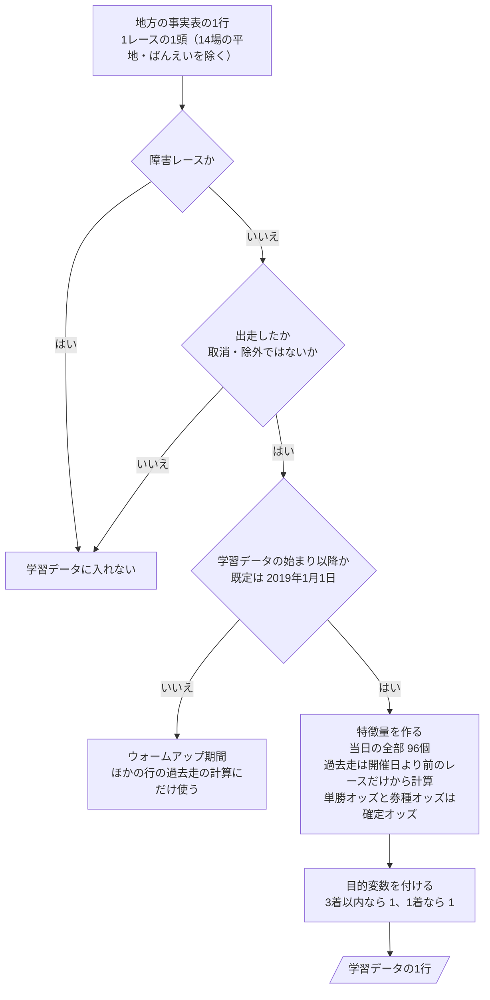
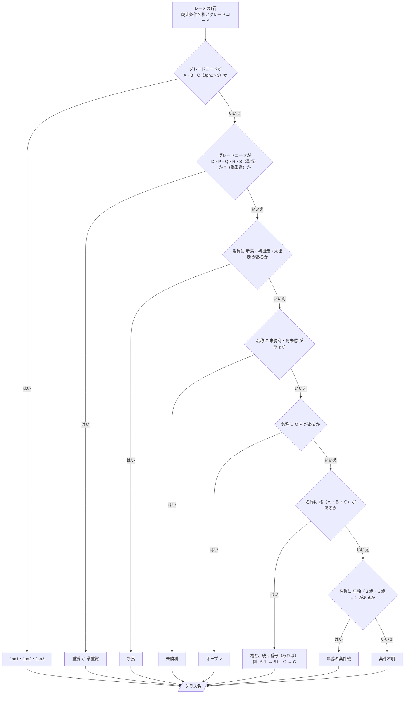
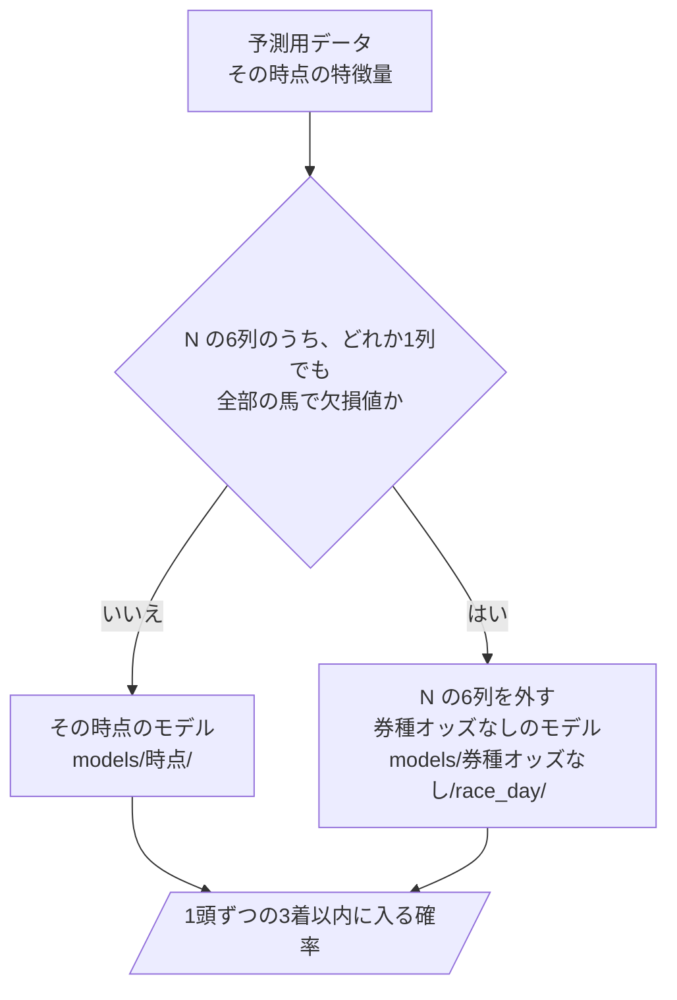

# 06 判断の手順（フローチャート）

**この文書で示すこと:** 学習データを作るとき・予測するときの、条件によって分かれる判断の手順。

**結論: 両方のモデルに共通で、条件によって分かれる判断は「学習データに入れる行の選び方」（図1）、「クラスの読み取り」（図2）、「当日のモデルの選び方」（図3）、「予測に使うオッズの決め方」（図4）の4つである。** 図2 が地方で増える判断で、ほかは中央の予想と同じ手順である。

- この文書は、1つの public メソッドの中で、条件で分かれる判断の手順を示す。クラスどうしのやりとりは [05-sequence.md](05-sequence.md) を参照。
- モデルごとの判断の手順（カテゴリ特徴量の値の変え方）は、[12-lightgbm.md](12-lightgbm.md)・[13-catboost.md](13-catboost.md) を参照。
- 用語の意味は [02-glossary.md](02-glossary.md) を参照。

## 図の読み方

中央の予想の [06 の「図の読み方」](../近走と適性から3着以内を予想/06-flowchart.md#図の読み方) と同じ。四角 = 作業、ひし形 = if 文1つ、平行四辺形 = できあがるもの。

## 図1. 学習データに入れる行の選び方

`RunnerSelector.training_samples()`（`DatasetBuilder.build_training_data()` から呼ばれる）の中で行う判断と、そのあとの段。事実表の1行（1レースの1頭）が、学習データの1行になるまで。ばんえい（競馬場 83）と中央の競馬場のレースは、事実表を作る段（`LOCAL_FACTS_SOURCE` の競馬場の範囲）で除いてあるので、ここには出てこない。

**説明。** 3つの問いで、学習データに入れる行を選ぶ。地方の平地に障害レースは無いが、問いは中央と共通の `FlatRunnerFilter` のまま残す（答えは常に「いいえ」）。規則は [08-training-data.md](08-training-data.md#3-どのサンプルを入れるか)、特徴量は [09-features.md](09-features.md)、目的変数は [10-target.md](10-target.md) を参照。3つ目の問いの日は、`train` の引数 `--train-from` で変えられる。予測用データを作るときも同じ手順を通る（3つ目の問いは常に「はい」、目的変数を付ける段は無い。作る特徴量はその時点で使うものだけ）。

## 図2. クラスの読み取り

`local_class_name_sql()`（`tools/共通/local_codes.py`。事実表を作る SQL の中で、レースの1行ごとに評価される CASE 式）の判断。地方のレースは競走条件コードがすべて `000` なので、クラスは競走条件名称の文字列（例 `３歳上Ｃ３　二`・`Ｂ１－２`・`ＯＰ`）とグレードコードから読む。読んだクラス名は `LOCAL_CLASS_ORDER` で並び順の数（特徴量「クラス」）になる（[09-features.md の A](09-features.md#a-レースの条件9個)）。

**説明。** 全角の英字と数字は半角にそろえてから見る。格に続く番号は、格のすぐあとの1桁（`Ｂ１－２` の `１`。`－２` は組の番号なので読まない）である。笠松・名古屋のように番号を付けない競馬場（`Ｃ －１２`）は、格だけのクラス名（`C`）になる。「選抜」「特別」のような言葉は無視する。確定成績の全レースで、この手順で条件不明になるのは 0.3%（名称が空のレース）で、残りは読める。クラス名から並び順の数への対応は [09-features.md の A の表](09-features.md#a-レースの条件9個) を参照。同じ `B1` でも競馬場によって強さが違うので、モデルには競馬場も特徴量として渡す。

## 図3. 当日のモデルの選び方

`PredictionWorkflow.run()`（と `BacktestWorkflow.run()`）の中で、予測用データを作ったあとに行う判断。中央の予想の [06 の図3](../近走と適性から3着以内を予想/06-flowchart.md#図3-当日のモデルの選び方) と同じ手順で、券種のオッズがあるかを答えるのは `PoolAvailability.missing()` である。

**説明。** 出馬表と前日の予測用データには N の列が無いので、いつも「いいえ」になり、その時点のモデルを使う。当日に券種のオッズが丸ごと無いレース（速報の全券種のオッズ `0B30` を取り込んでいない）は「はい」で、券種オッズなしのモデルに切り替える。地方の確定オッズ（`o1`〜`o6`）は 2016年からの全レースにそろっているので、学習データでは N がほぼ欠けない。

## 図4. 予測に使うオッズの決め方

`OddsResolver.resolve()` の中で行う判断。中央の予想の [06 の図2](../近走と適性から3着以内を予想/06-flowchart.md#図2-予測に使うオッズの決め方) と同じ手順である。渡されたオッズ → 元DB の締め切り前の単勝オッズ（時系列オッズ `0B41` の最新の断面）→ 無し（出走の行に入っている単勝オッズのまま）の順。出馬表の時点はオッズを特徴量に使わないので、この判断の結果は使われない（[07-prediction-timing.md](07-prediction-timing.md#予測のときのオッズの与え方)）。

## 文書情報

| 項目 | 内容 |
|---|---|
| 作成日 | 2026-10-06 |
