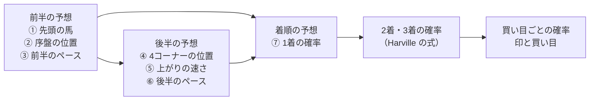

# 01 展開から着順を予想する: 概要

**出走馬の過去の位置取りと末脚、今回の相手、枠、コースから、レースの前半（どの馬が前に行き、ペースが速いか遅いか）と後半（4コーナーでどこにいて、最後の 600m をどれだけ速く走るか）を予想し、その2つを組み合わせて、どの馬が1着・2着・3着になるかを確率で出す予想である。** 着順の確率から、単勝〜3連単の買い目ごとの当たる確率を出し、印（◎○▲△☆注）と買い目を決める。

- 「最初のコーナー」とは、そのレースで通過順位が記録された最初のコーナーのことで、東京の芝1600m なら3コーナー、中山の芝2000m なら1コーナーになる（くわしくは [10-target.md](10-target.md#1-最初のコーナーの決め方)）。
- 「前半」とは、JV-Data の前3ハロン（スタートから 600m。距離が 200m で割り切れないレースは 500m や 550m）のことである。
- 「後半」とは、JV-Data の後3ハロン（ゴールまでの最後の 600m）と、4コーナーからゴールまでのことである。

この設計の中に、次の7つの予想がある。前半の3つを先に予想し、その結果を後半の3つの特徴量に入れ、前半と後半の結果を着順の特徴量に入れる（スタッキング。[02-glossary.md](02-glossary.md)）。

| 組 | 予想 | 1サンプル | 出すもの | 作り方 |
|---|---|---|---|---|
| 前半 | ① 先頭の馬 | 1レースの1頭 | 各馬が最初のコーナーで先頭になる確率。1レースの合計は 1 | 二値分類の確率を、レースの中で合計 1 にそろえる（[10-target.md](10-target.md#2-先頭の馬の目的変数)） |
| 前半 | ② 序盤の位置 | 1レースの1頭 | 各馬が最初のコーナーで先団・中団・後方にいる確率（3つの合計は 1） | 多クラス分類（3クラス） |
| 前半 | ③ 前半のペース | 1レース | ハイ・平均・スローの確率と、前半タイムの秒数（真ん中の値と、80% が入る幅） | 多クラス分類（3クラス）と、分位点回帰 |
| 後半 | ④ 4コーナーの位置 | 1レースの1頭 | 各馬の 4コーナーでの位置（0 が先頭、1 が最後方） | 回帰（[10-target.md](10-target.md#7-4コーナーの位置の目的変数)） |
| 後半 | ⑤ 上がりの速さ | 1レースの1頭 | 各馬の上がり3ハロンの、レースの中での速さ（0 がいちばん速い、1 がいちばん遅い） | 回帰（[10-target.md](10-target.md#8-上がりの速さの目的変数)） |
| 後半 | ⑥ 後半のペース | 1レース | 後半タイムの秒数（真ん中の値と、80% が入る幅） | 分位点回帰（[10-target.md](10-target.md#9-後半のペースの目的変数)） |
| 着順 | ⑦ 着順 | 1レースの1頭 | 各馬が1着になる確率（1レースの合計は 1）と、そこから出す 2着・3着・買い目ごとの確率 | 二値分類の確率をレースの中で合計 1 にそろえ、2着・3着は Harville の式で割り当てる（[10-target.md](10-target.md#10-着順の目的変数と確率の出し方)） |

- 道具: LightGBM と CatBoost の両方で学習し、2つの出した値を平均する（アンサンブル）。
- 予測する時点: 木曜（出走馬名表）・前日（出馬表）・当日（馬体重の発表のあと）の3つのどれでも出せる。時点ごとに、その時点で分かる特徴量だけで学習した別のモデルを使う（[07-prediction-timing.md](07-prediction-timing.md)）。過去のレースで的中率と回収率を確かめるのは、当日の時点である（[16-evaluation.md](16-evaluation.md#7-年ごとの的中率と回収率)）。
- オッズは、どの予想の特徴量にも使わない。オッズは、買い目の期待値（当たる確率 × オッズ）を出すときにだけ使う（[16-evaluation.md](16-evaluation.md#8-券種ごとの買い方)）。
- データの元: JRA-VAN Data Lab. の中央競馬のデータ（jvdata-store が DuckDB に貯めたもの）。
- 元にした計画: ワークスペースの `plans/展開予想モデルの作成計画.md`（前半の3つ）。計画と違うところは [15-decisions.md](15-decisions.md) の各項目に書いた。後半と着順は、2026-09-26 の利用者の依頼（「前後半を組み合わせ、着順まで予想して、過去データで券種ごと・年ごとの的中率と回収率を出す」）で足した。
- 用語の意味: [02-glossary.md](02-glossary.md) を参照。
- 状態: 決めてほしいことは、2026-09-26 にすべて決まった（[15-decisions.md](15-decisions.md) の 1〜21）。プログラム（`src/yosou/race_development/`）は 2026-09-26 に作った。コマンドは `train`（予測に使うモデルを学習して保存する）・`predict`（1レースの展開と着順を予測し、印と買い目を出す）・`backtest`（年ごとの的中率と回収率を確かめる）の3つ。年ごとの確かめの結果は、Git の対象外の `reports/race_development/backtest/results.md` に置く。作りながら変えたところは [04-classes.md の「作りながら変えたところ」](04-classes.md#作りながら変えたところ) にまとめた。

## 1頭の例

架空の1頭を当日に予測する場合で、モデルに何を渡して何が返ってくるかを示す。

> - **レース**: 2025年10月、東京・芝1600m・良、2勝クラス、16頭立て。最初のコーナーは3コーナー
> - **馬**: 2枠3番、4歳の牡馬、斤量 57kg
> - **序盤の位置取りの履歴**: 近5走のうち、最初のコーナーで先頭が 2回、先団（前から3分の1まで）が 4回。序盤の位置の平均は 0.15（0 が先頭、1 が最後方）
> - **末脚の履歴**: 近5走の上がりの速さの平均は 0.45（真ん中よりやや速い）。近5走で、4コーナーからゴールまでに位置を平均 0.10 上げている
> - **相手**: ほかの 15頭の先頭率の合計は 1.1。自分より内の2頭には、先行する馬がいない。先頭率はこのレースで 2番目に高い
> - **人**: 騎手A（前走から継続）。騎手Aの近1年の先団率は 0.41
>
> → 前半 ①: **先頭になる確率 0.31**（16頭の合計は 1）
> → 前半 ②: **先団 0.72、中団 0.21、後方 0.07**
> → 後半 ④: **4コーナーの位置 0.12**（①②とペースが材料に入る。スローなら、前にいる馬はそのまま前に残りやすい）
> → 後半 ⑤: **上がりの速さ 0.38**（スローで前にいる馬は、上がりも速くなりやすい）
> → 着順 ⑦: **1着 0.18、2着以内 0.33、3着以内 0.45**（16頭の中で1着の確率は 2番目に高い → 印は ○）

## 1レースの例

同じレースを、③と⑥で予測する場合。

> - **レース**: 上と同じ。前半タイムの測る区間は 600m
> - **前半タイムの基準**: 前日までの3年の、東京・芝1600m・2勝クラスのレースの前3ハロンの平均は 35.1秒（42レースから）。後3ハロンの平均は 34.2秒
> - **ペースの材料**: 先団率が 0.5 以上の馬が 3頭。先頭率の1位と2位の差は 0.02（先頭を争いそうな馬が2頭いる）
>
> → 前半 ③: **ハイ 0.45、平均 0.38、スロー 0.17**。前半タイムは **34.6秒**（基準より 0.5秒速い）、80% が入る幅は 34.1〜35.2秒
> → 後半 ⑥: 後半タイムは **34.6秒**（基準より 0.4秒遅い。前半が速いと、後半は遅くなりやすい）、80% が入る幅は 34.0〜35.3秒

## 着順から買い目までの例

同じレースで、⑦の1着の確率から、印と買い目を決める場合（当日の時点。数字は架空）。

> - 1着の確率の高い順に、◎ 7番 0.24、○ 3番 0.18、▲ 12番 0.11、△ 5番 0.09。印の付け方は [16-evaluation.md の 8.](16-evaluation.md#8-券種ごとの買い方)
> - 2着・3着の確率は、1着の確率から Harville の式で割り当てる。例えば「7番→3番→12番」の3連単の確率は 0.024
> - **印どおりに買う**: 単勝 ◎7番、馬連 7-3・7-12・7-5 など、券種ごとに決めた点数を 1点100円で買う
> - **期待値で買う**: 買い目ごとに「当たる確率 × オッズ」を出し、1.0 以上の買い目だけを買う。例えば 12番の単勝は、確率 0.11 × オッズ 11.2倍 = 1.23 なので買う

## 使うデータ

前半の予想①②（1行 = 1頭）は、98個の特徴量を 12 のまとまりに分けて使う（当日の場合）。A〜I の 71個は、ほかの予想と共通の特徴量である。予想③（1行 = 1レース）は、それを集約した 27個を使う。後半と着順の予想は、これに末脚の履歴（N）と、前の組の予想の結果（S・T）を足す。一覧は [09-features.md](09-features.md) を参照。

| まとまり | 何が分かるか | 特徴量の例 | 使う予想 |
|---|---|---|---|
| A〜I（手本と共通） | レースの条件、馬、騎手と調教師、前走、近走、この条件での経験、同じレースの馬との比較、血統、調教 | 距離、枠番、推定脚質、前走の4コーナーの位置、逃げそうな馬の数 | ①②④⑤⑦ |
| K. 序盤の位置取りの履歴 | この馬が、これまで序盤にどこを走ってきたか | 近5走の序盤の位置の平均、先頭率、騎手の先団率 | ①②④⑤⑦ |
| L. 同じレースの馬との比較（序盤） | このメンバーの中で、前に行けそうか | ほかの馬の先頭率の合計、自分より内の馬の先頭率の合計 | ①②④⑤⑦ |
| M. コースの形 | このコースで、どの枠の馬が前に行きやすいか | 最初のコーナーの番号、このコースで先頭になった馬の馬番の位置の平均 | ①②④⑤⑦ |
| N. 末脚の履歴 | この馬が、これまで後半にどう走ってきたか | 近5走の上がりの速さの平均、近5走の 4コーナーからゴールまでの位置の変化 | ④⑤⑦ |
| S. 前半の予想の結果 | この馬とこのレースの前半が、どうなりそうか | 先頭の確率、先団の確率、ハイペースの確率 | ④⑤⑥⑦ |
| T. 後半の予想の結果 | この馬の後半が、どうなりそうか | 4コーナーの位置の予測、上がりの速さの予測とそのレース内順位 | ⑦ |
| R・P・Q・U（1レースの予想だけ） | レースの条件、先行しそうな馬の集まり具合、前半・後半タイムの基準、末脚のある馬の集まり具合 | 先頭率の1位と2位の差、前半タイムの基準 | ③⑥ |

使わないデータとその理由は、[09-features.md](09-features.md#使わない特徴量) と [11-leak-prevention.md](11-leak-prevention.md) を参照。

## 流れ

LightGBM と CatBoost でどう学習・予測するかは [03-library-basics.md](03-library-basics.md)、どのクラスが何をするかは [04-classes.md](04-classes.md)、学習から予測までのやりとりは [05-sequence.md](05-sequence.md)、条件で分かれる判断の手順は [06-flowchart.md](06-flowchart.md) を参照。

（矢印は「予想の結果を、次の予想の特徴量に入れる」ことを表す。この図は予想どうしのつながりを示す概要で、クラスのやりとりは [05-sequence.md](05-sequence.md) に書く）

## 図の使い分け

図の使い分けの方針は、手本と同じである（[手本の 01 の「図の使い分け」](../近走と適性から3着以内を予想/01-overview.md#図の使い分け)）。

| 図 | 表すこと | 置き場所 |
|---|---|---|
| シーケンス図 | 利用者・jvdata-store・元DB と、この AI のクラスの間で、どのメソッドを、どの順に呼び、何を渡して何が返るか。実線の矢印1本 = 呼び出し1回 | 7つの予想に共通のものは [05-sequence.md](05-sequence.md)、モデルごとのものは [12-lightgbm.md](12-lightgbm.md)・[13-catboost.md](13-catboost.md) |
| フローチャート | 1つの public メソッドの中で、if 文によってどちらに進むか。図1枚 = public メソッド1つ、ひし形1つ = if 文1つ | 共通のものは [06-flowchart.md](06-flowchart.md) |

- 同じ手順を両方の図で描かない。分かれ道の無い一続きの作業は、シーケンス図の自分に戻る矢印で書く。
- 上の「流れ」の図は、予想どうしのつながりの概要で、どちらの種類でもない（クラスもメソッドも出てこない）。
- 図は Mermaid で書いてある。VS Code のプレビューで見るには、拡張機能「Markdown Preview Mermaid Support」（`bierner.markdown-mermaid`）が要る。

## 設計書の一覧

| ファイル | 何が書いてあるか | 状態 |
|---|---|---|
| 01-overview.md | この文書。どんなデータで何を予想するか | 決定（2026-09-26） |
| [02-glossary.md](02-glossary.md) | 用語の意味（手本に無いものだけ） | 決定（2026-09-26） |
| [03-library-basics.md](03-library-basics.md) | LightGBM と CatBoost の使い方のうち、この予想で足すもの（レースの中で確率をそろえる、多クラス、分位点回帰、回帰、2着・3着の確率の割り当て） | 決定（2026-09-26） |
| [04-classes.md](04-classes.md) | 共通の部品に足すもの・変えるものと、この予想だけのクラス、パッケージ構成 | 決定（2026-09-26） |
| [05-sequence.md](05-sequence.md) | 学習・予測・年ごとの検証のやりとり（シーケンス図） | 決定（2026-09-26） |
| [06-flowchart.md](06-flowchart.md) | 正解の付け方、前半・後半タイムの基準の決め方、印の付け方、買い目の決め方（フローチャート） | 決定（2026-09-26） |
| [07-prediction-timing.md](07-prediction-timing.md) | いつ予測するか（3つの時点と、時点ごとに使う特徴量） | 決定（2026-09-26） |
| [08-training-data.md](08-training-data.md) | 学習データの形と、どのレース・期間を使うか | 決定（2026-09-26） |
| [09-features.md](09-features.md) | 特徴量の一覧と例、使わない特徴量 | 決定（2026-09-26） |
| [10-target.md](10-target.md) | 7つの予想の目的変数の作り方と、着順の確率の出し方 | 決定（2026-09-26） |
| [11-leak-prevention.md](11-leak-prevention.md) | リークを防ぐ決まり（予想の結果を次の予想に入れるときの決まりを含む） | 決定（2026-09-26） |
| [12-lightgbm.md](12-lightgbm.md) | LightGBM で学習・予測するための設計 | 決定（2026-09-26） |
| [13-catboost.md](13-catboost.md) | CatBoost で学習・予測するための設計 | 決定（2026-09-26） |
| [14-hyperparameter-settings.md](14-hyperparameter-settings.md) | ハイパーパラメータを設定ファイルで外から指定する方法 | 決定（2026-09-26） |
| [15-decisions.md](15-decisions.md) | 決めたこと（1〜21）と、選ばなかった選び方 | 決定 |
| [16-evaluation.md](16-evaluation.md) | 当たり具合の測り方、比べる基準、採用の基準、年ごとの的中率と回収率、券種ごとの買い方 | 決定（2026-09-26） |

## 決めたこと

前半の3つの予想の決めてほしいことは、2026-09-26 にすべて決まった（[15-decisions.md](15-decisions.md) の 1〜12）。後半と着順を足すときに決めたことは 13〜21 にある（2026-09-26 に決定）。

## 文書情報

| 項目 | 内容 |
|---|---|
| 作成日 | 2026-09-26 |
| 更新 | 2026-09-26 後半（④〜⑥）と着順（⑦）、年ごとの的中率と回収率を足し、フォルダ名を「序盤の位置取りと前半ペースを予想」から「展開から着順を予想」に変えた |
| 更新 | 2026-09-26 プログラムを作り、状態を直した |
| 例の値 | すべて架空。JV-Data の実際の値は載せていない |
