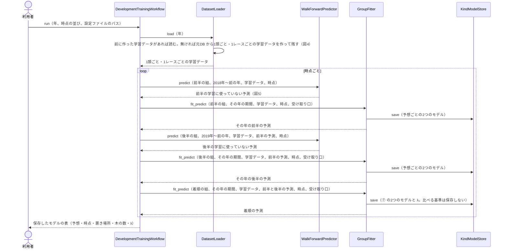
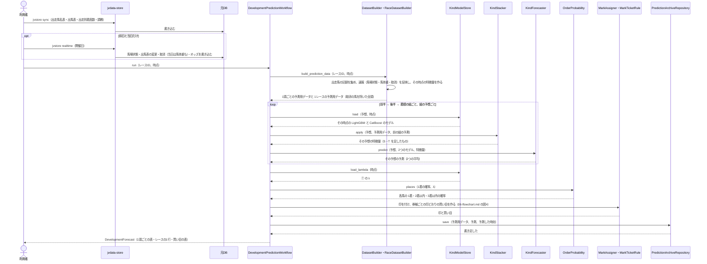
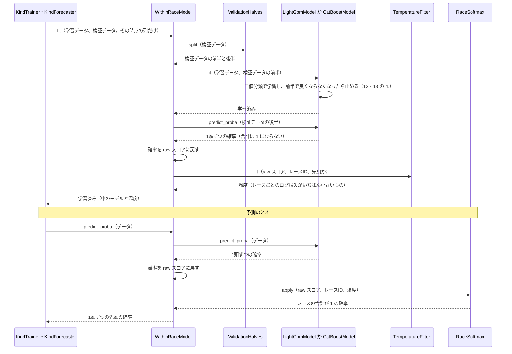
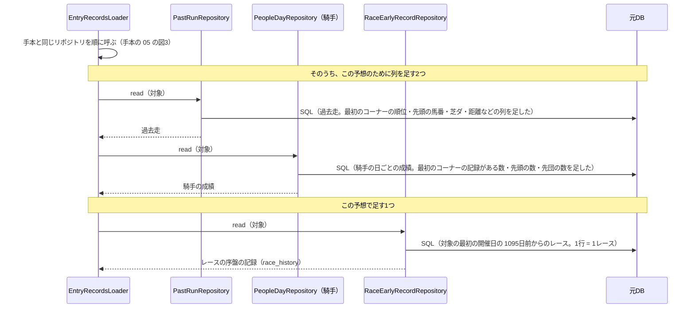
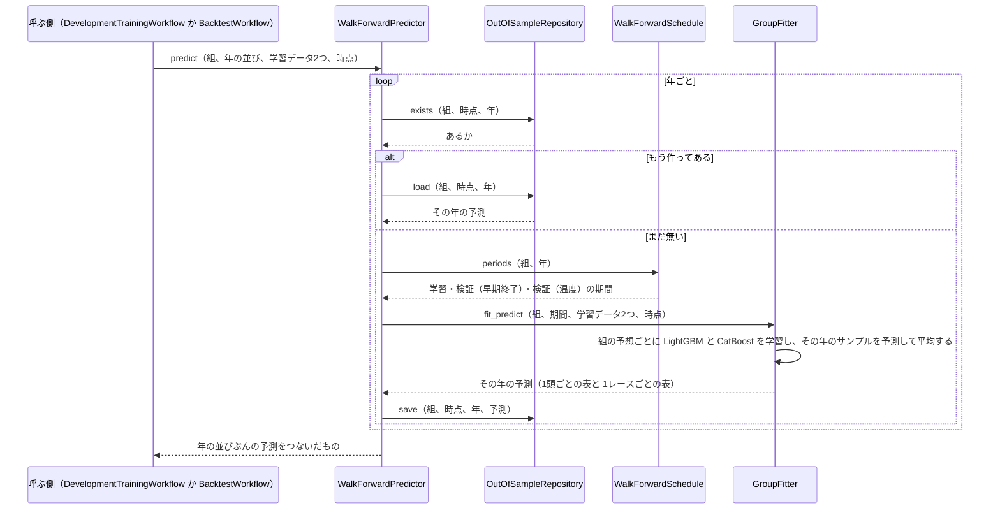
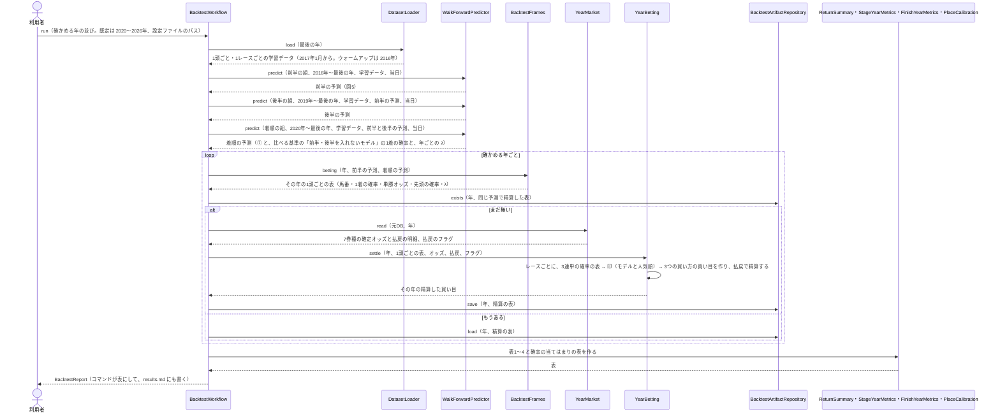

# 05 学習と予測のやりとり（シーケンス図）

**この文書で示すこと:** 学習・予測・年ごとの確かめのとき、利用者・jvdata-store・元DB と、[04-classes.md](04-classes.md) のクラスが、どの順に、どのメソッドを呼ぶか。

**結論: 流れは「学習」「予測」「年ごとの確かめ」の3つに分かれる。** 学習は `DevelopmentTrainingWorkflow` が進め、時点ごとに、前半・後半の組の前の年までの「学習に使っていない予測」（`WalkForwardPredictor`）と、指定の年のモデル（`GroupFitter`）を作って保存する。予測は `DevelopmentPredictionWorkflow` が進め、前半 → 後半 → 着順の順に予測して、前の組の予測を次の組の予測用データに足し（`KindStacker`）、印と買い目まで出して残す。年ごとの確かめは `BacktestWorkflow` が進め、3つの組の学習に使っていない予測を年ごとに作り、買い目を精算して表にする。

- public メソッドの中の判断（if 文による分かれ道）は [06-flowchart.md](06-flowchart.md) を参照。2種類の図の使い分けは [01-overview.md](01-overview.md#図の使い分け) を参照。
- 図の読み方（実線の矢印・点線の矢印・自分に戻る矢印・`loop`・`opt`）は、手本と同じで、[手本の 05 の「図の読み方」](../近走と適性から3着以内を予想/05-sequence.md#図の読み方) を参照。
- 用語の意味は [02-glossary.md](02-glossary.md) を参照。

## 図に出てくるもの

| 名前 | 種類 | 呼ばれ方 | 今あるか |
|---|---|---|---|
| 利用者 | 人 | ― | ― |
| jvdata-store | 隣のリポジトリの道具。JV-Data を取得して、元DB に入れる | コマンド（`jvstore sync` か `jvstore realtime`）を1回実行する | ある |
| 元DB | jvdata-store が作った DuckDB。この AI は読むだけ | SQL を1回流す | ある |
| `DevelopmentTrainingWorkflow`・`BacktestWorkflow` など | この予想のクラス。一覧と仕事は [04-classes.md](04-classes.md#3-この予想だけのクラスの一覧) を参照 | public メソッドを1回呼ぶ | ある（2026-09-26 に作った） |
| `DatasetBuilder`・`EnsembleModel`・`ModelRepository` など | 共通のクラス。[手本の 04](../近走と適性から3着以内を予想/04-classes.md#クラスの一覧) を参照 | public メソッドを1回呼ぶ | ある（一部を変える。[04-classes.md の 2.](04-classes.md#2-共通の部品に足すもの変えるもの)） |
| `LGBMClassifier`・`CatBoostClassifier`・`LGBMRegressor`・`CatBoostRegressor` | ライブラリのクラス（図には出さず、12・13 に書く） | `fit()`・`predict_proba()`・`predict()` を1回呼ぶ | ライブラリはある |
| モデルのファイル | 学習済みのモデルを保存したファイル | 1回書き込むか、1回読み込む | `train` を実行すると、`reports/race_development/models/` にできる |
| 予測の記録 | 予測のたびに書き足すファイル | 1回書き込む | `predict` を実行すると、`reports/race_development/predictions/` にできる |
| 学習に使っていない予測・年ごとの確かめの表 | 前の組の年ごとの予測と、精算の表 | 1回書き込むか、1回読み込む | `train`・`backtest` を実行すると、`reports/race_development/out_of_sample/`・`reports/race_development/backtest/` にできる |

## 図1. 学習

時点ごとに、7つの予想の、予測に使うモデルを学習して保存する流れ（`train`）。予測に使うのは ``year`` 年のモデル（学習は組の最初の年 〜（year−1）年9月、検証は（year−1）年10〜12月）で、年ごとの確かめの ``year`` 年のモデルと同じ作り方である。

**説明。** 元DB を読むのは、学習データを作る段だけである（1頭ごとと 1レースごとの2回。前に作ったものがあれば読まない）。学習データは当日の時点の特徴量で作り、木曜と前日のモデルには、その時点で使う列だけを渡す（[07-prediction-timing.md](07-prediction-timing.md#時点ごとに使う特徴量)）。前の組の予測（S・T）は時点ごとに作る（木曜の後半のモデルには、木曜の前半のモデルの予測）。`WalkForwardPredictor` が作った前の年までの予測は、年ごとの確かめと共有し、同じ条件なら読むだけにする。着順の組は後の組が無いので、前の年までの予測は作らない。`GroupFitter` の中の1つの予想の学習は、`KindStacker` で予想ごとの学習データを作り（S・T を足す）、目的変数を持ち替え、期間で学習・検証・予測に分けて、`KindTrainer` で LightGBM と CatBoost を学習し、`KindForecaster` で予測する（図5）。モデルは、8種類（7つの予想のうち、③は区分と秒数の2つ）× 3つの時点 × 2つのライブラリで、48組になる。

## 図2. 予測

木曜・前日・当日のどれかの時点で、1レースを予測するときの流れ（`predict`）。

**説明。** 予測用データも、学習と同じ `DatasetBuilder`・`RaceDatasetBuilder` で作り、前の組の予測の列も、学習と同じ `KindStacker` で足す（[11-leak-prevention.md](11-leak-prevention.md#決まり) の 4）。速報の取消を反映したあとの全頭で、L（同じレースの馬との比較）と P（ペースの材料）を作り直す（[11-leak-prevention.md](11-leak-prevention.md#決まり) の 9）。取消が出たら、出し直すと全頭の確率が変わる。木曜は馬番が決まっていないので、買い目は出さない。印の☆は単勝オッズを使うので、オッズがまだ無い木曜は付かない。期待値で買う買い目は、確定オッズが要るので、年ごとの確かめだけで出す。

## 図3. 先頭の確率をレースの中でそろえる

図1・図5 の `GroupFitter` の中で、`KindTrainer` が ① 先頭（と ⑦ 1着）の1つのモデルを学習するときの `fit` と、`KindForecaster` が予測するときの `predict_proba` の中の呼び出しを示す。LightGBM と CatBoost で同じ流れで、中のモデル（`LightGbmModel` か `CatBoostModel`）だけが違う。

⑦（1着）も、この図と同じ流れで、目的変数が「先頭」ではなく「1着」になるだけである。⑦では、`GroupFitter` が、2つのモデルの確率を平均したあと、同じ検証データの後半で、`OrderLambdaFitter` に 2着・3着の割り当てのならしの指数 λ を決めさせる。λ は予測の表に入れ、学習（train）ではモデルと同じフォルダに書く（[10-target.md の 10.](10-target.md#10-着順の目的変数と確率の出し方)）。

**説明。** 検証データを前半と後半に分けるのは、木の数（早期終了）を決めるデータと、温度を決めるデータを別にするためである（[16-evaluation.md](16-evaluation.md#1-期間の分け方)）。予測のときの「データ」は、1レースの全頭である。取消の馬を除いてから `predict_proba` を呼ぶので、残った馬だけで合計が 1 になる。

## 図4. 記録を集める（足すリポジトリ）

図1・図2 の「記録を集める」は、手本の流れ（[手本の 05 の図3](../近走と適性から3着以内を予想/05-sequence.md#図3-記録を集めるリポジトリとのやりとり)）のあとに、この予想で足すリポジトリを1つ呼ぶ。`EntryRecordsLoader` は、この予想から作られるときだけ `RaceEarlyRecordRepository` を受け取り、ほかの予想では呼ばない（[04-classes.md の 2.](04-classes.md#2-共通の部品に足すもの変えるもの)）。

**説明。** `race_history` には、学習では「ウォームアップの始まりの 1095日前から」の全部のレース、予測では「予測するレースの 1095日前から」の全部のレースと、予測するレース自身（条件の列だけ）が入る。特徴量を作るときは、開催日の前日までの行だけを見る（[11-leak-prevention.md](11-leak-prevention.md#決まり) の 2）。

## 図5. 前の組の学習に使っていない予測を作る

図1 の `WalkForwardPredictor.predict` の中の呼び出し。1つの組（前半か後半）と1つの時点について、年ごとに「その年より前だけで学習し、その年を予測する」をくり返す（[11-leak-prevention.md の決まり 11](11-leak-prevention.md#決まり)）。

**説明。** 年ごとの予測は `reports/race_development/out_of_sample/` に残し、2回目からは読むだけにする。学習（`train`）でも年ごとの確かめ（`backtest`）でも、同じ年・同じ組・同じ時点の予測は同じものなので、一度作れば両方で使える。ただし、設定ファイルか学習データの期間を変えたら、残した予測は使えないので、`OutOfSampleRepository` は、予測と一緒に設定ファイルの中身と期間を書いておき、違っていれば「まだ無い」と答える。後半の組の予測を作るときの学習データには、前半の組の予測（S）がすでに足してある。

## 図6. 年ごとの的中率と回収率の確かめ

`backtest` コマンドの流れ（[16-evaluation.md の 7.](16-evaluation.md#7-年ごとの的中率と回収率)）。時点は当日だけである。

**説明。** 着順の組も `WalkForwardPredictor` で作るので、確かめる年の予測は、どれもその年より前だけで学習したモデルのものになる。元DB を開くのは、学習データを作る段と、年ごとの確定オッズ・払戻を読む段だけである（3連単の確定オッズは1年で千万行を超えるので、1年ずつ読む）。券種ごとの当たる確率は、1レースずつ 3連単の確率の表（18頭立てで 4,896 通り）を作ってから足し算で出す（`TicketProbability`）。精算の表は、その年の予測の中身から作った名前で残すので、予測が変わらなければ、途中で止まっても作り直さない。

## まだ決まっていないところ

| 図の中の部分 | 今の状態 |
|---|---|
| アンサンブルの平均のしかた | 手本と同じく単純な平均。先頭と1着の確率は、合計 1 の確率どうしの平均なので、平均しても合計 1 になる |
| 既存の予想（3着以内など）に、この予想の出力を渡す流れ | この設計には入れない（[15-decisions.md](15-decisions.md#11-既存の予想に渡すか)）。着順は、この設計の中の⑦で出す |
| 年ごとの確かめを、木曜と前日の時点でもするか | しない（当日だけ）。当日の結果を見てから決める（[15-decisions.md の 18](15-decisions.md#18-年ごとの確かめのしかた)） |
| 学習をやり直す間隔 | 決まっていない。`train --year` の年のモデルは、前の年の12月までのデータで学習するので、年に1回（1月）が目安 |
| 予測を利用者に見せる形（表・画面など） | この設計では、コマンドの表だけ。画面は別に決める |

## 文書情報

| 項目 | 内容 |
|---|---|
| 作成日 | 2026-09-26 |
| 更新 | 2026-09-26 図1・図2 に後半と着順を足し、図5（学習に使っていない予測）・図6（年ごとの確かめ）を足した |
| 更新 | 2026-09-26 図1・図2・図6 を、作ったプログラムの呼び出しに合わせて書き直した |
