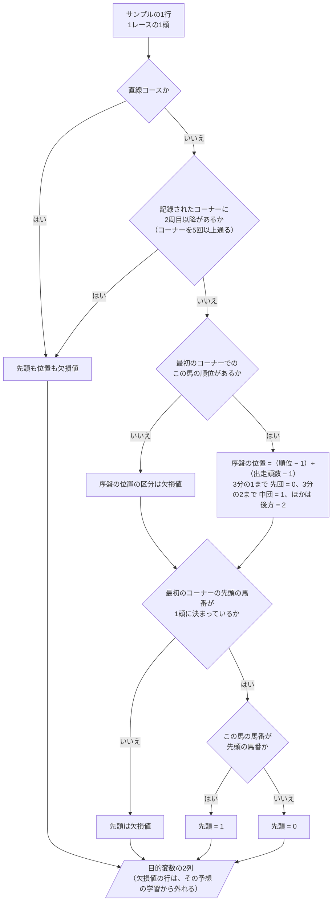
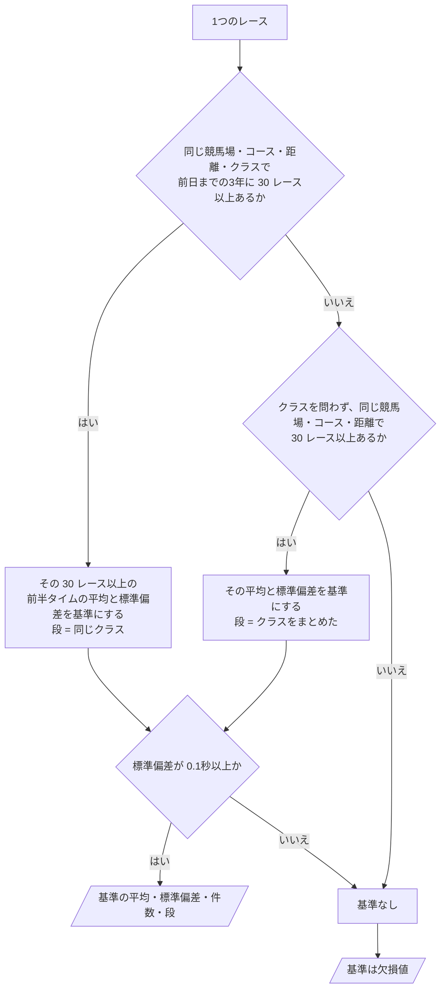
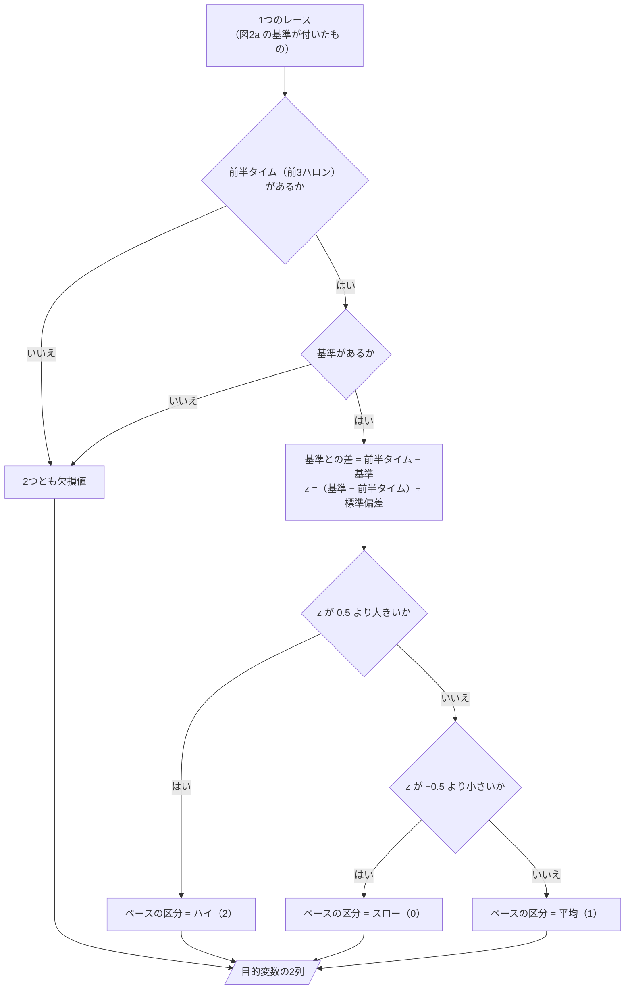
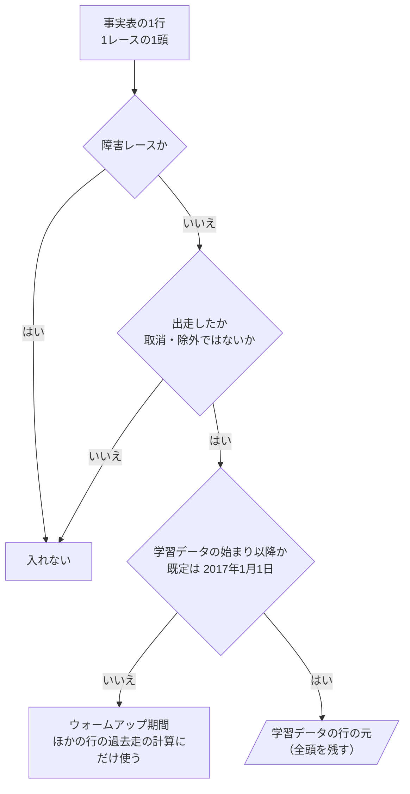
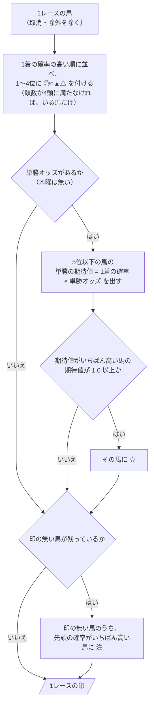
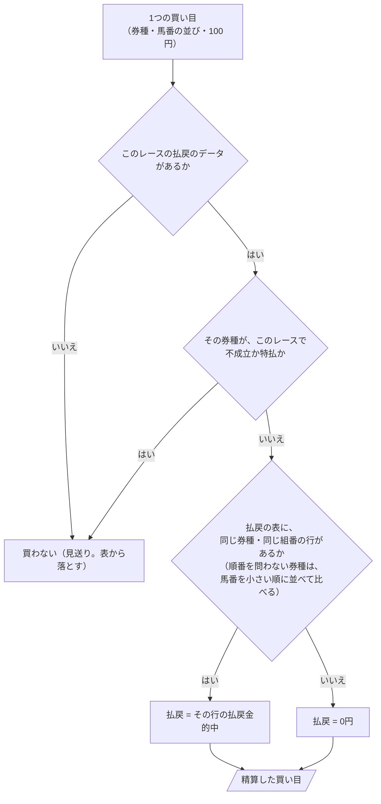
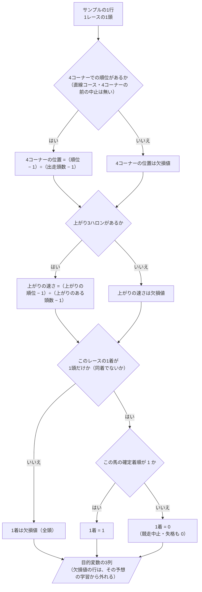

# 06 判断の手順（フローチャート）

**この文書で示すこと:** 学習データを作るときの、条件によって分かれる判断の手順。

**結論: 条件によって分かれる判断は「先頭と序盤の位置の正解の付け方」（図1）、「前半タイムの基準の決め方とペースの正解の付け方」（図2。後半タイムの基準も同じ）、「学習データに入れる行の選び方」（図3）、「印の付け方」（図4）、「買い目の精算」（図5）、「後半と着順の正解の付け方」（図6）である。この文書では、それをフローチャートで示す。**

- この文書は、1つの public メソッドの中で、条件で分かれる判断の手順を示す。クラスどうしのやりとりは [05-sequence.md](05-sequence.md) を参照。2種類の図の使い分けは [01-overview.md](01-overview.md#図の使い分け) を参照。
- 図の読み方（四角・ひし形・平行四辺形・矢印）は手本と同じで、[手本の 06 の「図の読み方」](../近走と適性から3着以内を予想/06-flowchart.md#図の読み方) を参照。
- 目的変数の決まりそのもの（なぜそうするか）は [10-target.md](10-target.md) に書いた。この文書は、その決まりをメソッドの中でどの順に確かめるかを示す。

## 図1. 先頭と序盤の位置の正解の付け方

`EarlyPositionLabeler.build()`（`DatasetBuilder.build_training_data()` から呼ばれる）の中で、サンプルの1行（1レースの1頭）に、目的変数「先頭」と「序盤の位置の区分」を付ける判断。値は事実表に足した列（[04-classes.md の 2.](04-classes.md#2-共通の部品に足すもの変えるもの)）から読む。

**説明。** 「先頭の馬番が1頭に決まっているか」は、事実表を作るときに、通過順位の文字列の先頭から決めてある（[10-target.md の 2.](10-target.md#2-先頭の馬の目的変数)）。先頭が欠損値になるのはレース単位で、そのレースの全頭が先頭の学習から外れる。先頭が決まらないレースでも、序盤の位置の区分は付くので、②の学習には入る。最初のコーナーの前に競走を中止した馬は、順位が無いので②から外れるが、①では「先頭ではなかった（0）」になる。

## 図2. 前半タイムの基準の決め方とペースの正解の付け方

### 図2a. 基準の決め方

`PaceBaseline.attach()`（`PaceRecordSource.read()` から呼ばれる）の中で、1つのレースに前半タイムの基準を付ける判断。数える元は、そのレースの開催日の前日までの 1095日（3年）に行われた、成績の確定したレースである。

**説明。** 距離が同じなら、前半タイムの測る区間（500・550・600m）も同じになるので、測る区間の違うレースが混ざることは無い。馬場状態は基準に入れない（[10-target.md の 5.](10-target.md#5-前半タイムの基準の作り方)）。30 レースと 0.1秒は初期値で、`PaceBaseline` の定数にする。

### 図2b. ペースの正解の付け方

`RaceLabeler.build()`（`RaceDatasetBuilder.build_training_data()` から呼ばれる）の中で、1つのレースに目的変数「ペースの区分」と「前半タイムの基準との差」を付ける判断。

**説明。** z は、速いほどプラスになるように引き算の向きを決めてある。0.5 の線引きは [15-decisions.md の 5](15-decisions.md#5-ペースの区分の線引き) で決める。

## 図3. 学習データに入れる行の選び方

`EarlyRunnerSelector.training_samples()`（`DatasetBuilder.build_training_data()` と `RaceDatasetBuilder.build_training_data()` から呼ばれる）の中で行う判断。事実表の1行（1レースの1頭）が、学習データの行の元になるまで。1レースごとの学習データは、ここで残った行をレースごとに集約して作る。

**説明。** 手本の図1 と同じ判断で、違うのは学習データの始まりの既定の日だけである（[08-training-data.md](08-training-data.md#5-期間の指定)）。**全頭を残す**のは、L（同じレースの馬との比較）と P（ペースの材料）を、レースの全出走馬から作るためである。正解が付かない行（直線コースなど）は、ここでは落とさず、目的変数を欠損値にして、予想ごとに `with_label()` で外す（図1）。予測用データも同じ手順を通るが、3つ目の問いは常に「はい」になる。木曜と前日は、その時点で取消・除外になっていない馬を「出走した」とみなす。

## 図4. 印の付け方

`MarkAssigner.assign()`（`DevelopmentPredictionWorkflow.run()` と `BacktestWorkflow.run()` から呼ばれる）の中で、1レースの馬に印を付ける判断。材料は、各馬の 1着の確率（⑦）・先頭の確率（①）・単勝オッズ（当日と前日だけ）である。印の意味は [16-evaluation.md の 8.](16-evaluation.md#8-券種ごとの買い方) を参照。

**説明。** ◎○▲△ は1着の確率の順位だけで決まる。☆と注は、買い方には使わず、表示だけに使う（[15-decisions.md の 21](15-decisions.md#21-印のと注の付け方)）。比べる基準の `PopularityMarkAssigner` は、1着の確率の代わりに単勝オッズの低い順に ◎○▲△ を付け、☆と注は付けない。

## 図5. 買い目の精算

`TicketSettler.settle()`（`BacktestWorkflow.run()` から呼ばれる）の中で、1つの買い目の払戻を決める判断。

**説明。** 不成立・特払の券種を見送りにするのは、研究「馬券の買い方の検証」と同じ扱いにして、比べやすくするためである（回収率への影響はほぼ無い）。同着で払戻の行が複数あるときも、買い目の組番と同じ行は1つだけなので、その行の払戻金になる。複勝（2〜3行）とワイド（3行）は、払戻の行が複数あるのがふつうで、どれか1行と組番が合えば的中である。取消・除外の馬を含む買い目は、買い目を作る段で作らない（[16-evaluation.md の 8.](16-evaluation.md#8-券種ごとの買い方)）ので、ここには来ない。

## 図6. 後半と着順の正解の付け方

`LateLabeler.build()` と `FinishLabeler.build()`（`DatasetBuilder.build_training_data()` から呼ばれる）の中で、サンプルの1行（1レースの1頭）に、④⑤⑦の目的変数を付ける判断。

**説明。** 4コーナーの位置と上がりの速さは、図1 の序盤の位置と同じく、`RelativeRank` で 0〜1 に直す。⑥（後半タイムの基準との差）は、図2a の基準の決め方を後半タイムで行い、図2b の「基準との差」の段だけを使う（区分は作らない）。

## 文書情報

| 項目 | 内容 |
|---|---|
| 作成日 | 2026-09-26 |
| 更新 | 2026-09-26 図4（印の付け方）・図5（買い目の精算）・図6（後半と着順の正解の付け方）を足した |
