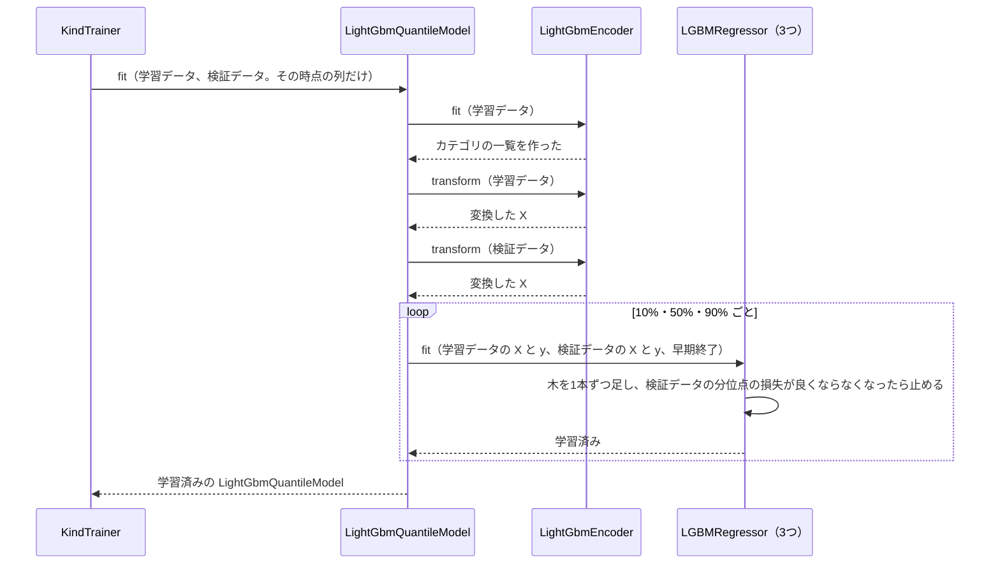
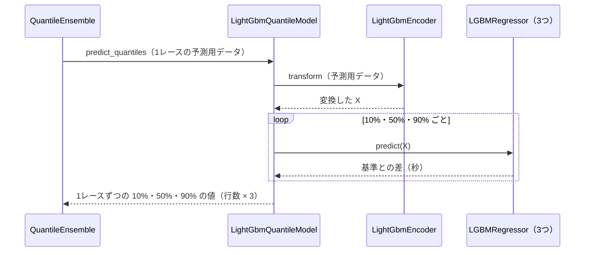

# 12 LightGBM で学習・予測するための設計

**この文書で決めること:** 07〜10 で決めた学習データ（特徴量と目的変数）は、LightGBM と CatBoost に共通である。この文書では、それを LightGBM で学習・予測するために、LightGBM だけに必要な次の3つを、8種類のモデル（先頭・序盤の位置・ペースの区分・前半タイム・4コーナーの位置・上がりの速さ・後半タイム・1着）について決める。

| 決めること | 結論 |
|---|---|
| 1. 学習データの渡し方 | 手本と同じ。カテゴリ特徴量を category 型にし、出走の少ない値は「その他」にまとめる。この予想で足す特徴量は、すべて数値なのでそのまま渡す |
| 2. ハイパーパラメータの初期値 | 目的関数だけ予想ごとに変え、ほかは手本と同じ値から始める。先頭は二値分類（`binary`）、序盤の位置とペースの区分は多クラス分類（`multiclass`、3クラス）、前半タイムは分位点回帰（`quantile`、10%・50%・90% の3つのモデル） |
| 3. 学習・予測・保存の手順 | 8種類 × 3つの時点（[07-prediction-timing.md](07-prediction-timing.md)）で、24組のモデルを学習する。先頭と1着は、学習のあとに温度を決めて一緒に保存する（4.〜6.） |

- 用語の意味は [02-glossary.md](02-glossary.md) を参照。
- CatBoost の設計は [13-catboost.md](13-catboost.md) を参照。
- LightGBM の使い方の基本は [手本の 03 の「4. LightGBM の使い方」](../近走と適性から3着以内を予想/03-library-basics.md#4-lightgbm-の使い方)、この予想で足す使い方（レースの中でそろえる・分位点回帰）は [03-library-basics.md](03-library-basics.md) を参照。
- 図の読み方は、[手本の 05 の「図の読み方」](../近走と適性から3着以内を予想/05-sequence.md#図の読み方) を参照。

## 1. 学習データの渡し方

手本と同じである（[手本の 12 の「1. 学習データの渡し方」](../近走と適性から3着以内を予想/12-lightgbm.md#1-学習データの渡し方)）。数値特徴量は欠損値も NaN のまま渡し、カテゴリ特徴量は `category` 型にして、学習データでの出走が 2000 回未満の値を「その他」にまとめる。この予想で足す K〜M・P・Q は、すべて数値特徴量である（[09-features.md](09-features.md#カテゴリ特徴量の渡し方)）。

| この予想で違うところ | 渡し方 | 理由 |
|---|---|---|
| 1レースごとの学習データ（③）の、出走の少ない値 | `min_category_count`（2000）は、1レースを1回と数える。約 3.2 万レースでは、競馬場・芝ダのような種類の少ない値しか残らない | ③のカテゴリ特徴量は R の条件だけで、騎手や父は入らない（荒れ具合の予想と同じ） |
| 前半タイム（分位点回帰）の目的変数 | 基準との差（秒）を、小数のまま `y` に渡す | 回帰なので、クラスの番号ではない |

## 2. ハイパーパラメータの初期値

LightGBM の引数名で書く。ここの値は設定ファイルの初期値で、プログラムを書き換えずに設定ファイルで変えられる（[14-hyperparameter-settings.md](14-hyperparameter-settings.md)）。値は仮で、検証データで調整する。

**8種類のモデルに共通の値**は、手本と同じである（[手本の 12 の「2. ハイパーパラメータの初期値」](../近走と適性から3着以内を予想/12-lightgbm.md#2-ハイパーパラメータの初期値)）: `learning_rate` 0.05、`n_estimators` 2000、早期終了 100 回、`num_leaves` 31、`min_child_samples` 100、`subsample` 0.8（`subsample_freq` 1）、`colsample_bytree` 0.8、`random_state` 42。

**予想ごとに違うもの**は、目的関数と、それに付く引数だけである。どれも設定ファイルでは変えられない（変えると、予測の値の意味が変わるため）。

| 予想 | ライブラリのクラス | `objective` | 付く引数 | 早期終了に使うデータ | 理由 |
|---|---|---|---|---|---|
| ① 先頭 | `LGBMClassifier`（`LightGbmWithinRaceModel` の中の `LightGbmModel`） | `binary` | ― | 検証データの前半 | 1頭ずつ「先頭になるか」を学ぶ。レースの中でそろえるのは、そのあと（[05-sequence.md の図3](05-sequence.md#図3-先頭の確率をレースの中でそろえる)） |
| ② 序盤の位置 | `LGBMClassifier` | `multiclass` | `num_class` = 3（学習データのクラスの並びから決める） | 検証データ | 先団・中団・後方の3つの確率を返す |
| ③ ペースの区分 | `LGBMClassifier` | `multiclass` | `num_class` = 3 | 検証データ | ハイ・平均・スローの3つの確率を返す |
| ③ 前半タイム | `LGBMRegressor` を3つ | `quantile` | `alpha` = 0.1・0.5・0.9（1つのモデルに1つ） | 検証データ | それぞれが 10%・50%・90% の分位点を返す。LightGBM は1つのモデルで1つの分位点しか学べない |
| ④ 4コーナーの位置・⑤ 上がりの速さ | `LGBMRegressor`（`LightGbmRegressionModel`） | `regression` | ― | 検証データ | 0〜1 の値を、二乗誤差で当てる（[03-library-basics.md の 4.](03-library-basics.md#4-4コーナーの位置と上がりの速さの回帰)） |
| ⑥ 後半タイム | `LGBMRegressor` を3つ | `quantile` | `alpha` = 0.1・0.5・0.9 | 検証データ | ③と同じ |
| ⑦ 1着 | `LGBMClassifier`（`LightGbmWithinRaceModel` の中の `LightGbmModel`） | `binary` | ― | 検証データの前半 | ①と同じ。温度は検証データの後半で決める |

- 1 と 0 の数・クラスの数の偏りを直す設定（`is_unbalance`・`class_weight`）は使わない（[10-target.md の 6.](10-target.md#6-クラスと-10-の数の偏り)）。
- 1レースごとの学習データ（③）は約 3.2 万行で、1頭ごとの約 14分の1 である。`min_child_samples` 100 は、行の少ない③には大きすぎるかもしれない。③では 20・50・100 を検証データで比べる（荒れ具合の予想と同じ）。

## 3. カテゴリ特徴量の値の変え方（フローチャート）

手本と同じで、共通の `LightGbmEncoder` をそのまま使う。図は [手本の 12 の「3.」](../近走と適性から3着以内を予想/12-lightgbm.md#3-カテゴリ特徴量の値の変え方フローチャート) を参照。

## 4. 学習のやりとり（シーケンス図）

**① 先頭** は、`LightGbmWithinRaceModel` が中の `LightGbmModel` を学習させてから温度を決める。流れは [05-sequence.md の図3](05-sequence.md#図3-先頭の確率をレースの中でそろえる)、中の `LightGbmModel` の学習は [手本の 12 の「4.」](../近走と適性から3着以内を予想/12-lightgbm.md#4-学習のやりとりシーケンス図) と同じである。

**② 序盤の位置・③ ペースの区分** は、共通の `LightGbmMulticlassModel` の学習で、[荒れ具合の 12 の「4.」](../レースの荒れ具合を4段階で予想/12-lightgbm.md#4-学習のやりとりシーケンス図) と同じである（クラスの数が 4 ではなく 3）。

**⑦ 1着** は、①と同じ流れである。**④⑤** は、`GroupFitter` の中の `KindTrainer` から、下の③の図の `LGBMRegressor` を1つにした流れ（`loop` が無い）で呼ぶ。**⑥** は③と同じ流れである。

**③ 前半タイム** は、`GroupFitter` の中の `KindTrainer` から、次の流れで呼ぶ（時点ごと・年ごとに1回ずつ）。

## 5. 予測のやりとり（シーケンス図）

① 先頭の予測は [05-sequence.md の図3](05-sequence.md#図3-先頭の確率をレースの中でそろえる)、②③の区分の予測は [荒れ具合の 12 の「5.」](../レースの荒れ具合を4段階で予想/12-lightgbm.md#5-予測のやりとりシーケンス図) と同じである。③ 前半タイムは次の流れになる（[05-sequence.md の図2](05-sequence.md#図2-予測) の `QuantileEnsemble.predict_quantiles()` の中の、LightGBM の分）。

## 6. 保存

- `KindModelStore` の中の共通の `ModelRepository` が、各モデルの `save(パス)` を呼ぶ。書き込みは手本と同じく `joblib.dump()` で、読み込みは `load(パス, 設定)` で `joblib.load()` を使う。ファイルの名前は、二値（①⑦）と多クラス（②③）が `lightgbm.joblib`、分位点回帰（③⑥）が `lightgbm_quantile.joblib`、回帰（④⑤）が `lightgbm_regression.joblib`（予想ごとにフォルダが違うので、名前が同じでもぶつからない）。
- `LightGbmWithinRaceModel` は、中の `LightGbmModel` の中身（`LGBMClassifier` とエンコーダーの中身）に、温度を足して書き込む。温度が無いと、予測のときにレースの中でそろえられないためである。
- `LightGbmQuantileModel` は、3つの `LGBMRegressor` と、エンコーダーの中身（列の並びとカテゴリの一覧）を1つのファイルに書き込む。`LightGbmRegressionModel` は、1つの `LGBMRegressor` とエンコーダーの中身を書き込む。
- ⑦の λ は、2つのライブラリの平均に対して決める値なので、モデルのファイルではなく、`FinishForecaster` が `finish/<時点>/order_lambda.json` に書く。
- 保存先: Git の対象外の `reports/race_development/models/<予想>/<時点>/`（予想は `leader`・`position`・`pace_class`・`pace_time`・`corner4`・`closing`・`late_pace_time`・`finish`。[04-classes.md の「4. パッケージ構成」](04-classes.md#4-パッケージ構成)）。モデルは JV-Data から作ったもので、公開しないため。

## 文書情報

| 項目 | 内容 |
|---|---|
| 作成日 | 2026-09-26 |
| 更新 | 2026-09-26 後半と着順のモデル（④〜⑦）を足した |
