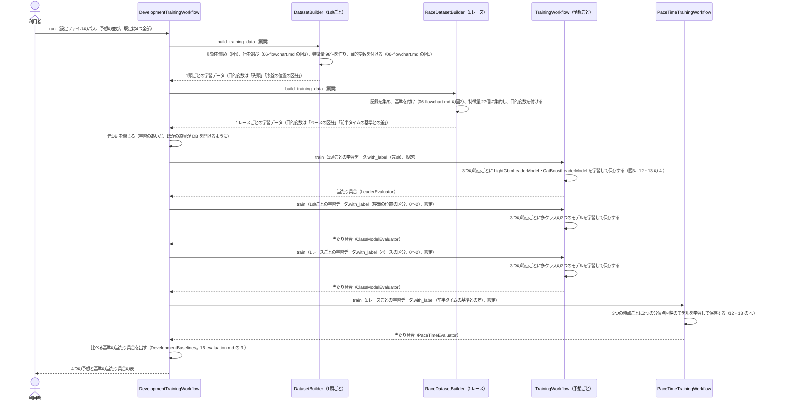
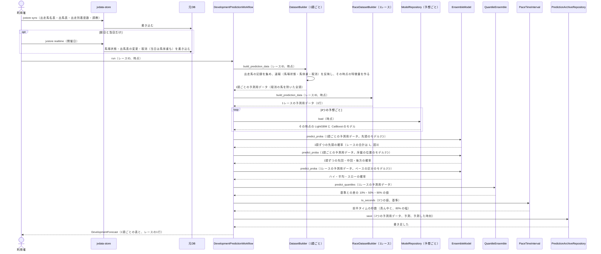
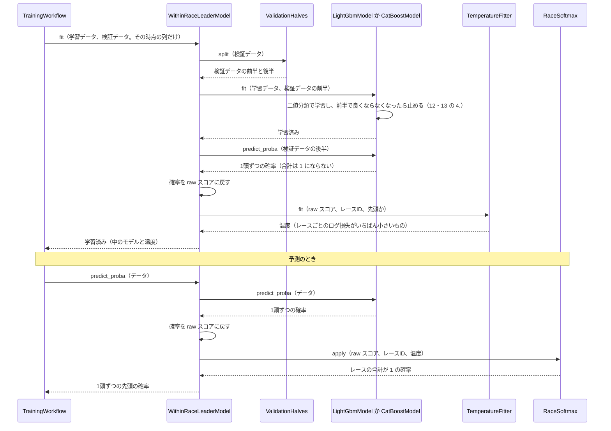
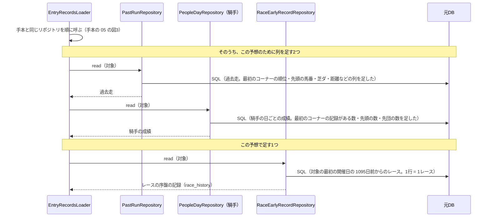

# 05 学習と予測のやりとり（シーケンス図）

**この文書で示すこと:** 学習と予測のとき、利用者・jvdata-store・元DB と、[04-classes.md](04-classes.md) のクラスが、どの順に、どのメソッドを呼ぶか。

**結論: 流れは「学習」と「予測」の2つに分かれる。** 学習は `DevelopmentTrainingWorkflow` が進め、1頭ごとと 1レースごとの学習データを1回ずつ作ってから、4つの予想（先頭・序盤の位置・ペースの区分・前半タイム）を順に学習させる。予測は `DevelopmentPredictionWorkflow` が進め、2つの予測用データを作り、4つの予想のその時点のモデルで予測して、1つの予測にまとめて残す。

- public メソッドの中の判断（if 文による分かれ道）は [06-flowchart.md](06-flowchart.md) を参照。2種類の図の使い分けは [01-overview.md](01-overview.md#図の使い分け) を参照。
- 図の読み方（実線の矢印・点線の矢印・自分に戻る矢印・`loop`・`opt`）は、手本と同じで、[手本の 05 の「図の読み方」](../近走と適性から3着以内を予想/05-sequence.md#図の読み方) を参照。
- 用語の意味は [02-glossary.md](02-glossary.md) を参照。

## 図に出てくるもの

| 名前 | 種類 | 呼ばれ方 | 今あるか |
|---|---|---|---|
| 利用者 | 人 | ― | ― |
| jvdata-store | 隣のリポジトリの道具。JV-Data を取得して、元DB に入れる | コマンド（`jvstore sync` か `jvstore realtime`）を1回実行する | ある |
| 元DB | jvdata-store が作った DuckDB。この AI は読むだけ | SQL を1回流す | ある |
| `DevelopmentTrainingWorkflow` など | この予想のクラス。一覧と仕事は [04-classes.md](04-classes.md#3-この予想だけのクラスの一覧) を参照 | public メソッドを1回呼ぶ | まだ無い |
| `DatasetBuilder`・`TrainingWorkflow` など | 共通のクラス。[手本の 04](../近走と適性から3着以内を予想/04-classes.md#クラスの一覧) を参照 | public メソッドを1回呼ぶ | ある（一部を変える。[04-classes.md の 2.](04-classes.md#2-共通の部品に足すもの変えるもの)） |
| `LGBMClassifier`・`CatBoostClassifier`・`LGBMRegressor`・`CatBoostRegressor` | ライブラリのクラス | `fit()`・`predict_proba()`・`predict()` を1回呼ぶ | ライブラリはある |
| モデルのファイル | 学習済みのモデルを保存したファイル | 1回書き込むか、1回読み込む | `train` を実行すると、`reports/race_development/models/` にできる |
| 予測の記録 | 予測のたびに書き足すファイル | 1回書き込む | `predict` を実行すると、`reports/race_development/predictions/` にできる |

## 図1. 学習

**説明。** 元DB を読むのは、1頭ごとと 1レースごとの学習データを作る2回だけである。学習データは当日の時点の特徴量で作り、木曜と前日のモデルには、その時点で使う列だけを渡す（[07-prediction-timing.md](07-prediction-timing.md#時点ごとに使う特徴量)）。4つの予想は、予想ごとに作った共通の `TrainingWorkflow`（保存先・モデルのクラス・当たり具合の測り方が違う）か、`PaceTimeTrainingWorkflow` が学習する。どれも、時期で分けた学習データで学習し、検証データで早期終了と確かめを行う（[16-evaluation.md](16-evaluation.md#1-期間の分け方)）。モデルは、4つの予想 × 3つの時点 × 2つのライブラリで、24組になる。

## 図2. 予測

木曜・前日・当日のどれかの時点で、1レースを予測するときの流れ。

**説明。** 予測用データも、学習と同じ `DatasetBuilder`・`RaceDatasetBuilder` で作る（[11-leak-prevention.md](11-leak-prevention.md#決まり) の 4）。速報の取消を反映したあとの全頭で、L（同じレースの馬との比較）と P（ペースの材料）を作り直す（[11-leak-prevention.md](11-leak-prevention.md#決まり) の 9）。取消が出たら、出し直すと全頭の確率が変わる。木曜は馬番が決まっていないので、1頭ごとの表は馬番ではなく馬ごとに返す。前半タイムの基準が作れないコース（前日までの3年に同じ条件のレースが少ない）は、ペースの区分と秒数を「基準なし」として出さない（[10-target.md](10-target.md#5-前半タイムの基準の作り方)）。

## 図3. 先頭の確率をレースの中でそろえる

図1の「LightGbmLeaderModel・CatBoostLeaderModel を学習して保存する」のうち、1つのモデルの `fit` と、図2の `predict_proba` の中の呼び出しを示す。LightGBM と CatBoost で同じ流れで、中のモデル（`LightGbmModel` か `CatBoostModel`）だけが違う。

**説明。** 検証データを前半と後半に分けるのは、木の数（早期終了）を決めるデータと、温度を決めるデータを別にするためである（[16-evaluation.md](16-evaluation.md#1-期間の分け方)）。予測のときの「データ」は、1レースの全頭である。取消の馬を除いてから `predict_proba` を呼ぶので、残った馬だけで合計が 1 になる。

## 図4. 記録を集める（足すリポジトリ）

図1・図2 の「記録を集める」は、手本の流れ（[手本の 05 の図3](../近走と適性から3着以内を予想/05-sequence.md#図3-記録を集めるリポジトリとのやりとり)）のあとに、この予想で足すリポジトリを1つ呼ぶ。`EntryRecordsLoader` は、この予想から作られるときだけ `RaceEarlyRecordRepository` を受け取り、ほかの予想では呼ばない（[04-classes.md の 2.](04-classes.md#2-共通の部品に足すもの変えるもの)）。

**説明。** `race_history` には、学習では「ウォームアップの始まりの 1095日前から」の全部のレース、予測では「予測するレースの 1095日前から」の全部のレースと、予測するレース自身（条件の列だけ）が入る。特徴量を作るときは、開催日の前日までの行だけを見る（[11-leak-prevention.md](11-leak-prevention.md#決まり) の 2）。

## まだ決まっていないところ

| 図の中の部分 | 今の状態 |
|---|---|
| アンサンブルの平均のしかた | 手本と同じく単純な平均。先頭の確率は、合計 1 の確率どうしの平均なので、平均しても合計 1 になる |
| 既存の予想（3着以内など）に、この予想の出力を渡す流れ | この設計には入れない（[15-decisions.md](15-decisions.md#11-既存の予想に渡すか)） |
| 学習をやり直す間隔 | 決まっていない。試験運用のあとで決める |
| 予測を利用者に見せる形（表・画面など） | この設計では、コマンドの表だけ。画面は別に決める |

## 文書情報

| 項目 | 内容 |
|---|---|
| 作成日 | 2026-09-26 |
