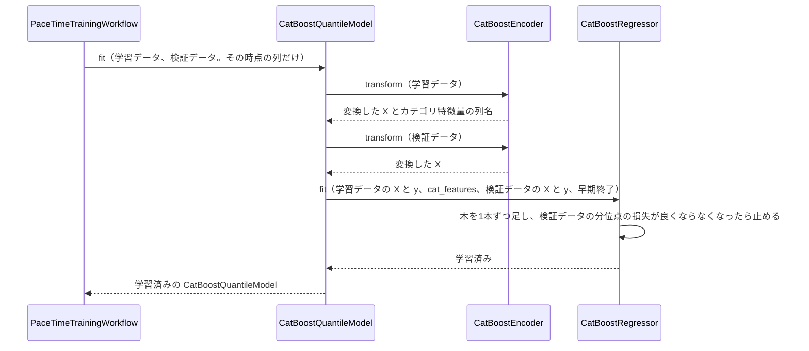
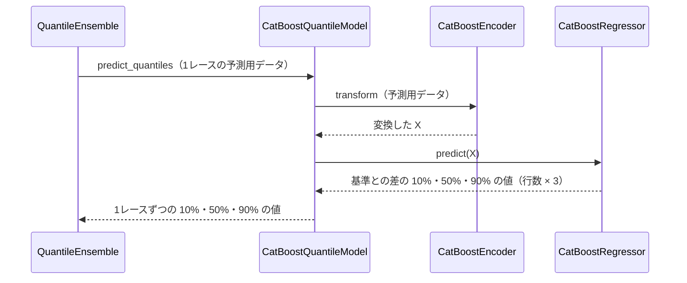

# 13 CatBoost で学習・予測するための設計

**この文書で決めること:** 07〜10 で決めた学習データ（特徴量と目的変数）は、LightGBM と CatBoost に共通である。この文書では、それを CatBoost で学習・予測するために、CatBoost だけに必要な次の3つを、4つの予想（先頭・序盤の位置・ペースの区分・前半タイム）について決める。

| 決めること | 結論 |
|---|---|
| 1. 学習データの渡し方 | 手本と同じ。カテゴリ特徴量は文字列のまま `cat_features` に指定し、欠損値だけ文字列「不明」にする。この予想で足す特徴量は、すべて数値なのでそのまま渡す |
| 2. ハイパーパラメータの初期値 | 目的関数だけ予想ごとに変え、ほかは手本と同じ値から始める。先頭は二値分類（`Logloss`）、序盤の位置とペースの区分は多クラス分類（`MultiClass`）、前半タイムは分位点回帰（`MultiQuantile`。1つのモデルで 10%・50%・90%） |
| 3. 学習・予測・保存の手順 | 4つの予想 × 3つの時点（[07-prediction-timing.md](07-prediction-timing.md)）で、12組のモデルを学習する。先頭は、学習のあとに温度を決めて一緒に保存する（4.〜6.） |

- 用語の意味は [02-glossary.md](02-glossary.md) を参照。
- LightGBM の設計は [12-lightgbm.md](12-lightgbm.md) を参照。
- CatBoost の使い方の基本は [手本の 03 の「5. CatBoost の使い方」](../近走と適性から3着以内を予想/03-library-basics.md#5-catboost-の使い方)、この予想で足す使い方（レースの中でそろえる・分位点回帰）は [03-library-basics.md](03-library-basics.md) を参照。
- 図の読み方は、[手本の 05 の「図の読み方」](../近走と適性から3着以内を予想/05-sequence.md#図の読み方) を参照。

## 1. 学習データの渡し方

手本と同じである（[手本の 13 の「1. 学習データの渡し方」](../近走と適性から3着以内を予想/13-catboost.md#1-学習データの渡し方)）。数値特徴量は欠損値も NaN のまま渡し、カテゴリ特徴量は文字列にして `cat_features` に列名を並べる。出走の少ない値はまとめない。この予想で足す K〜M・P・Q は、すべて数値特徴量である（[09-features.md](09-features.md#カテゴリ特徴量の渡し方)）。

| この予想で違うところ | 渡し方 | 理由 |
|---|---|---|
| 前半タイム（分位点回帰）の目的変数 | 基準との差（秒）を、小数のまま `y` に渡す | 回帰なので、クラスの番号ではない |

## 2. ハイパーパラメータの初期値

CatBoost の引数名で書く。ここの値は設定ファイルの初期値で、プログラムを書き換えずに設定ファイルで変えられる（[14-hyperparameter-settings.md](14-hyperparameter-settings.md)）。値は仮で、検証データで調整する。

**4つの予想に共通の値**は、手本と同じである（[手本の 13 の「2. ハイパーパラメータの初期値」](../近走と適性から3着以内を予想/13-catboost.md#2-ハイパーパラメータの初期値)）: `learning_rate` 0.05、`iterations` 2000、`early_stopping_rounds` 100、`depth` 6、`l2_leaf_reg` 3、`random_seed` 42。

**予想ごとに違うもの**は、目的関数だけである。どれも設定ファイルでは変えられない（変えると、予測の値の意味が変わるため）。

| 予想 | ライブラリのクラス | `loss_function` | 早期終了に使うデータ | 理由 |
|---|---|---|---|---|
| ① 先頭 | `CatBoostClassifier`（`CatBoostLeaderModel` の中の `CatBoostModel`） | `Logloss` | 検証データの前半 | 1頭ずつ「先頭になるか」を学ぶ。レースの中でそろえるのは、そのあと（[05-sequence.md の図3](05-sequence.md#図3-先頭の確率をレースの中でそろえる)） |
| ② 序盤の位置 | `CatBoostClassifier` | `MultiClass` | 検証データ | 先団・中団・後方の3つの確率を返す。クラスの数は `y` から決まる |
| ③ ペースの区分 | `CatBoostClassifier` | `MultiClass` | 検証データ | ハイ・平均・スローの3つの確率を返す |
| ③ 前半タイム | `CatBoostRegressor` を1つ | `MultiQuantile:alpha=0.1,0.5,0.9` | 検証データ | 1つのモデルで 10%・50%・90% の分位点を返す（`predict()` が 行数 × 3） |

- 1 と 0 の数・クラスの数の偏りを直す設定（`auto_class_weights`）は使わない（[10-target.md の 6.](10-target.md#6-クラスと-10-の数の偏り)）。
- 1レースごとの学習データ（③）は行が少ないので、`depth` を 4・6 で検証データで比べる（荒れ具合の予想と同じ）。
- **比べる候補:** ① を `CatBoostRanker(loss_function="QuerySoftMax")` にすると、はじめからレースの中で合計 1 になるように学べる（[03-library-basics.md の 2.](03-library-basics.md#2-先頭の確率をレースの中で合計-1-にそろえる)）。最初の作り方にはせず、[15-decisions.md の 1](15-decisions.md#1-先頭の確率の作り方) で決める。

## 3. カテゴリ特徴量の値の変え方（フローチャート）

手本と同じで、共通の `CatBoostEncoder` をそのまま使う。図は [手本の 13 の「3.」](../近走と適性から3着以内を予想/13-catboost.md#3-カテゴリ特徴量の値の変え方フローチャート) を参照。

## 4. 学習のやりとり（シーケンス図）

**① 先頭** は、`CatBoostLeaderModel` が中の `CatBoostModel` を学習させてから温度を決める。流れは [05-sequence.md の図3](05-sequence.md#図3-先頭の確率をレースの中でそろえる)、中の `CatBoostModel` の学習は [手本の 13 の「4.」](../近走と適性から3着以内を予想/13-catboost.md#4-学習のやりとりシーケンス図) と同じである。

**② 序盤の位置・③ ペースの区分** は、共通の `CatBoostMulticlassModel` の学習で、[荒れ具合の 13 の「4.」](../レースの荒れ具合を4段階で予想/13-catboost.md#4-学習のやりとりシーケンス図) と同じである（クラスの数が 4 ではなく 3）。

**③ 前半タイム** は、`PaceTimeTrainingWorkflow` から、次の流れで3つの時点ごとに1回ずつ呼ぶ。

## 5. 予測のやりとり（シーケンス図）

① 先頭の予測は [05-sequence.md の図3](05-sequence.md#図3-先頭の確率をレースの中でそろえる)、②③の区分の予測は [荒れ具合の 13 の「5.」](../レースの荒れ具合を4段階で予想/13-catboost.md#5-予測のやりとりシーケンス図) と同じである。③ 前半タイムは次の流れになる（[05-sequence.md の図2](05-sequence.md#図2-予測) の `QuantileEnsemble.predict_quantiles()` の中の、CatBoost の分）。

## 6. 保存

- `ModelRepository` が、各モデルの `save(パス)` を呼ぶ。書き込みは手本と同じく `save_model()` で、読み込みは `load(パス, 設定)` で `load_model()` を使う。カテゴリ特徴量の列名はモデルの中に残るので、別に保存しなくてよい。
- `CatBoostLeaderModel` は、中の `CatBoostModel` のファイルに加えて、温度を同じフォルダの小さな JSON に書く。温度が無いと、予測のときにレースの中でそろえられないためである。
- 保存先: Git の対象外の `reports/race_development/models/<予想>/<時点>/`（[04-classes.md の「4. パッケージ構成」](04-classes.md#4-パッケージ構成)）。

## 文書情報

| 項目 | 内容 |
|---|---|
| 作成日 | 2026-09-26 |
