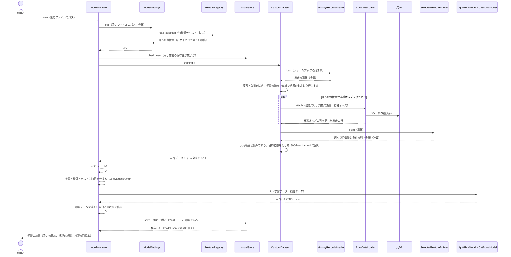
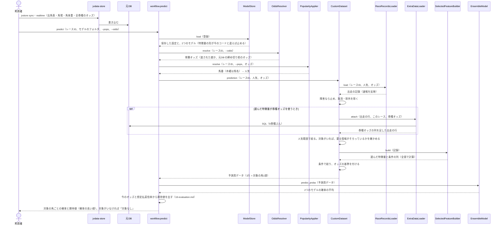

# 05 学習と予測のやりとり（シーケンス図）

**この文書で示すこと:** 学習と予測のとき、利用者・jvdata-store・元DB と、[04-classes.md](04-classes.md) のクラスが、どの順に、どのメソッドを呼ぶか。

**結論: 流れは「学習」と「予測」の2つに分かれる（テスト期間の評価は、学習の読み込み部分を使い回す）。どちらも、全頭で特徴量を作ってから、人気範囲と条件で絞る。学習では、選んだ特徴量が券種オッズを使うときだけ、それを出走の行に足す。予測では、保存した設定だけを使い、元の設定ファイルと特徴量テキストは読まない。**

- 図に出てくるものの種類と、図の読み方（凡例）は [手本の 05 の「図に出てくるもの」](../近走と適性から3着以内を予想/05-sequence.md#図に出てくるもの) と [「図の読み方」](../近走と適性から3着以内を予想/05-sequence.md#図の読み方) を参照。
- public メソッドの中の判断（if 文による分かれ道）は [06-flowchart.md](06-flowchart.md) を参照。
- 出走の記録を集めるリポジトリとのやりとりは、手本と同じである。学習は [手本の 05 の図3](../近走と適性から3着以内を予想/05-sequence.md#図3-記録を集めるリポジトリとのやりとり)、予測は [手本の 05 の図4](../近走と適性から3着以内を予想/05-sequence.md#図4-1レースの記録を集める速報の反映) を参照。

## 図1. 学習

**説明。** 利用者が `train --config <設定ファイル>` を実行する。設定を読むときに、特徴量テキストの名前が登録されているか・設定の時点に合うか・重なっていないかを、行番号付きで確かめる。同じ名前の保存先があれば、元DB を開く前に止める。

`CustomDataset.training()` は、**全頭で特徴量を作ってから絞る。** 人気範囲や条件で先に絞ると、同じレースの馬との比較（まとまり G）や、オッズの基準・券種オッズの確率（同じレースの全頭のオッズから作る）が変わってしまうためである（[08-training-data.md](08-training-data.md#3-どのサンプルを入れるか)）。

**元DB は、学習データを作り終えたら閉じる。** 学習には数分かかるので、その間 DB を握って、ほかの道具や jvdata-store の取り込みを止めないためである。

保存は、2つのモデルと検証の結果を書いたあと、最後に `model.json`（設定・特徴量の形・コードの版）を書く。途中で失敗したフォルダには `model.json` が無いので、読み込まれない（[12-lightgbm.md](12-lightgbm.md#6-保存)）。

## 図2. 予測

**説明。** 予測は、保存した `model.json` の設定だけを使う。学習のあとに設定ファイルや特徴量テキストを書き換えても、予測は変わらない。登録された特徴量の型・時点・依存項目が、保存したときと違えば、学習し直すよう案内して止める。

人気とオッズの決め方は、ほかの予想と同じ共通の部品である（[07-prediction-timing.md](07-prediction-timing.md#予測のときの人気とオッズの与え方)）。

**要る情報がそろっていなければ止める。** 選んだ特徴量（と、その依存項目・条件）に、馬番・馬体重・馬場状態・単勝オッズ・人気・券種オッズが要るのに、元DB に無ければ、取り込み方を案内して止める。対象の馬がいないレース（人気範囲や条件に当てはまらない）は、止めずに「対象なし」と出す。

## テスト期間の評価

`evaluate --models <モデルのフォルダ>` は、保存した設定で図1 の `CustomDataset.training()` までを行い、テスト期間の行だけで当たり具合と回収率を出して、モデルのフォルダに `test_evaluation.json` を書く（[16-evaluation.md](16-evaluation.md)）。複勝の想定払戻倍率は、学習期間の払戻から求める。

## 今は無く、これから作るところ

| 図の中の部分 | 今の状態 |
|---|---|
| 締め切り前の券種オッズ | 作った。jvdata-store の `jvstore realtime`（`realtime_today.bat`）が、レースごとに全賭式のオッズ（`0B30`）を取る |
| 流れを進めるクラス | 今は `workflow.py` の関数。クラスにするかは [04-classes.md](04-classes.md#4-手本の決まりと違うところ) を参照 |
| 買い目を決めて出す | 予測は確率と期待値を出すところまで。当日のレースをまとめて予想して「買い」（複勝・期待値の線以上）を出すのは、道具 `tools/当日の予想/`（[15-decisions.md](15-decisions.md#8-回収率を評価に入れるか)） |

## 文書情報

| 項目 | 内容 |
|---|---|
| 作成日 | 2026-09-26 |
