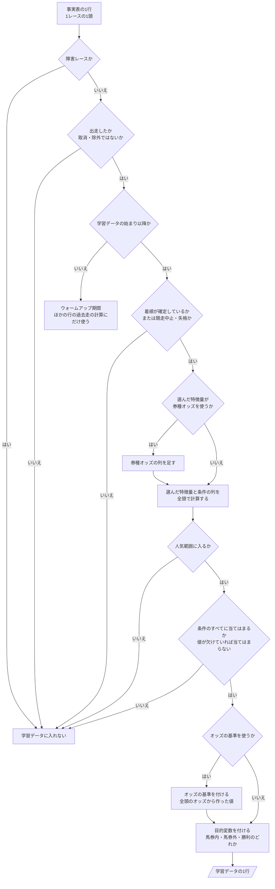
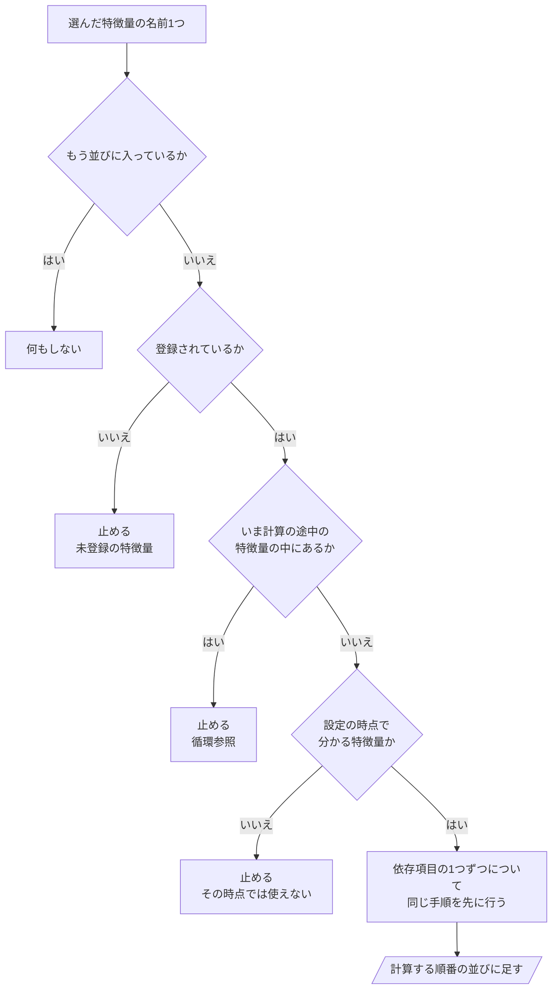

# 06 判断の手順（フローチャート）

**この文書で示すこと:** 学習データを作るときと、選んだ特徴量を計算する順番を決めるときの、条件によって分かれる判断の手順。

**結論: 条件によって分かれる判断は2つある。「学習データに入れる行の選び方」（人気範囲と条件の判断を含む）と、「特徴量を計算する順番の決め方」（登録・循環・時点の判断を含む）である。**

- この文書は、1つの public メソッドの中で、条件で分かれる判断の手順を示す。クラスどうしのやりとりは [05-sequence.md](05-sequence.md) を参照。2種類の図の使い分けは [01-overview.md](01-overview.md#図の使い分け) を参照。
- 図の読み方（凡例）は [手本の 06 の「図の読み方」](../近走と適性から3着以内を予想/06-flowchart.md#図の読み方) を参照。四角が作業、ひし形が if 文1つ、平行四辺形ができあがるものである。
- モデルごとの判断の手順（カテゴリ特徴量の値の変え方）は、手本と同じで、[手本の 12 の 3.](../近走と適性から3着以内を予想/12-lightgbm.md#3-カテゴリ特徴量の値の変え方フローチャート)・[手本の 13 の 3.](../近走と適性から3着以内を予想/13-catboost.md#3-カテゴリ特徴量の値の変え方フローチャート) を参照。

## 図1. 学習データに入れる行の選び方

`CustomDataset.training()` と、そこから呼ぶ `select_training_data()` の中で行う判断。事実表の1行（1レースの1頭）が、学習データの1行になるまで。

**説明。** 5つ目の問いまでで、レースの全出走馬が残る。特徴量は、ここで全頭について計算する。6つ目と7つ目の問い（人気範囲と条件）で絞るのは、そのあとである。同じレースの馬との比較（まとまり G）、単勝との差、オッズの基準は、どれも同じレースの全頭の値から作るので、先に絞ると値が変わってしまう（[08-training-data.md](08-training-data.md#3-どのサンプルを入れるか)）。

- 4つ目の問いは、正常に走ったのに着順が入っていない行（確定前のレースなど）を負例にしないためにある。競走中止・失格は、着順が無くても残す（[10-target.md](10-target.md#作り方)）。
- 6つ目の問いは、人気範囲を指定したときだけある。人気範囲を指定していて、人気の分からない行が1つでもあれば、止める（黙って落とすと、対象の馬が欠ける）。
- 予測用データも同じ手順を通る。ただし、これから走るレースなので3つ目と4つ目の問いは無く、目的変数を付ける段も無い。人気範囲に当てはまる馬がいれば、そのあとで、選んだ特徴量に要る情報がそろっているかを確かめる（[05-sequence.md](05-sequence.md#図2-予測)）。

## 図2. 特徴量を計算する順番の決め方

`FeatureRegistry.order()` の中で行う判断。選んだ特徴量（と条件の列）の名前から、依存項目を含めて、計算する順番を決める。学習・予測・設定の読み込みのたびに呼ばれ、登録したときにも全特徴量について一度呼ばれる。

**説明。** 依存項目を先に並べるので、どの特徴量も、依存項目を計算したあとに計算される。同じ特徴量が何度出てきても、並びには1回だけ入る（1つ目の問い）。

- 3つ目の問いは、「A は B に依存し、B は A に依存する」のような循環を見つける。
- 4つ目の問いは、依存項目にも当てる。当日から分かる特徴量に依存する特徴量は、木曜・前日の設定では選べない（[11-leak-prevention.md](11-leak-prevention.md#決まり)）。
- 止めるときは、どこから辿ってきたか（「A → B → C」）を示す。特徴量テキストの誤りなら、行番号も示す。

## 文書情報

| 項目 | 内容 |
|---|---|
| 作成日 | 2026-09-26 |
