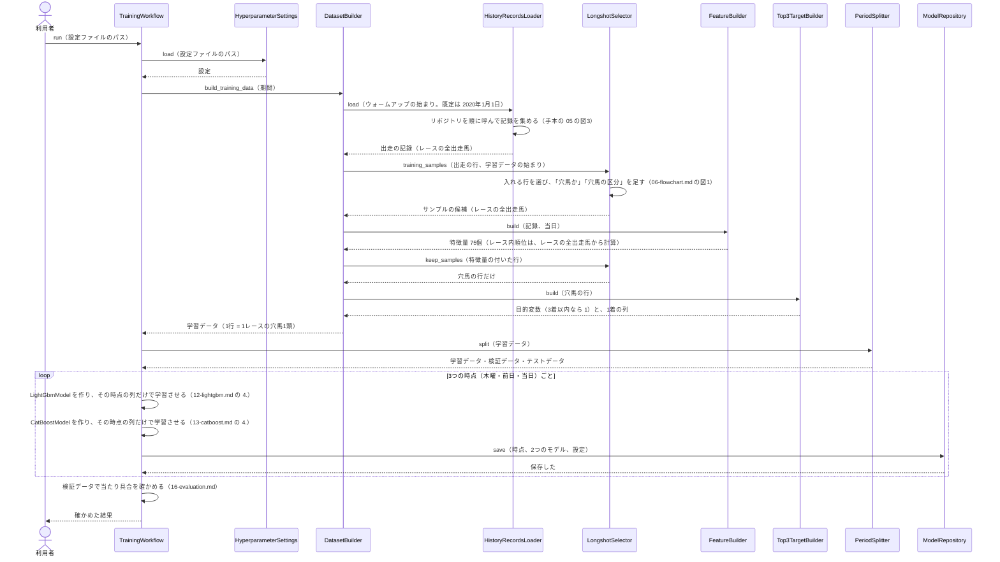
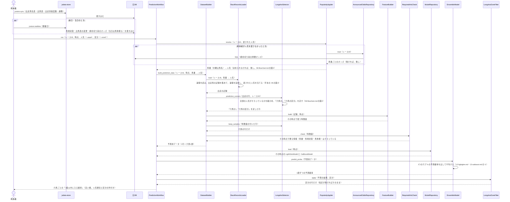

# 05 学習と予測のやりとり（シーケンス図）

**この文書で示すこと:** 学習と予測のとき、利用者・jvdata-store・元DB と、[04-classes.md](04-classes.md) のクラスが、どの順に、どのメソッドを呼ぶか。

**結論: 流れは「学習」と「予測」の2つに分かれる。** 学習は共通の `TrainingWorkflow` が進め、3つの時点（木曜・前日・当日）ごとに LightGBM と CatBoost を学習させて保存する。予測は `PredictionWorkflow` が進め、**利用者から受け取った全頭の人気を出走の行に当ててから**、穴馬の行だけの予測用データを作り、保存した2つのモデルの予測確率を平均し、最後に区分（中穴・大穴）が指定されていればその行だけに絞る。

- 図に出てくるものと、図の読み方（凡例）は [手本の 05 の「図に出てくるもの」](../近走と適性から3着以内を予想/05-sequence.md#図に出てくるもの) と [「図の読み方」](../近走と適性から3着以内を予想/05-sequence.md#図の読み方) を参照。この予想で増えるのは、利用者が渡す人気と区分、`AnnouncedOddsRepository`（危険な人気馬の予想と同じ）、`LongshotZoneFilter` である。
- public メソッドの中の判断（if 文による分かれ道）は [06-flowchart.md](06-flowchart.md) を参照。2種類の図の使い分けは [01-overview.md](01-overview.md#図の使い分け) を参照。
- **リポジトリとのやりとりは、手本とまったく同じである。** 学習データを集める流れは [手本の 05 の図3](../近走と適性から3着以内を予想/05-sequence.md#図3-記録を集めるリポジトリとのやりとり)、1レースの記録を集めて速報を反映する流れは [手本の 05 の図4](../近走と適性から3着以内を予想/05-sequence.md#図4-1レースの記録を集める速報の反映) を参照。この文書では描き直さない。

## 図1. 学習

**説明。** 利用者が設定ファイルのパスを付けて `TrainingWorkflow.run()` を呼ぶ。`TrainingWorkflow` は、設定を読み（[14-hyperparameter-settings.md](14-hyperparameter-settings.md)）、渡された期間で `DatasetBuilder` に学習データを作らせ、`PeriodSplitter` で時期に分ける。

危険な人気馬の予想と同じく、**穴馬に絞るのは、特徴量を作ったあとになる。** `LongshotSelector.training_samples()` は、障害・取消・期間でふるったうえで「穴馬か」「穴馬の区分」の列を足すだけで、行は減らさない。レース内順位（まとまり G）を、そのレースの全出走馬から計算するためである（[08-training-data.md](08-training-data.md#3-どのサンプルを入れるか)）。特徴量ができたあと、`keep_samples()` が穴馬の行だけを残し、共通の `Top3TargetBuilder` が目的変数を付ける。「穴馬の区分」の列は、学習データに残るが、モデルには渡さない（[08-training-data.md](08-training-data.md#2-列の種類)）。

学習データは、当日の時点の特徴量 75個で作る。木曜・前日のモデルには、そのうち、その時点で使う列だけを渡す（[07-prediction-timing.md](07-prediction-timing.md#時点ごとに使う特徴量)）。3つの時点ごとに2つのモデルを学習させるので、モデルは合わせて6つになる。

## 図2. 予測

木曜・前日・当日のどれかに、1レースの穴馬を予測するときの流れ。

**説明。** 利用者は、まず jvdata-store の `jvstore sync` で出走馬名表（木曜）・出馬表（前日から）・出走別着度数・調教を取り込む。前日・当日は `jvstore realtime --date <開催日>` で速報（馬場状態、締め切り前の単勝オッズ、当日は馬体重も）も取り込む。次に、レースIDと時点と人気（と、絞るなら区分）を付けて `PredictionWorkflow.run()` を呼ぶ。

危険な人気馬の予想と同じく、**人気を決める段（`PopularityApplier`）が、予測用データを作る前に入る。** 利用者が `--pops` で渡した人気があればそれを使い、無ければ `AnnouncedOddsRepository` で元DB の締め切り前のオッズを読んで人気を作る。どちらも無ければ「無し」を返し、元DB の出走の行に入っている人気（終わったレースの確定単勝人気）がそのまま使われる。木曜は馬番も締め切り前のオッズも無いので、利用者が `--pops 馬名:人気` で渡すしかない（[07-prediction-timing.md](07-prediction-timing.md#予測のときの人気の与え方)）。

この予想で違うのは、次の2つである。

- **`LongshotSelector.prediction_runners()` は、全頭の人気がそろっているかを確かめる。** 穴馬は出走馬の大半なので、人気の分からない馬を黙って落とすと、出力から穴馬が欠ける。人気の分からない馬が1頭でもいれば、止めて、足りない馬の人気を渡すよう案内する（判断は [06-flowchart.md](06-flowchart.md#図2-予測用データに人気を当てる)）。
- **予測確率を出したあとに、`LongshotZoneFilter` が区分で絞る。** モデルは穴馬すべてに確率を出す。`--zone` が指定されていれば、その区分の行だけを残して返す。指定が無ければ、穴馬すべてをそのまま返す。

決めた「馬番 → 人気」を出走の行に当てるのは、共通の `RaceRecordsLoader` である（手本の 05 の図4 の `RaceEntryTableRepository`）。木曜は馬番が無いので、馬名で当てる。学習と同じ SQL で作った出走の行の、単勝人気の列を書き換えるので、学習と予測で列の意味がずれない。そのあとの流れは学習と同じで、「穴馬か」「穴馬の区分」を足す → 特徴量を作る → 穴馬の行だけ残す、の順に進む。`RequiredInfoCheck` の仕事は手本と同じで、その時点で要る情報（前日以降は馬番と馬場状態、当日は馬体重も）がそろっているかを確かめる。

予測用データも、学習と同じ `DatasetBuilder` と `FeatureBuilder` で作る（[11-leak-prevention.md](11-leak-prevention.md#決まり) の 4）。

## 今は無く、これから作るところ

| 図の中の部分 | 今の状態 |
|---|---|
| `shared` に移す部品（人気を決める部品・J・締め切り前のオッズ・`Top3TargetBuilder`・多頭数の線引き） | 移した（`src/yosou/shared/`。2つの予想も移したあとの形に直した。[04-classes.md](04-classes.md#1-共通の部品とこの予想だけの部品の分け方)） |
| この予想のクラス（`LongshotSelector`・`LongshotZoneFilter` など） | 作った（`src/yosou/longshots_in_top3/`） |
| `PopularityInput` の「馬名:人気」 | 作った。木曜の予測で、馬名で人気を当てる（[07-prediction-timing.md](07-prediction-timing.md#予測のときの人気の与え方)） |
| `AnnouncedOddsRepository` が読むオッズ | 危険な人気馬の予想と同じ。断面は jvdata-store の `jvstore realtime --date <開催日>` で入る。今の元DB には断面がごく少数しか無く、取り忘れたレースは `--pops` で人気を渡す |
| 学習データ・検証データ・テストデータの期間の分け方と、評価指標 | 決めた（[16-evaluation.md](16-evaluation.md)）。人気の基準との比べ方と、同じ人気の中での AUC を出す。区分（中穴・大穴）ごとの当たり具合は、学習の報告ではなく `reports/` の集計で見る |
| アンサンブルの平均のしかた | 手本と同じく、次の設計書で決める |
| 予測確率から「買い」と判定する線引き | 決めない。確率をそのまま高い順に出す（[15-decisions.md](15-decisions.md#11-買いと判定する線引きを設計書に入れるか)） |

## 文書情報

| 項目 | 内容 |
|---|---|
| 作成日 | 2026-09-23 |
