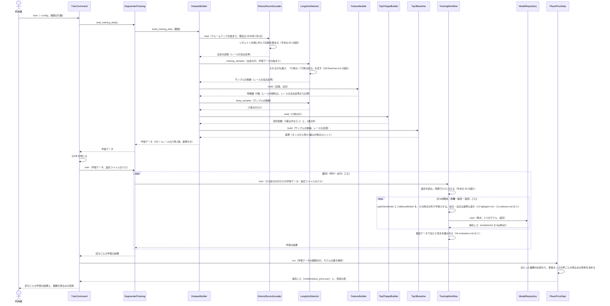
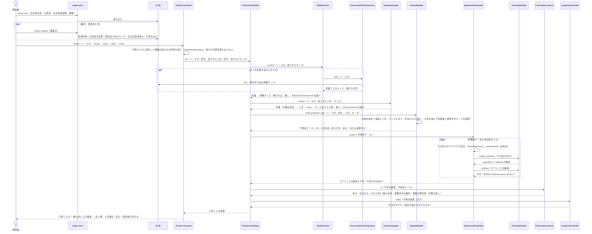

# 05 学習と予測のやりとり（シーケンス図）

**この文書で示すこと:** 学習と予測のとき、利用者・jvdata-store・元DB と、[04-classes.md](04-classes.md) のクラスが、どの順に、どのメソッドを呼ぶか。

**結論: 流れは「学習」と「予測」の2つに分かれる。** 学習は `TrainCommand` から始まり、共通の `SegmentedTraining` が区分（中穴・大穴）ごとに `TrainingWorkflow` を回して、3つの時点（木曜・前日・当日）ごとに LightGBM と CatBoost を学習させて保存する。最後に `PlacePriceStep` が、複勝の見込みの倍率を保存する。予測は `PredictionWorkflow` が進め、**オッズと全頭の人気を決めて出走の行に当ててから**、穴馬の行だけの予測用データを作り、その馬の区分のモデル2つの予測確率を平均し、前日・当日は複勝の期待値を足し、最後に区分（`--zone`）が指定されていればその行だけに絞る。

2026-09-24 の直し（オッズから作った基準を出発点にする・中穴と大穴で別のモデル・複勝の期待値。[15-decisions.md の 12](15-decisions.md#12-既存モデルの修正計画での直し)）を、2026-09-28 に図に入れた。図は `src/yosou/longshots_in_top3/` と `src/yosou/shared/` のコードで確かめた呼び出しの順である。

- 図に出てくるものと、図の読み方（凡例）は [手本の 05 の「図に出てくるもの」](../近走と適性から3着以内を予想/05-sequence.md#図に出てくるもの) と [「図の読み方」](../近走と適性から3着以内を予想/05-sequence.md#図の読み方) を参照。この予想で増えるのは、利用者が渡す人気と区分、区分ごとに学習と予測を分ける `SegmentedTraining`・`SegmentedPrediction`、基準を作る `Top3Baseline`、複勝の期待値を出す `PlacePriceStep`・`PlacePriceRepository`・`PlaceValueColumns`、`LongshotZoneFilter` である。
- public メソッドの中の判断（if 文による分かれ道）は [06-flowchart.md](06-flowchart.md) を参照。2種類の図の使い分けは [01-overview.md](01-overview.md#図の使い分け) を参照。
- **リポジトリとのやりとりは、手本とまったく同じである。** 学習データを集める流れは [手本の 05 の図3](../近走と適性から3着以内を予想/05-sequence.md#図3-記録を集めるリポジトリとのやりとり)、1レースの記録を集めて速報を反映する流れは [手本の 05 の図4](../近走と適性から3着以内を予想/05-sequence.md#図4-1レースの記録を集める速報の反映) を参照。この文書では描き直さない。

## 図1. 学習

```mermaid
sequenceDiagram
    actor U as 利用者
    participant C as TrainCommand
    participant ST as SegmentedTraining
    participant D as DatasetBuilder
    participant L as HistoryRecordsLoader
    participant LS as LongshotSelector
    participant F as FeatureBuilder
    participant T as Top3TargetBuilder
    participant B as Top3Baseline
    participant W as TrainingWorkflow
    participant MR as ModelRepository
    participant PP as PlacePriceStep
    U->>C: train（--config、期間の引数）
    C->>ST: read_training_data()
    ST->>D: build_training_data（期間）
    D->>L: load（ウォームアップの始まり。既定は 2020年1月1日）
    L->>L: リポジトリを順に呼んで記録を集める（手本の 05 の図3）
    L-->>D: 出走の記録（レースの全出走馬）
    D->>LS: training_samples（出走の行、学習データの始まり）
    LS->>LS: 入れる行を選び、「穴馬か」「穴馬の区分」を足す（06-flowchart.md の図1）
    LS-->>D: サンプルの候補（レースの全出走馬）
    D->>F: build（記録、当日）
    F-->>D: 特徴量 78個（レース内順位は、レースの全出走馬から計算）
    D->>LS: keep_samples（サンプルの候補）
    LS-->>D: 穴馬の行だけ
    D->>T: build（穴馬の行）
    T-->>D: 目的変数（3着以内なら 1）と、1着の列
    D->>B: build（サンプルの候補。レースの全頭）
    B-->>D: 基準（オッズから見た3着以内率のロジット）
    D-->>ST: 学習データ（1行 = 1レースの穴馬1頭。基準付き）
    ST-->>C: 学習データ
    C->>C: 元DB を閉じる
    C->>ST: train（学習データ、設定ファイルのパス）
    loop 区分（中穴・大穴）ごと
        ST->>W: train（その区分の行だけの学習データ、設定ファイルのパス）
        W->>W: 設定を読み、時期で3つに分ける（手本の 05 の図1）
        loop 3つの時点（木曜・前日・当日）ごと
            W->>W: LightGbmModel と CatBoostModel を、その時点の列で学習させる。前日・当日は基準も渡す（12-lightgbm.md・13-catboost.md の 4.）
            W->>MR: save（時点、2つのモデル、設定）
            MR-->>W: 保存した（models/mid か big/時点/）
        end
        W->>W: 検証データで当たり具合を確かめる（16-evaluation.md の 2.）
        W-->>ST: 学習の結果
    end
    ST-->>C: 区分ごとの学習の結果
    C->>PP: run（学習データの期間の行、モデルの置き場所）
    PP->>PP: 当たった複勝の払戻から、最低オッズの帯ごとの見込みの倍率を決める
    PP-->>C: 保存した（models/place_price.json）と、倍率の表
    C-->>U: 区分ごとの学習の結果と、複勝の見込みの倍率
```

**説明。** 利用者が `train` を実行すると、`TrainCommand` は元DB を開き、`SegmentedTraining.read_training_data()` で学習データを1回だけ作る。作り終えたら元DB を閉じ、学習のあいだはロックを持たない。

危険な人気馬の予想と同じく、**穴馬に絞るのは、特徴量を作ったあとになる。** `LongshotSelector.training_samples()` は、障害・取消・期間でふるったうえで「穴馬か」「穴馬の区分」の列を足すだけで、行は減らさない。レース内順位（まとまり G）を、そのレースの全出走馬から計算するためである（[08-training-data.md](08-training-data.md#3-どのサンプルを入れるか)）。特徴量ができたあと、`keep_samples()` が穴馬の行だけを残し、共通の `Top3TargetBuilder` が目的変数を付ける。「穴馬の区分」の列は、学習データの評価用の列に残り、学習データを区分に分けるのに使うが、特徴量としてはモデルに渡さない（[08-training-data.md](08-training-data.md#2-列の種類)）。**基準（共通の `Top3Baseline`）は、穴馬に絞る前のレースの全頭で作ってから、穴馬の行だけにする。** オッズから見た3着以内率は、同じレースのほかの馬のオッズも使って出すためである。

学習は `SegmentedTraining` が区分ごとに行を分け、共通の `TrainingWorkflow` を区分の数だけ回す。`TrainingWorkflow` の中は手本の図1 と同じである。前日・当日のモデルは基準を出発点にして上げ下げだけを学び（LightGBM の `init_score`、CatBoost の `baseline`）、木曜のモデルはオッズが無いので基準なしで学ぶ。木曜・前日のモデルには、78個のうちその時点で使う列だけを渡す（[07-prediction-timing.md](07-prediction-timing.md#時点ごとに使う特徴量)）。モデルは 2つの区分 × 3つの時点 × 2つで、12個になる。

最後に `PlacePriceStep` が、学習データの期間（検証データの始まりより前）の複勝の払戻から見込みの倍率を決めて保存する。検証データとテストデータの払戻は使わない。

## 図2. 予測

木曜・前日・当日のどれかに、1レースの穴馬を予測するときの流れ。

```mermaid
sequenceDiagram
    actor U as 利用者
    participant JS as jvdata-store
    participant DB as 元DB
    participant PC as PredictCommand
    participant W as PredictionWorkflow
    participant OR as OddsResolver
    participant AO as AnnouncedOddsRepository
    participant PA as PopularityApplier
    participant D as DatasetBuilder
    participant SP as SegmentedPrediction
    participant E as EnsembleModel
    participant PV as PlaceValueColumns
    participant ZF as LongshotZoneFilter
    U->>JS: jvstore sync（出走馬名表・出馬表・出走別着度数・調教）
    JS->>DB: 書き込む
    opt 前日・当日のとき
        U->>JS: jvstore realtime（開催日）
        JS->>DB: 馬場状態・出馬表の変更・締め切り前のオッズ（当日は馬体重も）を書き込む
    end
    U->>PC: predict（レースID、--timing、--pops、--odds、--zone）
    PC->>PC: 学習のときに保存した複勝の見込みの倍率を読む（PlacePriceRepository。無ければ期待値を出さない）
    PC->>W: run（レースID、時点、渡された人気、区分、渡されたオッズ）
    W->>OR: resolve（レースID、渡されたオッズ）
    opt オッズを渡さなかったとき
        OR->>AO: read（レースID）
        AO->>DB: SQL（締め切り前の単勝オッズ）
        AO-->>OR: 馬番ごとのオッズ（無ければ空）
    end
    OR-->>W: 馬番 → 単勝オッズ（無ければ、無し。手本の 06-flowchart.md の図2）
    W->>PA: resolve（レースID、渡された人気、オッズ）
    PA-->>W: 馬番（木曜は馬名）→ 人気（--pops → オッズの小さい順 → 無し。06-flowchart.md の図2）
    W->>D: build_prediction_data（レースID、時点、人気、オッズ）
    D->>D: 記録を集めて速報と人気・オッズを当て（手本の 05 の図4）、穴馬を選んで特徴量と基準を作る（下の説明）
    D-->>W: 予測用データ（1行 = 穴馬1頭。区分付き。前日・当日は基準付き）
    W->>SP: predict（予測用データ）
    loop 予測用データにある区分ごと
        SP->>SP: その区分のモデル2つを読む（ModelRepository。models/mid か big/時点/）
        SP->>E: predict_members（その区分の行）
        E-->>SP: LightGBM と CatBoost の確率
        SP->>E: combine（モデルごとの確率）
        E-->>SP: 平均（手本の 03-library-basics.md の 6.）
    end
    SP-->>W: モデルごとの確率と平均（穴馬の行の並び）
    W->>PV: of（平均の確率、予測用データ）
    PV-->>W: 前日・当日はオッズから見た3着以内率・複勝的中の確率・複勝の期待値（木曜は無し）
    W->>ZF: apply（予測の結果、区分）
    ZF-->>W: 区分の行だけ（指定が無ければそのまま）
    W-->>PC: 穴馬ごとの結果
    PC-->>U: 穴馬ごとの「3着以内に入る確率」（高い順。人気順位・区分・期待値の列付き）
```

**説明。** 利用者は、まず jvdata-store の `jvstore sync` で出走馬名表（木曜）・出馬表（前日から）・出走別着度数・調教を取り込む。前日・当日は `jvstore realtime --date <開催日>` で速報（馬場状態、締め切り前の単勝オッズ、当日は馬体重も）も取り込む。次に `predict` を実行する。

`PredictionWorkflow` は、**先にオッズを決め、次に人気を決める。** オッズは `--odds` → 元DB の締め切り前のオッズ → 無し、の順（手本と同じ `OddsResolver`）。人気は `--pops` → そのオッズの小さい順 → 無し、の順（`PopularityApplier`）。無しのときは、元DB の出走の行に入っている値（終わったレースの確定オッズ・確定単勝人気）がそのまま使われる。木曜は馬番も締め切り前のオッズも無いので、利用者が `--pops 馬名:人気` で渡すしかない（[07-prediction-timing.md](07-prediction-timing.md#予測のときの人気の与え方)）。

`DatasetBuilder.build_prediction_data()` の中は、学習と同じ順である。`RaceRecordsLoader` が記録を集めて速報と人気・オッズを当て（木曜は馬名で当てる）、`LongshotSelector.prediction_runners()` が全頭の人気がそろっているかを確かめて「穴馬か」「穴馬の区分」を足し、`FeatureBuilder` がその時点の特徴量を作り、`keep_samples()` が穴馬の行だけを残す。`RequiredInfoCheck` が、その時点で要る情報（前日以降は馬番・馬場状態・単勝オッズ、当日は馬体重も）がそろっているかを確かめ、前日・当日は `Top3Baseline` がレースの全頭のオッズから基準を作る。予測用データも学習と同じ `DatasetBuilder` と `FeatureBuilder` で作る（[11-leak-prevention.md](11-leak-prevention.md#決まり) の 4）。

この予想で違うのは、次の3つである。

- **`LongshotSelector.prediction_runners()` は、全頭の人気がそろっているかを確かめる。** 穴馬は出走馬の大半なので、人気の分からない馬を黙って落とすと、出力から穴馬が欠ける。人気の分からない馬が1頭でもいれば、止めて、足りない馬の人気を渡すよう案内する（判断は [06-flowchart.md](06-flowchart.md#図2-予測用データに人気を当てる)）。
- **`PlaceValueColumns` が、平均の確率から複勝の期待値を出す。** 3着以内の確率を複勝が当たる確率に直し（7頭以下は2着まで）、学習のときに保存した見込みの倍率を掛ける。オッズの無い木曜は、この列を出さない（[15-decisions.md の 12](15-decisions.md#12-既存モデルの修正計画での直し)）。
- **最後に、`LongshotZoneFilter` が区分で絞る。** 予測は中穴・大穴それぞれのモデルで行い、`--zone` が指定されていれば、その区分の行だけを残して返す。指定が無ければ、穴馬すべてをそのまま返す。

## 今は無く、これから作るところ

| 図の中の部分 | 今の状態 |
|---|---|
| `shared` に移す部品（人気を決める部品・J・締め切り前のオッズ・`Top3TargetBuilder`・多頭数の線引き） | 移した（`src/yosou/shared/`。2つの予想も移したあとの形に直した。[04-classes.md](04-classes.md#1-共通の部品とこの予想だけの部品の分け方)） |
| この予想のクラス（`LongshotSelector`・`LongshotZoneFilter` など） | 作った（`src/yosou/longshots_in_top3/`） |
| `PopularityInput` の「馬名:人気」 | 作った。木曜の予測で、馬名で人気を当てる（[07-prediction-timing.md](07-prediction-timing.md#予測のときの人気の与え方)） |
| `AnnouncedOddsRepository` が読むオッズ | 危険な人気馬の予想と同じ。断面は jvdata-store の `jvstore realtime --date <開催日>` で入る。今の元DB には断面がごく少数しか無く、取り忘れたレースは `--pops` で人気を渡す |
| 学習データ・検証データ・テストデータの期間の分け方と、評価指標 | 決めた（[16-evaluation.md](16-evaluation.md)）。人気の基準との比べ方と、同じ人気の中での AUC を出す。2026-09-24 に区分（中穴・大穴）ごとに学習するようにしてからは、学習の報告も区分ごとに出る |
| アンサンブルの平均のしかた | 決めた。手本と同じく、重みを付けない単純な平均（[15-decisions.md の 13](15-decisions.md#13-アンサンブルの平均のしかた)） |
| 予測確率から「買い」と判定する線引き | 決めない。確率をそのまま高い順に出す（[15-decisions.md](15-decisions.md#11-買いと判定する線引きを設計書に入れるか)） |

## 文書情報

| 項目 | 内容 |
|---|---|
| 作成日 | 2026-09-23 |
| 更新 | 2026-09-28: 「今は無く、これから作るところ」の評価指標と平均のしかたを、今の状態に直した |
| 更新 | 2026-09-28: 図1・図2 を、2026-09-24 の直し（基準・中穴と大穴ごとのモデル・複勝の期待値）を入れた今のコードの呼び出しの順に描き直した |
