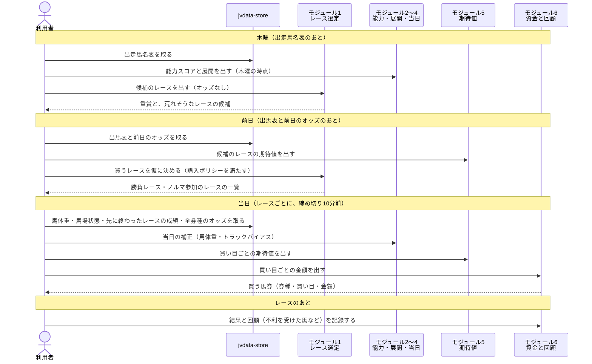

# 01 買うレースと買い目を決める: 概要

**週末の全レースから「買うレース」を選び、そのレースで「どの馬券を・何円買うか」まで決める仕組みの提案である。**
目的は、長い目で回収率 100% を超えること。勝つ馬を当てるのではなく、**市場（オッズ）の見立てと、この仕組みの見立ての差（期待値）** がある馬券だけを買う。

この文書は、利用者の要件定義（6つのモジュールと購入ポリシー）に対する **Phase 1: 判定のロジックと計算式の提案** である。コードはまだ書かない。

- 状態: 提案（2026-09-27）。決めてほしいことは [09-decisions.md](09-decisions.md) に集めた。
- 用語の意味: [02-glossary.md](02-glossary.md) を参照。
- 例の値: すべて架空。JV-Data の実際の値（馬名・オッズ・回収率の実測値）は載せていない。実測は Git の対象外の `reports/` を参照する。

## まず知っておいてほしいこと（何が問題か）

このリポジトリでは、これまでに回収率 100% 超えをいくつもの方法で確かめてきた。結果は次のとおりである。

| 確かめた方法 | 結果 | 資料 |
|---|---|---|
| 大きい券種（3連単・3連複など）のオッズから馬ごとの確率を取り出し、**複勝を期待値 1.20 以上のときだけ買う** | **100% を超えた**（ただし確定オッズでの検証） | [research/回収率100超](../../../research/回収率100超/docs/04-買い方.md) |
| 近走・適性・能力指数・当日の馬場傾向で確率を作る | オッズから作った確率に**ほとんど上乗せできなかった** | [research/既存モデルの改善 の 5](../../../research/既存モデルの改善/docs/02-結果の読み方.md) |
| 危険な1番人気を消して、期待値の高い馬を買う | 消したレースは、消さなかったレースより**大きく負けた** | [research/既存モデルの改善 の 3](../../../research/既存モデルの改善/docs/02-結果の読み方.md) |
| 4つの予想とルール集の買い方の組み合わせ（約2万通り） | 確認の期間で 100% に届くものは**無かった** | [research/馬券の買い方の検証](../../../research/馬券の買い方の検証/) |

ここから、この提案では次の4つを前提にする。

1. **出発点は市場の確率にする。** 能力・展開・当日の情報で「独自のスコア」を作ってオッズと比べるのではなく、全券種のオッズから作った確率を出発点にして、能力・展開・当日の情報で上げ下げ（補正）する。上げ下げした量が、そのまま市場との差（期待値の元）になる。利用者の決定（2026-09-27）。
2. **回収率の元になるのはモジュール5で、モジュール2〜4は補正の材料である。** 能力・展開・当日の情報は、単独では市場に勝てていない。補正の材料として足し、効いたものだけ残す。
3. **購入ポリシー（重賞は必ず買う・毎日1レースは買う）は、期待値が 1 に届かないレースも買うことを意味する。** これは競馬を楽しむための参加費（エンタメ税）と割り切り、勝負レース用とは別の「ポリシー用の財布」から出す。ポリシー用の財布が少しずつ減るのは想定内とする（利用者の決定、2026-09-27。[08-bankroll-and-review.md](08-bankroll-and-review.md#1-予算の分け方)）。
4. **実際のお金で買い始める前に、締め切り10分前のオッズで1か月ほどフォワードテストをする。** 過去の検証は確定オッズでしているので、実際に買うときのオッズでも 100% を超えるかを確かめる（利用者の決定、2026-09-27。[08-bankroll-and-review.md](08-bankroll-and-review.md#4-実際に買い始める前のフォワードテスト)）。

## 1日の流れ

時点を木曜・前日・当日の3つに分けるのは、既存の予想と同じである（[近走と適性から3着以内を予想 の 07](../近走と適性から3着以内を予想/07-prediction-timing.md)）。

## 6つのモジュールと既存の資産

このリポジトリには、6つのモジュールの大半に当たるものがすでにある。**既存のものを部品として使い、足りない部分だけを新しく作る。** 利用者の決定（2026-09-27）。

| 要件のモジュール | 使う既存の資産 | 新しく作るもの | 文書 |
|---|---|---|---|
| 1. レースの期待値ランキング | 荒れ具合の予想（`src/yosou/upset_level/`）、見送りの条件（ルール集の ALL-09） | レースの点数、**購入ポリシーを満たすレースの選び方**、堅い重賞での買い方 | [03-race-screening.md](03-race-screening.md) |
| 2. 基礎能力と適性 | 能力指数（`tools/共通/ability/`）、全頭の予想の特徴量 | 今回の斤量の補正、レース内の偏差 | [04-ability-aptitude.md](04-ability-aptitude.md) |
| 3. 展開予測 | 展開の予想（`src/yosou/race_development/`）、研究「展開の理論の検証」の結論 | 展開スコア（脚質×ペースの有利・不利を、市場との差で数える） | [05-race-development.md](05-race-development.md) |
| 4. 当日の補正 | 速報の馬体重の反映（`announced_weight_applier.py`）、馬場傾向の実験 | **トラックバイアスの検知**（作り直し）、馬体重の補正の表 | [06-realtime-adjustment.md](06-realtime-adjustment.md) |
| 5. 期待値と危険な人気馬 | 券種のオッズから確率を作る方法（研究「回収率100超」）、人気馬・穴馬の予想、確率の較正 | 補正のまとめ方、印の付け方 | [07-expected-value.md](07-expected-value.md) |
| 6. 資金管理と回顧 | 券種ごとの予算と払戻均等（研究「既存モデルの改善」）、運用の目安 | **勝負とノルマ参加で予算を変える式**、**回顧データの形** | [08-bankroll-and-review.md](08-bankroll-and-review.md) |

## 要件の問いと、答えている場所

要件の「あなたが考えるべきこと」の問いごとに、答えを書いた節を示す。

| モジュール | 要件の問い | 答えている節 |
|---|---|---|
| 1 | 荒れるレースをどう定義し、点数にするか | [03 の 1](03-race-screening.md#1-荒れるレースの定義) と [03 の 2](03-race-screening.md#2-レースの点数) |
| 1 | 堅い重賞でどうするか | [03 の 4](03-race-screening.md#4-堅い重賞での買い方) |
| 1 | 購入ポリシーをどう満たすか | [03 の 3](03-race-screening.md#3-購入ポリシーを満たすレースの選び方) |
| 2 | スピード指数・上がり3F・適性・斤量を、どんな比重と式で1つにするか | [04 の 1](04-ability-aptitude.md#1-能力スコアの式) と [04 の 3](04-ability-aptitude.md#3-比重をどう決めるか) |
| 3 | 逃げ馬が何頭ならハイペースか | [05 の 1](05-race-development.md#1-ペースの予測) |
| 3 | どのポジションが展開有利・不利か | [05 の 2](05-race-development.md#2-展開スコア有利不利の判定) |
| 4 | 内伸び・外伸びをどう検知し、数にするか | [06 の 1](06-realtime-adjustment.md#1-トラックバイアスの検知) |
| 4 | 馬体重の増減とパドックをどう点数にするか | [06 の 2](06-realtime-adjustment.md#2-馬体重の補正) と [06 の 3](06-realtime-adjustment.md#3-パドックの気配) |
| 5 | 危険な人気馬の閾値と条件 | [07 の 3](07-expected-value.md#3-危険な人気馬の判定) |
| 5 | 美味しい穴馬を見つける期待値の式 | [07 の 2](07-expected-value.md#2-期待値の式) と [07 の 4](07-expected-value.md#4-美味しい穴馬の判定) |
| 6 | 勝負レースとポリシーで買う重賞で、予算の式をどう変えるか | [08 の 1](08-bankroll-and-review.md#1-予算の分け方) |
| 6 | 不利を受けた馬などを蓄積し、次走に活かすデータの形 | [08 の 3](08-bankroll-and-review.md#3-回顧データの形) |

## 図の使い分け

この提案では、図を2種類だけ使い、次の方針で使い分ける。

| 図 | 表すこと | 例 |
|---|---|---|
| シーケンス図 | 利用者・jvdata-store・モジュールの間で、どの順に何を頼み、何が返るか | この文書の「1日の流れ」 |
| フローチャート | 条件によって進む先が分かれる判断の手順 | [03 のレースの選び方](03-race-screening.md#3-購入ポリシーを満たすレースの選び方) |

- 同じ手順を両方の図で描かない。分かれ道の無い一続きの作業は、フローチャートにしない。
- 図は Mermaid で書いてある。VS Code のプレビューで見るには、拡張機能「Markdown Preview Mermaid Support」（`bierner.markdown-mermaid`）が要る。
- Phase 3 でクラスを決めたら、既存の設計書と同じく「矢印1本 = public メソッドの呼び出し1回」の粒度に描き直す。

## この提案と、予想モデルの設計書の関係

この提案は、**仕組み全体の判定の考え方**を決めるものである。既存の予想モデルの設計書（01〜16）とは粒度が違う。
Phase 2 以降で新しい予想モデル（例: トラックバイアスの補正を入れた全頭の予想）を作ることになったら、既存と同じ 01〜16 の構成で、`designing-yosou-models` スキルを使って別に設計書を書く。

## 文書の一覧

| ファイル | 何が書いてあるか | 状態 |
|---|---|---|
| 01-overview.md | この文書。前提、1日の流れ、既存の資産との対応 | 提案 |
| [02-glossary.md](02-glossary.md) | 用語の意味 | 提案 |
| [03-race-screening.md](03-race-screening.md) | モジュール1: 買うレースの選び方 | 提案 |
| [04-ability-aptitude.md](04-ability-aptitude.md) | モジュール2: 能力スコアの式 | 提案 |
| [05-race-development.md](05-race-development.md) | モジュール3: ペースの予測と展開スコア | 提案 |
| [06-realtime-adjustment.md](06-realtime-adjustment.md) | モジュール4: トラックバイアス・馬体重・パドック | 提案 |
| [07-expected-value.md](07-expected-value.md) | モジュール5: 確率の作り方、期待値の式、危険な人気馬と穴馬、印 | 提案 |
| [08-bankroll-and-review.md](08-bankroll-and-review.md) | モジュール6: 予算の式、回顧データの形 | 提案 |
| [09-decisions.md](09-decisions.md) | 決めてほしいこと | 確認待ち |

## 次の進め方

1. [09-decisions.md](09-decisions.md) の決めてほしいことを決める（Phase 1 の承認）。
2. Phase 2: データの項目・取り方・DB・技術を決める。データの元は jvdata-store の DuckDB（`../jvdata-store/jvdata.duckdb`）で、締め切り前の全券種のオッズ（`0B30`）もすでに取る対象に入っている。
3. Phase 3: モジュールごとに作る。

## 文書情報

| 項目 | 内容 |
|---|---|
| 作成日 | 2026-09-27 |
| 例の値 | すべて架空。JV-Data の実際の値は載せていない |
