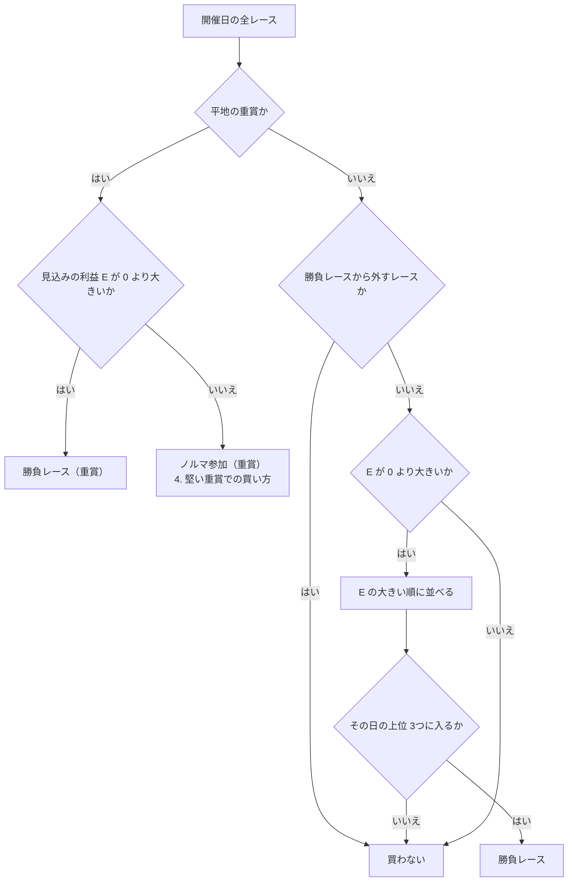

# 03 モジュール1: 買うレースの選び方

この文書で決めること: 週末の全レースから、どのレースを買うか。荒れるレースをどう数にするか。購入ポリシー（重賞は必ず買う・土日それぞれ最低1レース買う）をどう満たすか。堅い重賞でどう買うか。

結論:

- **荒れるかどうかは、既存の荒れ具合の予想が出す「券種ごとの中荒れ以上の確率」で数にする。** ハンデ戦・多頭数・馬場状態などに手で点数を付けて足すことはしない。これらはすでに予想の特徴量に入っていて、組み合わせの効き方をモデルが学んでいる。
- **レースの順位は「荒れそうか」ではなく「見込みの利益」で付ける。** 荒れそうなレースほど期待値が高いとは限らないからである。荒れ具合は、木曜の候補の絞り込みと、券種の選び方に使う。
- **購入ポリシーは、開催日（土日と、祝日の月曜など）ごとに次の順で満たす。** ① 平地の重賞は全部入れる（障害の重賞は入れない）。② 重賞以外で見込みの利益があるレースを、大きい順に1日3つまで入れる。③ それでも1レースも無い日は、前日に決めた予備の1レースを買う。
- **堅い重賞は「ノルマ参加」として、損の小さい複勝だけを最大2点、ポリシー用の財布から小さい予算で買う。**

## 1. 荒れるレースの定義

**荒れるとは、払戻が券種ごとの線を超えることである。** 線は既存の荒れ具合の予想で決めてあり、固い・中荒れ・大荒れ・超荒れの4段階に分ける（線の値は [荒れ具合の予想 の 10「券種ごとの線引き」](../レースの荒れ具合を4段階で予想/10-target.md) にだけ書いてある）。券種は単勝・馬連・3連複・3連単の4つで見る。1つの券種だけでは、「1着は人気馬だが2・3着が荒れた」レースを見落とすからである。

荒れ具合の予想（`src/yosou/upset_level/`）は、レースごとに4券種 × 4段階の確率を出す。この提案では、次の値を「波乱度」と呼んで使う。

```text
波乱度 U = （単勝・馬連・3連複・3連単の、中荒れ以上の確率）の平均     … 0〜1
```

例（架空）: 単勝 0.40・馬連 0.55・3連複 0.60・3連単 0.65 なら、U = 0.55。

### 要件の例（ハンデ戦・多頭数・馬場状態）の扱い

要件に挙がった条件は、どれも荒れ具合の予想の特徴量にすでに入っている。

| 要件の例 | 予想の中での扱い |
|---|---|
| ハンデ戦 | レース条件の特徴量（重量種別） |
| 多頭数 | レース条件の特徴量（頭数） |
| 馬場状態 | レース条件の特徴量（馬場状態。当日は速報 `0B14` の値） |
| 1番人気が抜けているか | オッズの形の特徴量（1番人気のオッズ、上位人気のオッズの開き。前日と当日だけ） |
| 同じ条件の過去の荒れ方 | 過去の同条件の荒れ率の特徴量 |

**手で点数を付けて足さない理由:** 効き方が組み合わせで変わるからである。例えば、多頭数のハンデ戦でも、1頭だけ抜けて強い馬がいれば固く収まる。手で「ハンデ戦 +10点・16頭以上 +10点」と足すと、この組み合わせを見分けられず、同じことを二重に数えてしまう。

### 今後の改善

研究「既存モデルの改善」では、**3つの予想（全頭・穴馬・人気馬）を組み合わせた馬ごとの勝率から荒れ具合を計算する方法が、4券種 × 7区切りのすべてで今の予想より良かった**（[research/既存モデルの改善 の 2](../../../research/既存モデルの改善/docs/02-結果の読み方.md)）。ただし全券種の締め切り前のオッズが要るので、本番には使っていない。jvdata-store が `0B30`（全券種の速報オッズ）を取るようになったので、数週ためたら当日の時点をこの方法に切り替える。

## 2. レースの点数

**レースの順位は、時点によって次の点数で付ける。**

| 時点 | 点数 | 理由 |
|---|---|---|
| 木曜 | 波乱度 U | オッズがまだ無く、期待値が出せない。荒れそうなレースを候補として残すだけに使う |
| 前日・当日 | 見込みの利益 E | 期待値が出せる。お金に直結する点数で並べる |

```text
見込みの利益 E = Σ（期待値 − 1）× 掛け金      … 期待値が線以上の買い目だけを足す
最大の期待値 M = そのレースの買い目の期待値の最大                … 線に届かないレースも含めて比べるときに使う
```

- 期待値と線の決め方は [07-expected-value.md の 2](07-expected-value.md#2-期待値の式)、掛け金は [08-bankroll-and-review.md の 2](08-bankroll-and-review.md#2-勝負レースの中の掛け金) を参照。
- 例（架空）: 期待値 1.35 の複勝に 1,000円、期待値 1.22 の複勝に 1,000円なら、E = 350 + 220 = 570円。

**波乱度で並べない理由:** 荒れそうなレースは、ほかの人も穴馬を買うので、穴馬のオッズが下がり期待値が上がらないことがある。研究「既存モデルの改善」でも、「荒れそう」を条件にするだけでは回収率は 100% に届かなかった。

### 木曜の候補の絞り込み

木曜は、次のどれかに当たるレースを候補に残し、前日に期待値を出す。候補を絞るのは、前日のオッズを見る手間を減らすためである（全レースの期待値を出せるなら、絞らなくてよい）。

- 重賞
- 波乱度 U が、その週のレースの上位 3割
- 平場・特別で、ほかの時点の予想（展開・能力）で人気になりそうな馬に不安がある（[07 の 3](07-expected-value.md#3-危険な人気馬の判定) の木曜版）

### 勝負レースから外すレース

次のレースは、期待値が出ても勝負レースにしない（ノルマ参加の予備にはしてよい）。

| 外すレース | 理由 |
|---|---|
| 新馬戦 | 過去の走が無く、能力スコア・展開スコアが出せない。補正が効かず、市場の確率そのままになる |
| 障害レース | 能力指数を出していない。予想のどれも障害を学習していない |
| 出走が7頭以下 | 複勝が2着までになり、複勝の期待値の見積もり（3着以内が前提）が合わない |

ルール集の ALL-09（ハンデ戦・不良馬場・夏競馬などを見送る）は、**使わない。** 未検証で、荒れ具合の予想とも食い違う（[ルール集 01「ルール同士の食い違い」](../../rules/馬券の買い方/01-overview.md)）。見送るかどうかは、期待値に任せる。

## 3. 購入ポリシーを満たすレースの選び方

**開催日ごとに、次の順で買うレースを決める。** 1日は、土曜・日曜に加えて、祝日の月曜などの開催日も含む。どの開催日も、最低1レースを買う（利用者の決定、2026-09-27）。必ず買う重賞は、平地の G1・G2・G3 だけで、障害の重賞は入れない（同じく利用者の決定。障害は能力指数も予想も無く、期待値が出せないため）。障害の重賞は、ほかの障害レースと同じく買わない。



そのあと、**その日の勝負レースと重賞が0レースなら、ノルマ参加（日）を1レース選ぶ。** 選び方は次のとおり。

1. **前日の夜に、予備を1つ決めておく。** 重賞以外（新馬戦・障害は除く）で、前日のオッズで最大の期待値 M が最も高いレース。
2. **当日、予備のレースの締め切り10分前に、その日まだ1レースも買っていなければ、予備を買う。** 買い方は堅い重賞と同じ（この文書の 4）で、予算はノルマ参加（日）の額（[08 の 1](08-bankroll-and-review.md#1-予算の分け方)）。
3. 当日のオッズで別のレースが勝負レースになり、先に買えていれば、予備は買わない。

**1日の上限を3つにする理由:** ルール集の ALL-06（勝負するレースを1日1〜3に絞る）と同じ考えで、買うレースが増えるほど、期待値の見積もりの誤差で線を越えただけのレースが混ざるからである。研究「既存モデルの改善」でも、上位 N レースの N を検証で選ばせると、ほとんど「全部」が選ばれて絞れなかった。**3 は初めの値で、締め切り前のオッズの記録が貯まったら検証で決め直す。**

### 1日の例（架空）

土曜、中山と阪神で 24レース、重賞は1つ（G3）。

| レース | 重賞か | E | 決まったこと |
|---|---|---|---|
| 阪神11R | G3 | 0円 | ノルマ参加（重賞） |
| 中山7R | | 520円 | 勝負レース（1位） |
| 阪神9R | | 310円 | 勝負レース（2位） |
| 中山3R | | 150円 | 勝負レース（3位） |
| 阪神5R | | 90円 | 買わない（4位） |
| そのほか19レース | | 0円 | 買わない |

重賞があるので、この日はノルマ参加（日）の予備は使わない。

## 4. 堅い重賞での買い方

**堅い重賞とは、重賞で見込みの利益 E が 0（期待値が線を超える買い目が無い）のレースである。** 荒れ具合ではなく期待値で決める。荒れそうでも期待値の無い重賞はあり、固そうでも期待値のある重賞は勝負レースになるからである。

堅い重賞は「ノルマ参加（重賞）」として、次のように買う。

1. **券種を複勝に絞る。** 控除率がいちばん低く（20%）、3着以内に来れば当たるので、損の揺れが小さい。過去のデータでの検証で、期待値で選んだ買い目の回収率が、複勝はワイドよりはっきり高かった（[08 の 2](08-bankroll-and-review.md#複勝以外の券種の検証過去のデータで先に確かめる)。2026-09-27 にワイドから変えた）。
2. **複勝を期待値の高い順に並べ、上から最大2点を買う。** 期待値が線に届かなくても、少なくとも1点は買う（ポリシーを守るため）。
3. **1強のとき**（1番人気の市場の勝率が 0.5 以上。単勝でおよそ 1.6倍以下）も同じく、期待値の高い順に複勝を買う。1強の複勝は払戻が 1.1倍ほどにしかならず、期待値が上がりにくいので、ふつうは ☆（期待値の最も高い穴馬）の複勝が選ばれる。
4. **予算はノルマ参加（重賞）の額で、ポリシー用の財布から出す**（[08 の 1](08-bankroll-and-review.md#1-予算の分け方)）。

**穴馬の単勝にしない理由:** 研究「回収率100超」で、大穴の単勝は回収率が控除率の水準を大きく下回り、大穴の複勝なら 100% を超えた（[research/回収率100超 の 04 の 7](../../../research/回収率100超/docs/04-買い方.md)）。「大穴が勝つのを当てる」より「大穴が3着に来るのを当てる」ほうが、買われすぎていない。

### 例（架空）

G2、16頭立て、1番人気は単勝 1.4倍（市場の勝率 0.56）。☆は 9番人気で複勝の期待値 1.08、次に高いのは 6番人気の 0.97（どちらも線の 1.20 に届かない）。

| 買い目 | 期待値 | 金額 |
|---|---|---|
| 複勝 ☆（9番人気） | 1.08 | 500円 |
| 複勝 6番人気 | 0.97 | 400円 |

ポリシー用の財布が 3万円のときの例（予算 900円）。

## 文書情報

| 項目 | 内容 |
|---|---|
| 作成日 | 2026-09-27 |
| 更新 | 2026-09-27: 券種の検証の結果で、堅い重賞の買い方を複勝だけにした |
| 例の値 | すべて架空 |
