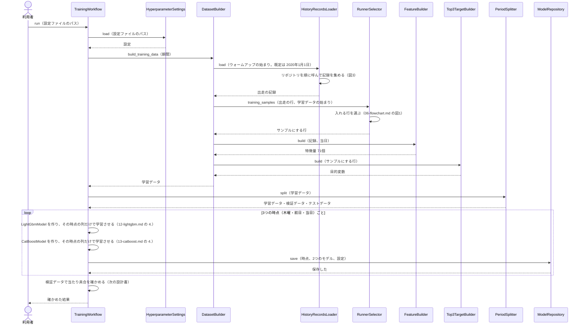
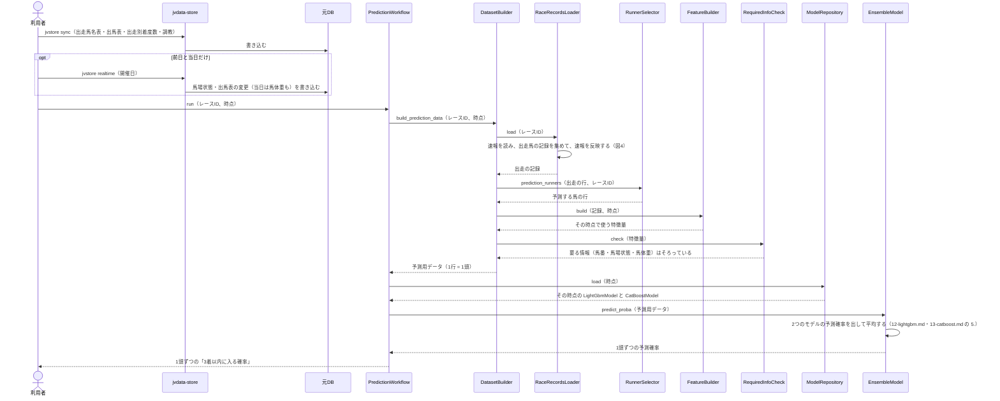
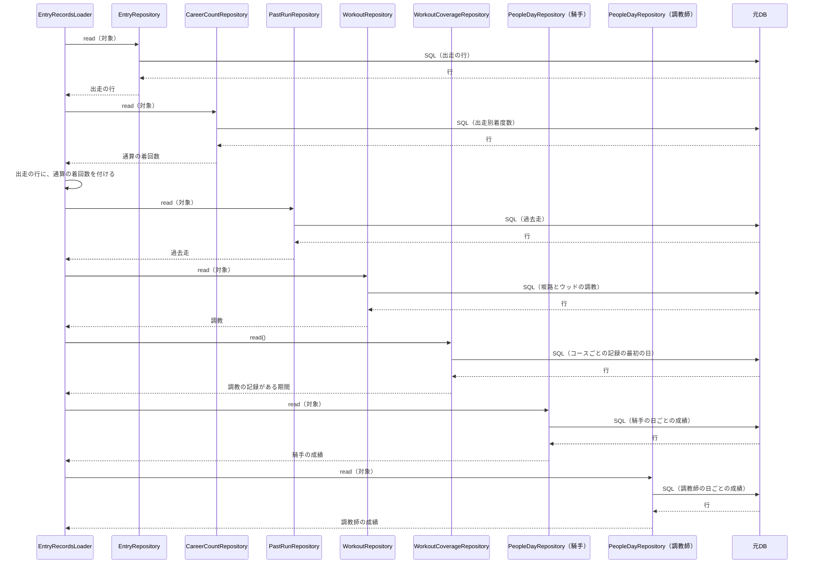
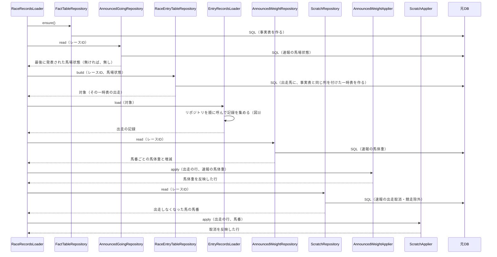

# 05 学習と予測のやりとり（シーケンス図）

**この文書で示すこと:** 学習と予測のとき、利用者・jvdata-store・元DB と、[04-classes.md](04-classes.md) のクラスが、どの順に、どのメソッドを呼ぶか。

**結論: 流れは「学習」と「予測」の2つに分かれる。** 学習は `TrainingWorkflow` が進め、3つの時点ごとに LightGBM と CatBoost を学習させて保存する。予測は `PredictionWorkflow` が進め、その時点の予測用データを作り、保存した2つのモデルで予測確率を出して平均する。

- public メソッドの中の判断（if 文による分かれ道）は [06-flowchart.md](06-flowchart.md) を参照。2種類の図の使い分けは [01-overview.md](01-overview.md) の「図の使い分け」を参照。
- 用語の意味は [02-glossary.md](02-glossary.md) を参照。

## 図に出てくるもの

この文書と、[12-lightgbm.md](12-lightgbm.md)・[13-catboost.md](13-catboost.md) のシーケンス図に出てくるもの。図では、それぞれが、上に名前が書かれた縦の線1本になる。「呼ばれ方」は、ほかから矢印1本で呼ばれるときに、何を1回行うかを示す。

| 名前 | 種類 | 呼ばれ方 | 今あるか |
|---|---|---|---|
| 利用者 | 人 | ― | ― |
| jvdata-store | 隣のリポジトリの道具。JV-Data を取得して、元DB に入れる | コマンド（`jvstore sync` か `jvstore realtime`）を1回実行する | ある |
| 元DB | jvdata-store が作った DuckDB。この AI は読むだけ | SQL を1回流す | ある |
| `TrainingWorkflow` など | この AI のクラス。一覧と仕事は [04-classes.md](04-classes.md) を参照 | public メソッドを1回呼ぶ | ある（`src/yosou/form_aptitude_top3/`） |
| `LGBMClassifier`・`CatBoostClassifier` | ライブラリのクラス | `fit()` か `predict_proba()` を1回呼ぶ | ライブラリはある |
| モデルのファイル | 学習済みのモデルを保存したファイル | 1回書き込むか、1回読み込む | `train` を実行すると、`reports/form_aptitude_top3/models/` にできる |

## 図の読み方

この文書と、[12-lightgbm.md](12-lightgbm.md)・[13-catboost.md](13-catboost.md) のシーケンス図に共通する。

| 形 | 意味 |
|---|---|
| 人の形 | 利用者 |
| 上の四角と下へ伸びる線 | 上の「図に出てくるもの」の1つ。線の上から下へ時間が進む |
| 実線の矢印 | 呼び出し1回（上の表の「呼ばれ方」）。矢印の上に、呼ぶメソッドと渡すものを書く |
| 点線の矢印 | その呼び出しの戻り値 |
| 自分に戻る矢印 | 呼ばれた public メソッドの中で行う作業のうち、設計として見せたいもの。引数のチェックのような、どのメソッドにもある作業は書かない |
| 自分に戻る矢印で、「（〇〇.md の N.）」か「（図N）」と書いてあるもの | その作業の中で、ほかのものを呼ぶ。呼び出しの1本1本は、書いてある文書の図（「図N」なら、この文書の図）に分けて描いてある |
| `loop` と書いた枠 | 枠の上に書いたものごとに、中のやりとりをくり返す（例: 3つの時点ごと） |
| `opt` と書いた枠 | 枠の上の条件に当てはまるときだけ行うやりとり（例: 前日と当日だけ）。利用者が行う手順の違いに使い、メソッドの中の if 文には使わない（if 文はフローチャートで描く） |

## 図1. 学習

**説明。** 利用者が設定ファイルのパスを付けて `TrainingWorkflow.run()` を呼ぶ。`TrainingWorkflow` は、`HyperparameterSettings` で設定を読み（[14-hyperparameter-settings.md](14-hyperparameter-settings.md)）、作られたときに渡された期間（`TrainingPeriod`。[08-training-data.md](08-training-data.md) の 4）で `DatasetBuilder` に学習データを作らせ、`PeriodSplitter` で時期に分ける。`DatasetBuilder` は、記録を集める（`HistoryRecordsLoader`。図3）・入れる行を選ぶ（`RunnerSelector`）・特徴量を作る（`FeatureBuilder`）・目的変数を付ける（共通の `Top3TargetBuilder`）を順に呼ぶだけである。学習データは、当日の時点の特徴量 71個で作る。木曜と前日のモデルには、そのうち、その時点で使う列だけを渡す（[07-prediction-timing.md の「時点ごとに使う特徴量」](07-prediction-timing.md#時点ごとに使う特徴量)）。3つの時点ごとに、2つのモデルを学習させ、`ModelRepository` で保存する。モデルは合わせて6つになる。

## 図2. 予測

木曜・前日・当日のどれかの時点で、1レースを予測するときの流れ。

**説明。** 利用者は、まず jvdata-store の `jvstore sync` で、出走馬名表（木曜）か出馬表（前日から）と、出走別着度数・調教を取り込む。前日と当日は、`jvstore realtime` で速報も取り込む。次に、レースIDと時点を付けて `PredictionWorkflow.run()` を呼ぶ。`PredictionWorkflow` は、`DatasetBuilder` に予測用データを作らせ、`ModelRepository` からその時点のモデル2つを読み込み、`EnsembleModel` で予測確率を平均する。予測用データも、学習と同じ `DatasetBuilder` と `FeatureBuilder` で作る（[11-leak-prevention.md](11-leak-prevention.md) の 4）。木曜は馬番が決まっていないので、馬番ではなく馬ごとに返す。

## 図3. 記録を集める（リポジトリとのやりとり）

図1の「リポジトリを順に呼んで記録を集める」と、図4の `EntryRecordsLoader.load()` の中の呼び出しを示す。リポジトリは、1つの SQL につき1つある（[04-classes.md](04-classes.md) の「repository/」）。学習でも予測でも、同じリポジトリを同じ順に呼ぶ。違うのは「対象」（`TargetScope`）だけで、学習では「ウォームアップの始まり（既定は 2020年1月1日）以降の全部の出走」、予測では「1レースの出走馬」になる。調教の記録がある期間を読む `WorkoutCoverageRepository` だけは、対象によらず DB 全体から読む。

**説明。** 学習のときは、`HistoryRecordsLoader` が、`FactTableRepository.ensure()` で事実表を用意してから、この流れを呼ぶ。

## 図4. 1レースの記録を集める（速報の反映）

図2の「速報を読み、出走馬の記録を集めて、速報を反映する」の中の呼び出しを示す。

**説明。** 速報がまだ DB に無ければ、リポジトリは「無し」か空の表を返し、出走の行は変わらない。そのうえで、その時点の予測に要る情報（前日なら馬番と馬場状態、当日なら馬体重も）が欠けていれば、図2の `RequiredInfoCheck.check()` が、取り込み方の案内を付けて止める。

## まだ決まっていないところ

クラスは作ってある（[04-classes.md](04-classes.md)）。次のところは、まだ決まっていないか、仮の作りである。

| 図の中の部分 | 今の状態 |
|---|---|
| 学習データ・検証データ・テストデータの期間の分け方と、評価指標 | 仮の作り（2025年7月から検証、2026年1月からテスト。ログ損失・AUC・Brier など）。次の設計書で決める |
| アンサンブルの平均のしかた | 仮に単純な平均。次の設計書で決める |
| 学習をやり直す間隔 | 決まっていない。次の設計書で決める |
| 予測確率を利用者に見せる形（表・画面など） | 決まっていない。次の設計書で決める |

## 文書情報

| 項目 | 内容 |
|---|---|
| 作成日 | 2026-09-21 |
