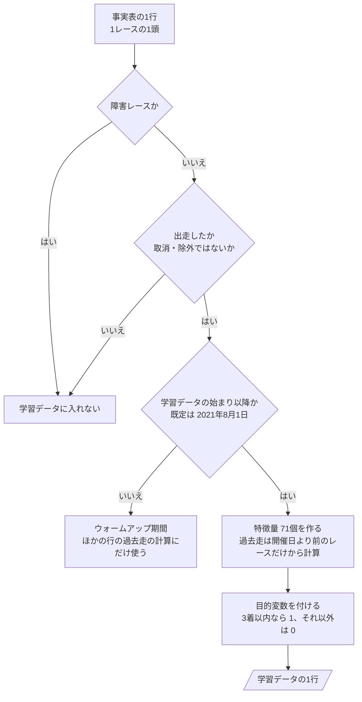

# 06 判断の手順（フローチャート）

**この文書で示すこと:** 学習データを作るときの、条件によって分かれる判断の手順。

**結論: 両方のモデルに共通で、条件によって分かれる判断は「学習データに入れる行の選び方」の1つである。この文書では、それをフローチャートで示す。**

- この文書は、1つの public メソッドの中で、条件で分かれる判断の手順を示す。クラスどうしのやりとりは [05-sequence.md](05-sequence.md) を参照。2種類の図の使い分けは [01-overview.md](01-overview.md) の「図の使い分け」を参照。
- モデルごとの判断の手順（カテゴリ特徴量の値の変え方）は、[12-lightgbm.md](12-lightgbm.md)・[13-catboost.md](13-catboost.md) を参照。
- 用語の意味は [02-glossary.md](02-glossary.md) を参照。

## 図の読み方

この文書と、[12-lightgbm.md](12-lightgbm.md)・[13-catboost.md](13-catboost.md) のフローチャートに共通する。

| 形 | 意味 |
|---|---|
| 四角 | 作業（手順の1つ） |
| ひし形 | if 文1つ。設計として決めておく分かれ道だけを描き、引数のチェックのような、どのメソッドにもある分かれ道は描かない。矢印の上の言葉が、問いへの答え |
| 平行四辺形 | できあがるもの |
| 矢印 | 作業の順番 |

## 図1. 学習データに入れる行の選び方

`RunnerSelector.training_samples()`（`DatasetBuilder.build_training_data()` から呼ばれる）の中で行う判断と、そのあとの段。事実表の1行（1レースの1頭）が、学習データの1行になるまで。

**説明。** 3つの問いで、学習データに入れる行を選ぶ。規則は [08-training-data.md](08-training-data.md) の「どのサンプルを入れるか」、特徴量は [09-features.md](09-features.md)、目的変数は [10-target.md](10-target.md) を参照。「開催日より前のレースだけから計算」はリークを防ぐためで、[11-leak-prevention.md](11-leak-prevention.md) を参照。

3つ目の問いの日は、`train` の引数 `--train-from` で変えられる（[08-training-data.md](08-training-data.md) の 4）。予測用データを作るときも同じ手順を通る。ただし、これから走るレースなので3つ目の問い（学習データの始まり以降か）は常に「はい」になり、目的変数を付ける段は無い。木曜と前日は、その時点で取消・除外になっていない馬を「出走した」とみなす。作る特徴量は、その時点で使うものだけである（[07-prediction-timing.md の「時点ごとに使う特徴量」](07-prediction-timing.md#時点ごとに使う特徴量)）。

## 文書情報

| 項目 | 内容 |
|---|---|
| 作成日 | 2026-09-21 |
