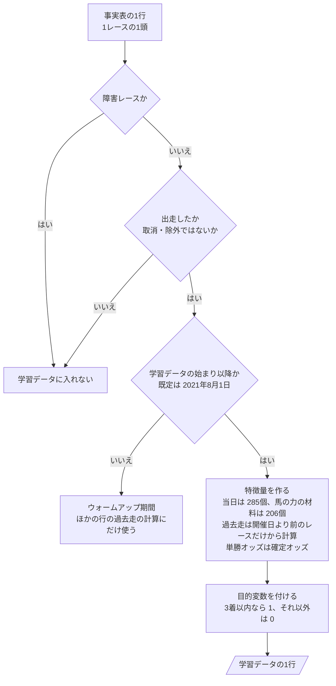
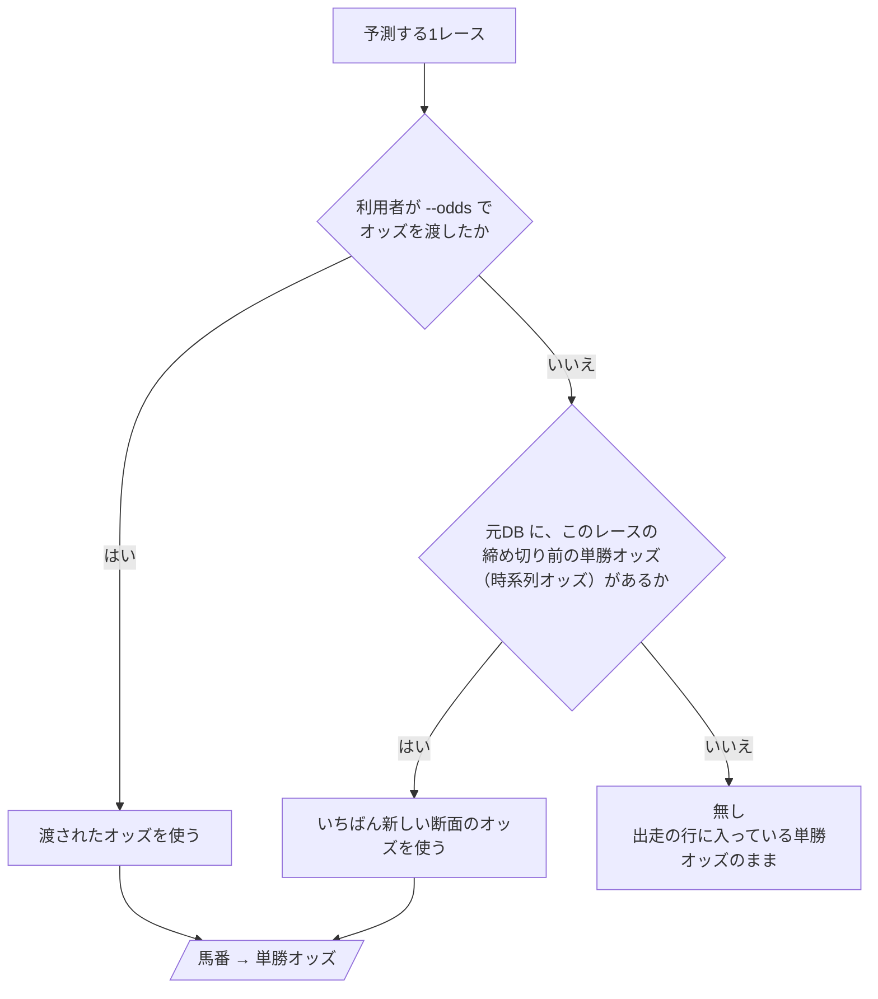
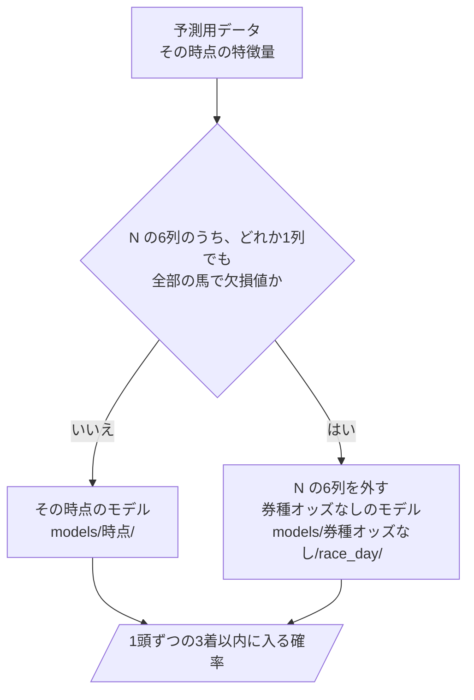

# 06 判断の手順（フローチャート）

**この文書で示すこと:** 学習データを作るとき・予測するときの、条件によって分かれる判断の手順。

**結論: 両方のモデルに共通で、条件によって分かれる判断は「学習データに入れる行の選び方」（図1）と「予測に使うオッズの決め方」（図2）と「当日のモデルの選び方」（図3）の3つである。この文書では、それをフローチャートで示す。**

- この文書は、1つの public メソッドの中で、条件で分かれる判断の手順を示す。クラスどうしのやりとりは [05-sequence.md](05-sequence.md) を参照。2種類の図の使い分けは [01-overview.md](01-overview.md) の「図の使い分け」を参照。
- モデルごとの判断の手順（カテゴリ特徴量の値の変え方）は、[12-lightgbm.md](12-lightgbm.md)・[13-catboost.md](13-catboost.md) を参照。
- 用語の意味は [02-glossary.md](02-glossary.md) を参照。

## 図の読み方

この文書と、[12-lightgbm.md](12-lightgbm.md)・[13-catboost.md](13-catboost.md) のフローチャートに共通する。

| 形 | 意味 |
|---|---|
| 四角 | 作業（手順の1つ） |
| ひし形 | if 文1つ。設計として決めておく分かれ道だけを描き、引数のチェックのような、どのメソッドにもある分かれ道は描かない。矢印の上の言葉が、問いへの答え |
| 平行四辺形 | できあがるもの |
| 矢印 | 作業の順番 |

## 図1. 学習データに入れる行の選び方

`RunnerSelector.training_samples()`（`DatasetBuilder.build_training_data()` から呼ばれる）の中で行う判断と、そのあとの段。事実表の1行（1レースの1頭）が、学習データの1行になるまで。

```mermaid
flowchart TD
    S["事実表の1行<br>1レースの1頭"] --> Q1{"障害レースか"}
    Q1 -->|はい| X["学習データに入れない"]
    Q1 -->|いいえ| Q2{"出走したか<br>取消・除外ではないか"}
    Q2 -->|いいえ| X
    Q2 -->|はい| Q3{"学習データの始まり以降か<br>既定は 2021年8月1日"}
    Q3 -->|いいえ| W["ウォームアップ期間<br>ほかの行の過去走の計算にだけ使う"]
    Q3 -->|はい| F["特徴量を作る<br>当日は 285個、馬の力の材料は 206個<br>過去走は開催日より前のレースだけから計算<br>単勝オッズは確定オッズ"]
    F --> T["目的変数を付ける<br>3着以内なら 1、それ以外は 0"]
    T --> R[/"学習データの1行"/]
```

**説明。** 3つの問いで、学習データに入れる行を選ぶ。規則は [08-training-data.md](08-training-data.md) の「どのサンプルを入れるか」、特徴量は [09-features.md](09-features.md)、目的変数は [10-target.md](10-target.md) を参照。「開催日より前のレースだけから計算」はリークを防ぐためで、[11-leak-prevention.md](11-leak-prevention.md) を参照。

3つ目の問いの日は、`train` の引数 `--train-from`（馬の力の材料は `--ability-train-from`）で変えられる（[08-training-data.md](08-training-data.md) の 4）。予測用データを作るときも同じ手順を通る。ただし、これから走るレースなので3つ目の問い（学習データの始まり以降か）は常に「はい」になり、目的変数を付ける段は無い。木曜と前日は、その時点で取消・除外になっていない馬を「出走した」とみなす。作る特徴量は、その時点で使うものだけである（[07-prediction-timing.md の「時点ごとに使う特徴量」](07-prediction-timing.md#時点ごとに使う特徴量)）。

## 図2. 予測に使うオッズの決め方

`OddsResolver.resolve()`（`PredictionWorkflow.run()` から、予測用データを作る前に呼ばれる）の中で行う判断。予測は締め切りの前に出すので、学習で使った確定オッズはまだ無い。その代わりに使うオッズを、次の順で決める。

```mermaid
flowchart TD
    S["予測する1レース"] --> Q1{"利用者が --odds で<br>オッズを渡したか"}
    Q1 -->|はい| G["渡されたオッズを使う"]
    Q1 -->|いいえ| Q2{"元DB に、このレースの<br>締め切り前の単勝オッズ（時系列オッズ）があるか"}
    Q2 -->|はい| A["いちばん新しい断面のオッズを使う"]
    Q2 -->|いいえ| N["無し<br>出走の行に入っている単勝オッズのまま"]
    G --> R[/"馬番 → 単勝オッズ"/]
    A --> R
```

**説明。** 「無し」のときは、元DB の出走の行に入っている単勝オッズがそのまま使われる。終わったレースなら確定オッズが入っているので、そのまま答え合わせに使える。これから走るレースでは空なので、そのあとの `RequiredInfoCheck.check()` が、`--odds` で渡すか `jvstore realtime` で取り込むよう案内して止める（[05-sequence.md](05-sequence.md#図2-予測) の図2）。木曜はオッズを特徴量に使わないので、この判断の結果は使われない（[07-prediction-timing.md](07-prediction-timing.md#時点ごとに使う特徴量)）。

## 図3. 当日のモデルの選び方

`PredictionWorkflow.run()` の中で、予測用データを作ったあとに行う判断。当日のモデルは、券種ごとのオッズから見た支持（まとまり N。[09-features.md の N](09-features.md#n-券種ごとのオッズから見た支持6個当日のモデルだけ)）を使う。
N には、予想する時点の全券種の締め切り前のオッズ（jvdata-store の速報オッズ `0B30`）が要る。取り込んでいないレースでも止まらないように、次の手順で使うモデルを選ぶ。
券種のオッズがあるかを答えるのは `PoolAvailability.missing()` である。

```mermaid
flowchart TD
    S["予測用データ<br>その時点の特徴量"] --> Q1{"N の6列のうち、どれか1列でも<br>全部の馬で欠損値か"}
    Q1 -->|いいえ| A["その時点のモデル<br>models/時点/"]
    Q1 -->|はい| B["N の6列を外す<br>券種オッズなしのモデル<br>models/券種オッズなし/race_day/"]
    A --> R[/"1頭ずつの3着以内に入る確率"/]
    B --> R
```

**説明。** 木曜と前日の予測用データには N の列が無いので、いつも「いいえ」になり、その時点のモデルを使う。当日に一部の馬だけ券種のオッズが無い
（取り込んだあとに出走取消が出たなど）ときは「いいえ」で、N を使うモデルのまま欠損値を渡す。1つの券種が丸ごと無いときも「はい」にするのは、
学習データ（確定オッズ）には券種のオッズが丸ごと無いレースがほとんど無く、欠けたまま N を使うモデルに渡すと、学習のときと違う様子のデータになるためである。
「券種オッズなし」のモデルは、当日の学習データから N を外して、同じ期間・同じ設定で学ぶ（279個）。

## 文書情報

| 項目 | 内容 |
|---|---|
| 作成日 | 2026-09-21 |
| 更新 | 2026-09-23: 図2（予測に使うオッズの決め方）を足した |
| 更新 | 2026-09-28: 図1の特徴量の数を 75個にそろえた |
| 更新 | 2026-09-30: まとまり L（騎手・調教師・血統の市場に対する成績）の4個を足し、図1の特徴量の数を 79個にそろえた |
| 更新 | 2026-10-01: 研究「一番人気を疑う」の直し方を移したのに合わせて、図3（当日のモデルの選び方。券種のオッズが無いレースは券種オッズなしのモデル）を足した。図1の特徴量の数を、材料ごとの数にした |
| 更新 | 2026-10-02: 当日のモデルにも馬の力の材料（M。今の材料と名前の重なる2つを除く 200個）を足した（PR #52 の残課題。7つの区切りで基準を満たした）。当日は 285個、券種オッズなしは 279個 |
