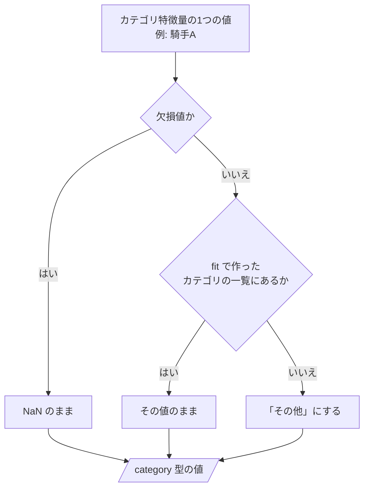
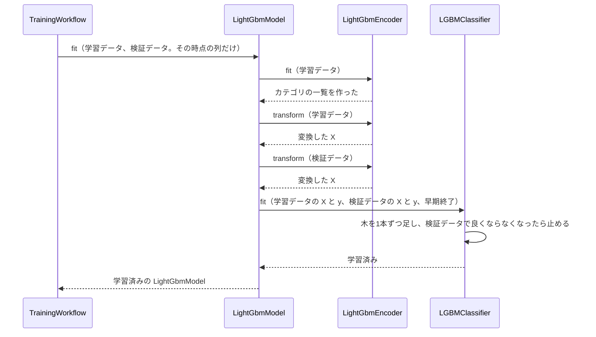
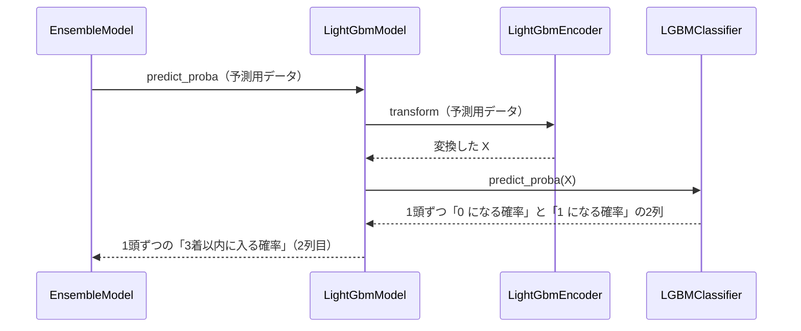

# 12 LightGBM で学習・予測するための設計

**この文書で決めること:** 07〜09 で決めた学習データ（特徴量と目的変数）は、LightGBM と CatBoost に共通である。この文書では、それを LightGBM で学習・予測するために、LightGBM だけに必要な次の3つを決める。

| 決めること | 結論 |
|---|---|
| 1. 学習データの渡し方 | カテゴリ特徴量を category 型にする。出走の少ない値は「その他」にまとめる |
| 2. ハイパーパラメータの初期値 | 目的関数は二値分類（`binary`）。木の数は早期終了で決める |
| 3. 学習・予測・保存の手順 | 3つの時点（[07-prediction-timing.md](07-prediction-timing.md)）ごとに1つずつ、計3つのモデルを学習する。学習したらモデルとカテゴリの一覧を保存し、予測のときはその時点のものを読み込む（4.〜6.） |

- 用語の意味は [02-glossary.md](02-glossary.md) を参照。
- 学習データ・特徴量・目的変数は CatBoost と共通で、[08-training-data.md](08-training-data.md)・[09-features.md](09-features.md)・[10-target.md](10-target.md) を参照。この文書には、LightGBM だけに関わることを書く。
- CatBoost の設計は [13-catboost.md](13-catboost.md) を参照。
- LightGBM の使い方の基本（`fit()`・`predict_proba()`・保存と読み込み）は [03-library-basics.md](03-library-basics.md) の「4. LightGBM の使い方」を参照。
- 図の読み方は、フローチャートは [06-flowchart.md](06-flowchart.md)、シーケンス図は [05-sequence.md](05-sequence.md) の「図の読み方」を参照。

## 1. 学習データの渡し方

| 列 | 渡し方 | 理由 |
|---|---|---|
| 数値特徴量 | そのまま渡す。欠損値も NaN のまま | LightGBM は、欠損値を分かれ道のどちら側に送るかを学習で決める |
| カテゴリ特徴量 | pandas の `category` 型にして渡す | LightGBM は `category` 型の列を、カテゴリ特徴量として扱う |
| カテゴリ特徴量の、出走が少ない値 | 学習データでの出走が 50 回未満（設定ファイルの `min_category_count` で変えられる）の値を「その他」にまとめる。対象は騎手・調教師・父・父の父・母の父 | LightGBM は数回しか出てこない値でも分かれ道を作れてしまい、過学習しやすい |
| カテゴリ特徴量の欠損値 | NaN のまま | `category` 型の欠損値として扱われる |
| ID 列・評価用の列 | 渡さない | [08-training-data.md](08-training-data.md) の「列の種類」を参照 |

学習のときに作ったカテゴリの一覧（「その他」にまとめたあとの値の一覧）は、モデルと一緒に保存し、予測のときにも使う。一覧が学習と予測で違うと、同じ騎手でも別の値として扱われるからである。

## 2. ハイパーパラメータの初期値

`lightgbm.LGBMClassifier` の引数名で書く。ここの値は設定ファイルの初期値で、プログラムを書き換えずに設定ファイルで変えられる（[14-hyperparameter-settings.md](14-hyperparameter-settings.md)）。値は仮で、検証データで調整する。調整のやり方は、検証データの分け方と一緒に次の設計書で決める。

| 引数 | 初期値 | 意味 | 理由 |
|---|---|---|---|
| `objective` | `binary` | 目的関数。二値分類 | `predict_proba` が 3着以内に入る確率を返すようにする |
| `learning_rate` | 0.05 | 学習率 | 小さめにして、木の数で調整する |
| `n_estimators` | 2000 | 木の数の上限 | 実際の数は早期終了で決まる |
| 早期終了 | 100 回 | 検証データの当たり具合が、木を 100 本足しても良くならなければ止める | 木を増やしすぎて過学習するのを防ぐ。`fit()` に、検証データ（`eval_X=`・`eval_y=`）と `callbacks=[lightgbm.early_stopping(100)]` を渡す |
| `num_leaves` | 31 | 1本の木の葉の数 | 既定値のまま始める |
| `min_child_samples` | 100 | 1枚の葉に入るサンプルの最小数 | 既定値の 20 より大きくし、少数の馬のくせを覚えないようにする |
| `subsample` / `subsample_freq` | 0.8 / 1 | 木を1本作るごとに、サンプルの 8割を選んで使う | 過学習を抑える |
| `colsample_bytree` | 0.8 | 木を1本作るごとに、特徴量の 8割を選んで使う | 過学習を抑える |
| `random_state` | 42 | 乱数の種 | 同じ学習データから同じモデルができるようにする |

1 と 0 の数の偏りを直す設定（`is_unbalance`・`class_weight`）は使わない。[10-target.md](10-target.md) の「1 と 0 の数の偏り」を参照。

## 3. カテゴリ特徴量の値の変え方（フローチャート）

`LightGbmEncoder` が、騎手・調教師・父・父の父・母の父の値を、LightGBM に渡す値に変える。

- `fit(学習データ)`: 学習データでの出走が 50 回以上の値を集めて、カテゴリの一覧を作る。分かれ道は、この「50 回以上か」の1つだけである。
- `transform(データ)`: 下の図の手順で、値を変える。学習データ・検証データ・予測用データのどれにも使う。

**説明。** 一覧に無い値は、学習データで出走が 50 回に満たなかった値か、学習のあとに出てきた値（学習のあとにデビューした騎手など）である。どちらも「その他」にする。競馬場・芝ダのように値の種類が少ないカテゴリ特徴量は、この手順を通さず、そのまま `category` 型にする。

## 4. 学習のやりとり（シーケンス図）

[05-sequence.md](05-sequence.md) の図1の「LightGbmModel を作り、その時点の列だけで学習させる」の中の呼び出しを示す。3つの時点ごとに1回ずつ、計3回この流れを行う。

## 5. 予測のやりとり（シーケンス図）

[05-sequence.md](05-sequence.md) の図2の「2つのモデルの予測確率を出して平均する」のうち、LightGBM の分の呼び出しを示す。

## 6. 保存

- `ModelRepository` が `LightGbmModel.save(パス)` を呼ぶ。`LightGbmModel` は、学習済みの `LGBMClassifier` と、`LightGbmEncoder` のカテゴリの一覧を、`joblib.dump()` で書き込む。読み込みは `LightGbmModel.load(パス)` で、`joblib.load()` を使う。
- 3つの時点ごとのモデルと、学習に使った設定を保存する（[14-hyperparameter-settings.md](14-hyperparameter-settings.md)）。
- 保存先: Git の対象外の `reports/form_aptitude_top3/models/`（[04-classes.md の「パッケージ構成」](04-classes.md#パッケージ構成)）。モデルは JV-Data から作ったもので、公開しないため。

## 文書情報

| 項目 | 内容 |
|---|---|
| 作成日 | 2026-09-21 |
