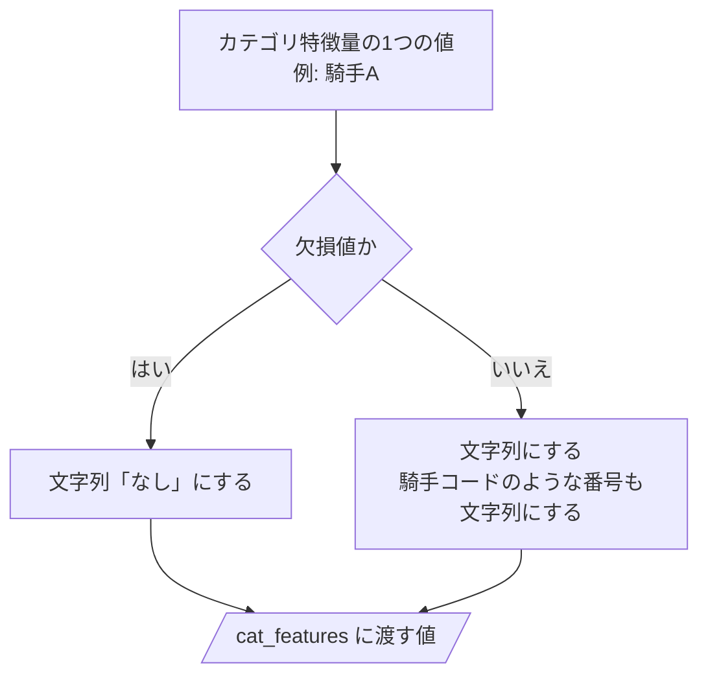
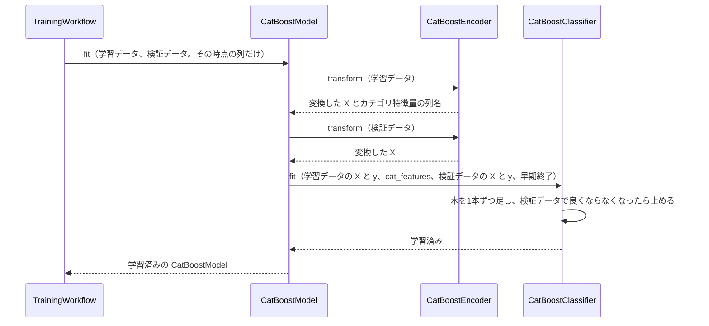
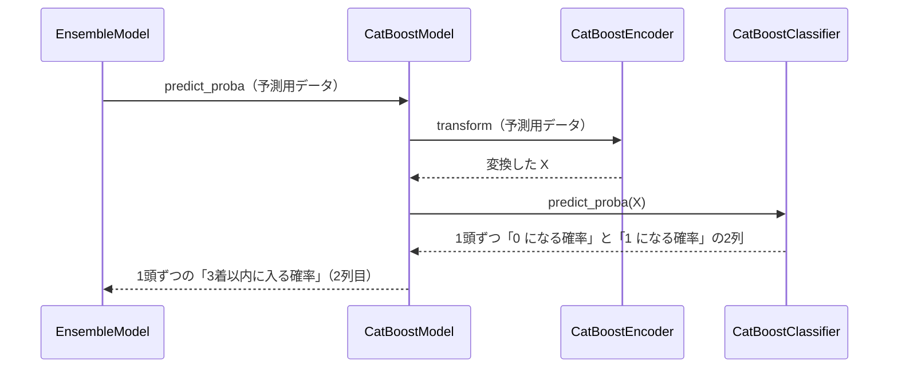

# 13 CatBoost で学習・予測するための設計

**この文書で決めること:** 07〜09 で決めた学習データ（特徴量と目的変数）は、LightGBM と CatBoost に共通である。この文書では、それを CatBoost で学習・予測するために、CatBoost だけに必要な次の3つを決める。

| 決めること | 結論 |
|---|---|
| 1. 学習データの渡し方 | カテゴリ特徴量は文字列のまま `cat_features` に指定し、欠損値だけ文字列「なし」にする。出走の少ない値はまとめない |
| 2. ハイパーパラメータの初期値 | 目的関数は二値分類（`Logloss`）。木の数は早期終了で決める |
| 3. 学習・予測・保存の手順 | 3つの時点（[07-prediction-timing.md](07-prediction-timing.md)）ごとに1つずつ、計3つのモデルを学習する。学習したらモデルを保存し、予測のときはその時点のものを読み込む（4.〜6.） |

- 用語の意味は [02-glossary.md](02-glossary.md) を参照。
- 学習データ・特徴量・目的変数は LightGBM と共通で、[08-training-data.md](08-training-data.md)・[09-features.md](09-features.md)・[10-target.md](10-target.md) を参照。この文書には、CatBoost だけに関わることを書く。
- LightGBM の設計は [12-lightgbm.md](12-lightgbm.md) を参照。
- CatBoost の使い方の基本（`fit()`・`predict_proba()`・保存と読み込み）は [03-library-basics.md](03-library-basics.md) の「5. CatBoost の使い方」を参照。
- 図の読み方は、フローチャートは [06-flowchart.md](06-flowchart.md)、シーケンス図は [05-sequence.md](05-sequence.md) の「図の読み方」を参照。

## 1. 学習データの渡し方

| 列 | 渡し方 | 理由 |
|---|---|---|
| 数値特徴量 | そのまま渡す。欠損値も NaN のまま | CatBoost は、数値の欠損値を「どの値よりも小さい値」として扱う |
| カテゴリ特徴量 | 文字列にして渡し、`fit` の `cat_features` に列名を並べる | CatBoost は、`cat_features` に指定した列をカテゴリ特徴量として扱う。値は文字列か整数でなければならない |
| カテゴリ特徴量の、出走が少ない値 | まとめない | CatBoost は、カテゴリ特徴量を順序付きターゲット統計で数に置き換える。数が少ない値は全体の割合に寄せて扱うので、まとめなくても過学習しにくい |
| カテゴリ特徴量の欠損値 | 文字列「なし」にする | CatBoost は、カテゴリ特徴量に NaN があると学習できない |
| ID 列・評価用の列 | 渡さない | [08-training-data.md](08-training-data.md) の「列の種類」を参照 |

予測のとき、学習データに無かった値（学習のあとにデビューした騎手など）は、そのまま渡してよい。CatBoost は、知らない値を全体の割合として扱う。

## 2. ハイパーパラメータの初期値

`catboost.CatBoostClassifier` の引数名で書く。ここの値は設定ファイルの初期値で、プログラムを書き換えずに設定ファイルで変えられる（[14-hyperparameter-settings.md](14-hyperparameter-settings.md)）。値は仮で、検証データで調整する。調整のやり方は、検証データの分け方と一緒に次の設計書で決める。

| 引数 | 初期値 | 意味 | 理由 |
|---|---|---|---|
| `loss_function` | `Logloss` | 目的関数。二値分類 | `predict_proba` が 3着以内に入る確率を返すようにする |
| `learning_rate` | 0.05 | 学習率 | 小さめにして、木の数で調整する |
| `iterations` | 2000 | 木の数の上限 | 実際の数は早期終了で決まる |
| `early_stopping_rounds` | 100 | 検証データの当たり具合が、木を 100 本足しても良くならなければ止める | 木を増やしすぎて過学習するのを防ぐ。`fit` に検証データ（`eval_set`）と一緒に渡す |
| `depth` | 6 | 木の深さ | 既定値のまま始める |
| `l2_leaf_reg` | 3 | 葉の値を大きくしすぎないように抑える強さ | 既定値のまま始める |
| `random_seed` | 42 | 乱数の種 | 同じ学習データから同じモデルができるようにする |

1 と 0 の数の偏りを直す設定（`auto_class_weights`）は使わない。[10-target.md](10-target.md) の「1 と 0 の数の偏り」を参照。

## 3. カテゴリ特徴量の値の変え方（フローチャート）

`CatBoostEncoder.transform(データ)` の中で行う判断。すべてのカテゴリ特徴量の値を、CatBoost に渡す値に変える。学習データ・検証データ・予測用データのどれにも、同じ手順を使う。LightGBM と違い、学習データから覚えることが無いので、`fit()` は無い。

**説明。** 欠損値だけを文字列「なし」に置き換え、それ以外はすべて文字列にする。LightGBM と違い、出走の少ない値や、学習のときに無かった値を「その他」にまとめる分かれ道は無い。

## 4. 学習のやりとり（シーケンス図）

[05-sequence.md](05-sequence.md) の図1の「CatBoostModel を作り、その時点の列だけで学習させる」の中の呼び出しを示す。3つの時点ごとに1回ずつ、計3回この流れを行う。

## 5. 予測のやりとり（シーケンス図）

[05-sequence.md](05-sequence.md) の図2の「2つのモデルの予測確率を出して平均する」のうち、CatBoost の分の呼び出しを示す。

## 6. 保存

- `ModelRepository` が `CatBoostModel.save(パス)` を呼ぶ。`CatBoostModel` は、学習済みの `CatBoostClassifier` を `save_model()` で書き込む。カテゴリ特徴量の列名はモデルの中に残るので、別に保存しなくてよい。読み込みは `CatBoostModel.load(パス)` で、`load_model()` を使う。
- 3つの時点ごとのモデルと、学習に使った設定を保存する（[14-hyperparameter-settings.md](14-hyperparameter-settings.md)）。
- 保存先: Git の対象外の `reports/form_aptitude_top3/models/`（[04-classes.md の「パッケージ構成」](04-classes.md#パッケージ構成)）。モデルは JV-Data から作ったもので、公開しないため。

## 文書情報

| 項目 | 内容 |
|---|---|
| 作成日 | 2026-09-21 |
