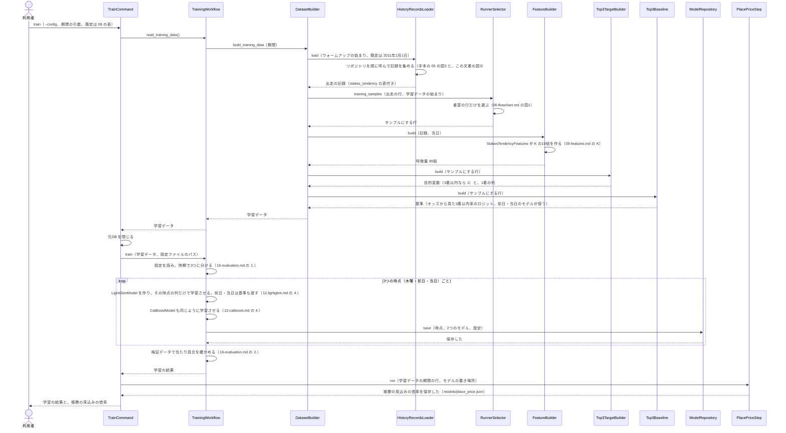
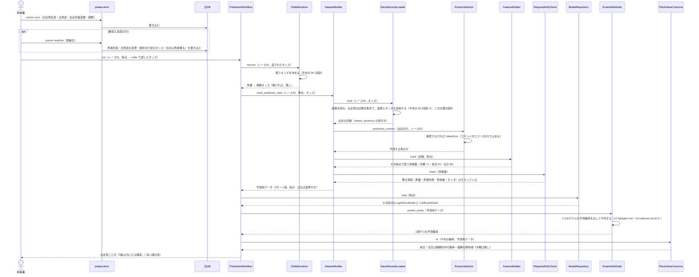
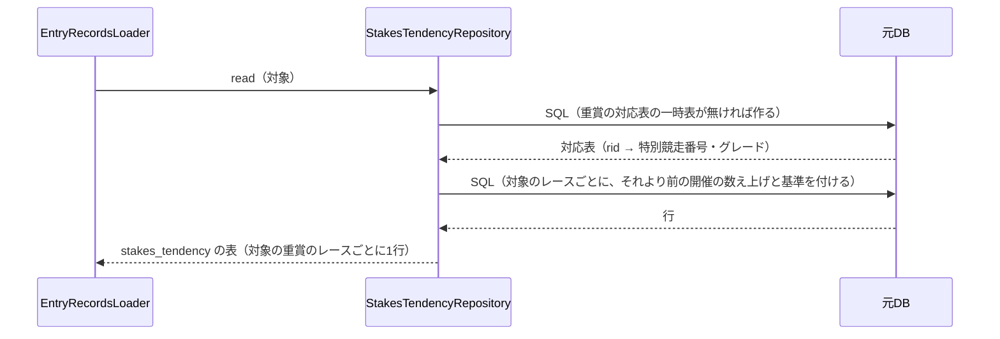

# 05 学習と予測のやりとり（シーケンス図）

**この文書で示すこと:** 学習と予測のとき、利用者・jvdata-store・元DB と、[04-classes.md](04-classes.md) のクラスが、どの順に、どのメソッドを呼ぶか。

**結論: 流れは「学習」と「予測」の2つに分かれ、手本の予想とほぼ同じである。** 学習は共通の `TrainingWorkflow` が進め、3つの時点ごとに LightGBM と CatBoost を学習させて保存する。予測は `PredictionWorkflow` が進め、その時点の予測用データを作り、保存した2つのモデルで予測確率を出して平均する。この予想で増えるのは、記録を集めるときに `StakesTendencyRepository` が重賞の傾向を読む1回の呼び出し（図3）だけである。

- 図に出てくるものと、図の読み方（凡例）は [手本の 05 の「図に出てくるもの」](../近走と適性から3着以内を予想/05-sequence.md#図に出てくるもの) と [「図の読み方」](../近走と適性から3着以内を予想/05-sequence.md#図の読み方) を参照。この予想で増えるのは、`StakesTendencyRepository`（傾向を読むリポジトリ）と `StakesTendencyFeatures`（まとまり K を作るクラス）である。
- public メソッドの中の判断（if 文による分かれ道）は [06-flowchart.md](06-flowchart.md) を参照。2種類の図の使い分けは [01-overview.md の「図の使い分け」](01-overview.md#図の使い分け) を参照。
- **リポジトリとのやりとりは、手本とほぼ同じである。** 学習データを集める流れは [手本の 05 の図3](../近走と適性から3着以内を予想/05-sequence.md#図3-記録を集めるリポジトリとのやりとり)、1レースの記録を集めて速報を反映する流れは [手本の 05 の図4](../近走と適性から3着以内を予想/05-sequence.md#図4-1レースの記録を集める速報の反映) を参照。この予想では、その並びの最後に、この文書の図3の呼び出しが1つ増える。

## 図1. 学習

**説明。** 利用者が `train` を実行すると、`TrainCommand` は元DB を開き、共通の `TrainingWorkflow.read_training_data()` で学習データを1回だけ作る。作り終えたら元DB を閉じ、学習のあいだはロックを持たない（手本と同じ）。`DatasetBuilder` は、記録を集める（`HistoryRecordsLoader`）・入れる行を選ぶ（`RunnerSelector`）・特徴量を作る（`FeatureBuilder`）・目的変数を付ける（共通の `Top3TargetBuilder`）・基準を作る（共通の `Top3Baseline`）を順に呼ぶだけである。

手本と違うのは次の3つで、ほかは手本の図1と同じである。

- 記録を集めるとき、`StakesTendencyRepository` が重賞の傾向を読む呼び出しが1つ増える（図3）。傾向は出走の記録（`EntryRecords`）の `stakes_tendency` の表として持ち、`FeatureBuilder` の中で `StakesTendencyFeatures` が出走の行と突き合わせて K の10個を作る。
- `RunnerSelector` が、重賞（グレードコード A・B・C の平地）の行だけをサンプルにする（[06-flowchart.md の図1](06-flowchart.md#図1-学習データに入れる行の選び方)）。重賞でないレースの出走も読むが、過去走と傾向の数え上げにだけ使う。
- 学習データは、当日の時点の特徴量 85個で作る（単勝オッズは確定オッズ）。木曜と前日のモデルには、その時点で使う列だけを渡す（[07-prediction-timing.md の「時点ごとに使う特徴量」](07-prediction-timing.md#時点ごとに使う特徴量)）。モデルは 3つの時点 × 2つで6個になる。

## 図2. 予測

木曜・前日・当日のどれかの時点で、1つの重賞を予測するときの流れ。

**説明。** 利用者は、まず jvdata-store の `jvstore sync` で、出走馬名表（木曜）か出馬表（前日から）と、出走別着度数・調教を取り込む。前日と当日は、`jvstore realtime` で速報（締め切り前のオッズを含む）も取り込む。予測に使うオッズの決め方（渡されたオッズ → 締め切り前のオッズ → 無し）と、要る情報が欠けているときの止め方は、手本とまったく同じである（[07-prediction-timing.md](07-prediction-timing.md#予測のときのオッズの与え方)）。

手本と違うのは、`RunnerSelector.prediction_runners()` が「重賞か」を確かめるところだけである。渡されたレースが重賞（グレードコード A・B・C の平地）でなければ、`ValueError` を投げ、コマンドが「エラー: このレースは重賞（G1・G2・G3）ではない」の1行で止まる。この予想のモデルは重賞だけで学習しているので、ほかのレースに使うと確率の意味が保てないためである。

## 図3. 重賞の傾向を読む

図1・図2の「リポジトリを順に呼んで記録を集める」（手本の 05 の図3・図4）の並びの最後に増える呼び出しを示す。学習でも予測でも同じで、違うのは「対象」（学習では期間内の全部の出走、予測では1レース）だけである。

**説明。** 2本の SQL は、どちらも `tools/共通/stakes.py` のもの（実装済み）である。返る表の列は、開催の同定（`race_id`・`stakes_no`・`grade`・`editions`）と、切り口ごとの過去の出走数 `*_n`・3着以内の数 `*_hits`（前・内枠は期待の数 `*_exp` も）、基準 `base_*`（[04-classes.md の 2](04-classes.md#2-shared-に足す変えるもの)）。数えるのは、そのレースの開催日より前の開催・基準だけである（[11-leak-prevention.md](11-leak-prevention.md#決まり) の 6）。予測するレース（確定前の行）も、対応表に入っているので同じ SQL で傾向が付く。`EntryRecordsLoader` がこのリポジトリを受け取っていない予想では、この呼び出しは行われず、`stakes_tendency` は空の表になる。

## 今は無く、これから作るところ

| 図の中の部分 | 今の状態 |
|---|---|
| レースの同定と傾向の数え上げの SQL（`tools/共通/stakes.py`） | ある（実装済み。分析ツール `tools/重賞攻略/` も実装済みで、同じ SQL を使う） |
| `shared` に足す・変えるもの（`StakesTendencyRepository`・`EntryRecords` の `stakes_tendency`・ローダーの変更） | 作った（`src/yosou/shared/`。[04-classes.md の 2](04-classes.md#2-shared-に足す変えるもの)） |
| この予想のパッケージ（`RunnerSelector`・`StakesTendencyFeatures`・`PredictionWorkflow`・コマンド） | 作った（`src/yosou/stakes_tendency_top3/`。[04-classes.md](04-classes.md#4-この予想だけのクラスの一覧)） |
| `evaluate` コマンド | 作った（同上。[16-evaluation.md の 4](16-evaluation.md#4-evaluate-コマンド学習に使っていない期間での確かめ)） |
| 学習済みモデル（`reports/重賞の傾向と近走から3着以内を予想/models/`） | 実DB で学習して保存済み（2026-09-29）。学習し直すときは `train` を実行する |
| 7つの半年の区切りでの確かめ（ウォークフォワード）の重賞版 | 無い。残っている課題（[15-decisions.md の 8](15-decisions.md#8-当たり具合の確かめ方)） |

## 文書情報

| 項目 | 内容 |
|---|---|
| 作成日 | 2026-09-29 |
| 更新 | 2026-09-29: 実装が済んだのに合わせて「今は無く、これから作るところ」を直し、図3 の列の説明に `*_exp` を足した |
