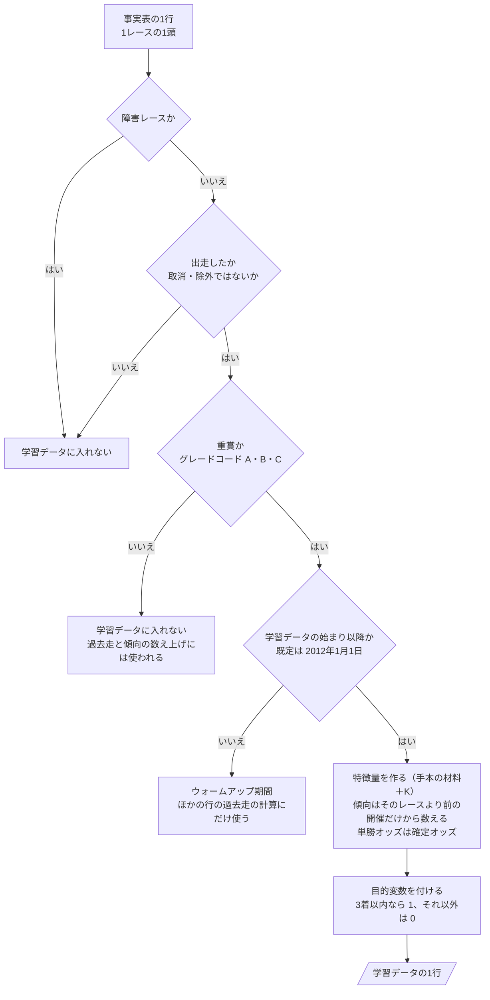

# 06 判断の手順（フローチャート）

**この文書で示すこと:** 学習データを作るときの、条件によって分かれる判断の手順。

**結論: この予想で手本と違う判断は「学習データに入れる行の選び方」（図1。重賞かどうかの問いが増える）だけである。予測に使うオッズの決め方は手本と同じなので、描き直さない。**

- この文書は、1つの public メソッドの中で、条件で分かれる判断の手順を示す。クラスどうしのやりとりは [05-sequence.md](05-sequence.md) を参照。2種類の図の使い分けは [01-overview.md の「図の使い分け」](01-overview.md#図の使い分け) を参照。
- 図の読み方（凡例）は [手本の 06 の「図の読み方」](../近走と適性から3着以内を予想/06-flowchart.md#図の読み方) を参照。
- 予測に使うオッズの決め方（`OddsResolver.resolve()` の中の判断）は、[手本の 06 の図2](../近走と適性から3着以内を予想/06-flowchart.md#図2-予測に使うオッズの決め方) をそのまま使う。
- モデルごとの判断の手順（カテゴリ特徴量の値の変え方）は、手本と同じで [12-lightgbm.md](12-lightgbm.md)・[13-catboost.md](13-catboost.md) を参照。
- 用語の意味は [02-glossary.md](02-glossary.md) を参照。

## 図1. 学習データに入れる行の選び方

`RunnerSelector.training_samples()`（共通の `DatasetBuilder.build_training_data()` から呼ばれる）の中で行う判断と、そのあとの段。事実表の1行（1レースの1頭）が、学習データの1行になるまで。

**説明。** 4つの問いで、学習データに入れる行を選ぶ。はじめの2つ（障害レースか・出走したか）は、どの予想でも同じ決まりで、共通の `FlatRunnerFilter` が行う。3つ目（重賞か）が、この予想で増える問いである。規則は [08-training-data.md](08-training-data.md#3-どのサンプルを入れるか)、特徴量は [09-features.md](09-features.md)、目的変数は [10-target.md](10-target.md) を参照。「そのレースより前の開催だけから数える」はリークを防ぐためで、[11-leak-prevention.md](11-leak-prevention.md) を参照。

- **重賞でないレースの行は、サンプルにしないが、捨てない。** ほかの行の過去走の特徴量（前走・近5走など）と、傾向の基準（同じ競馬場・コース・距離の全クラスの複勝率）の計算に使われる。障害の重賞（グレードコード F・G・H）は、1つ目の問いで外れる。
- 4つ目の問いの日は、`train` の引数 `--train-from` で変えられる（[08-training-data.md の 4](08-training-data.md#4-期間の指定)）。
- 予測用データを作るときも同じ手順を通る。ただし、`RunnerSelector.prediction_runners()` は、3つ目の問いで「いいえ」なら `ValueError` を投げて止まる（渡された1レースが対象外なので、黙って空を返さない。[05-sequence.md の図2](05-sequence.md#図2-予測)）。4つ目の問いは、これから走るレースなので常に「はい」になり、目的変数を付ける段は無い。作る特徴量は、その時点で使うものだけである（[07-prediction-timing.md の「時点ごとに使う特徴量」](07-prediction-timing.md#時点ごとに使う特徴量)）。

## 文書情報

| 項目 | 内容 |
|---|---|
| 作成日 | 2026-09-29 |
