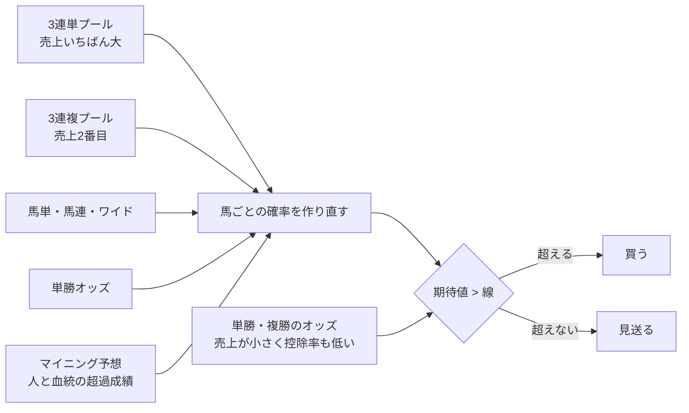

# 01. 何が問題か

**問題は1つ。** これまでの4つの予想は、**単勝オッズがすでに知っていること以上のことを知らない**。
市場と同じ確率しか出せないモデルでどの馬を買っても、長い目で見れば控除率（単勝・複勝 20%、3連単 27.5%）の
ぶんだけ負ける。買い方を 1.5 万通り試しても 100% を超える戦略が再現しなかったのは、買い方が悪いのではなく、
予測に「市場への上乗せ」が無かったからである。

実測値は `reports/回収率100超/` にある（この文書には JV-Data 由来の値を書かない）。

## 1. 確かめたこと

### 1-1. 既存のモデルの確率には、市場への上乗せがほぼ無い

手本の予想（近走と適性から3着以内）の確率と、単勝オッズから見た確率を組み合わせると、
モデル側に付く重みがほぼ 0 になる（`reports/form_aptitude_top3/market/combine.txt`）。
つまり、モデルが言えることは全部オッズが先に言っている。

### 1-2. 券種の人気順で買っても、どれも控除率のぶんだけ負ける

8つの券種それぞれについて、「人気 N 番目の買い目を毎レース買う」を 10 年分集計した。
どの券種のどの人気順でも、回収率は控除率から決まる水準に収まった。
つまり、**単純な人気の偏りで儲かる穴は残っていない**。

### 1-3. 人気薄は買われすぎている。ただし、それだけでは足りない

単勝オッズが 100倍を超える馬の回収率は、市場全体の水準よりはっきり低い。逆に、いちばん人気の
馬の複勝は、市場全体より高い。人気薄が買われすぎ、人気馬が買われなさすぎる（favorite-longshot bias）という
よく知られた偏りが、今の中央競馬にもある。

ただし、いちばん条件の良い帯（最上位人気の複勝）でも 100% には届かない。
**この偏りを突くだけでは 100% を超えられない。**

## 2. どこに可能性が残るか

JRA には券種ごとに別々の投票プールがあり、**売上の大きさが数倍違う**（3連単がいちばん大きい）。
3連単・3連複には大きな金が入り、単勝・複勝には小さな金しか入らない。

大きなプールのオッズには、多くの人の判断が集まっている。小さなプールのオッズには、それが集まっていない。
だとすれば、**大きなプールから取り出した確率のほうが、小さなプールのオッズより正しい**はずである。

これを確かめた。単勝オッズから作った確率で、3連複・ワイド・馬連の買い目の期待値を計算し、
期待値が 1 を超える買い目を買ってみると、**期待値のしきい値を上げるほど回収率が下がった**。
これは「単勝オッズ側が間違っている」ことを意味する。組み合わせ券種のほうが正しい。

そこで**向きを逆にする**。大きなプール（3連単・3連複・馬単・馬連・ワイド）のオッズから確率を取り出し、
それを使って、**いちばん情報が薄くて控除率も低い単勝・複勝を買う**。これがこの研究の方針である。

## 3. 図の使い分け

この研究の文書では、**流れ（どのデータがどこへ行くか）はフローチャート**で描き、
**時間の順（いつ何が分かるか）が問題になるところだけシーケンス図**で描く。
同じ手順を両方で描かない。
