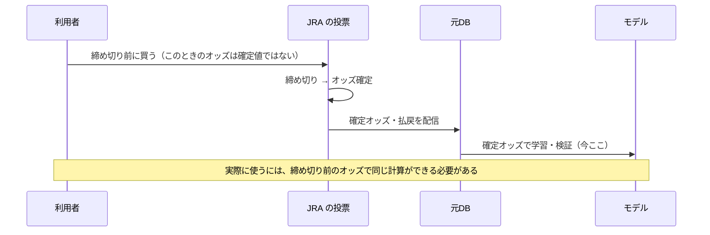

# 02. 市場の測り方

**この文書は、オッズから確率を作る手順を書く。** 実測値は `reports/回収率100超/` にある。

## 1. オッズから確率へ（1段目）

単勝オッズの逆数を、レース内で合計 1 になるようにそろえると、その馬に入った金の割合になる。
これを**市場の確率**と呼ぶ。合計する前の値（オーバーラウンド）は 1 + 控除率 に近い。

組み合わせ券種でも同じことをする。たとえば 3連単なら、全買い目のオッズの逆数を合計 1 にそろえ、
**その馬が1着の買い目だけを足す**と、「3連単プールから見た勝率」になる。
3連複なら、その馬が組に入っている買い目を足すと「3連複プールから見た3着以内率」になる。

作るのは次の6つ。部品は [analysis/repository/pool_marginal_repository.py](../analysis/repository/pool_marginal_repository.py)。

| 作る値 | 元の券種 | 意味 |
|---|---|---|
| 3連単から見た勝率 | 3連単 | その馬が1着の買い目の合計 |
| 馬単から見た勝率 | 馬単 | 同上 |
| 3連複から見た3着以内率 | 3連複 | その馬が組に入っている買い目の合計 |
| 馬連から見た2着以内率 | 馬連 | 同上 |
| 複勝から見た3着以内率 | 複勝 | 発表オッズの幅の中間の逆数 |
| ワイドから見た3着以内率 | ワイド | その馬が組に入っている買い目の合計 |

## 2. 人気薄の買われすぎを直す（2段目）

市場の確率をそのまま使うと、人気薄に高すぎる確率が付いている。
これを直すのに **`p^τ`（べき乗）では足りなかった**。τ を最良に選んでも、100倍超の馬のずれが残る。
歪みの大きさが人気帯によって違うからである。

そこで、`log p` を折れ線に分けて、帯ごとに違う補正を学べるようにした
（[analysis/market/log_probability_basis.py](../analysis/market/log_probability_basis.py)）。
学習は**レース単位の条件付きロジット**で行う
（[analysis/market/conditional_logit.py](../analysis/market/conditional_logit.py)）。
1頭ずつ独立に「勝つか」を当てる学習では、同じレースの馬の確率を足しても 1 にならず、期待値が計算できない。

この補正は、最後のモデルでは**そのままは使わない**。勾配ブースティング（§6）に `log` の確率をそのまま渡すと、
木が同じ形の補正を自分で学ぶからである。この節の手順は、**土台が成り立っているかの診断**として残している
（[market_check.py](../market_check.py) で年ごとに測れる）。
「単勝オッズには直せる歪みがある」ことが、ここで確かめられる。

## 3. 勝率から複勝・ワイド・3連複の確率へ（3段目）

Harville モデルは「1着が決まったら、残りの馬の勝率の比で2着を決める」をくり返す。
これをそのまま使うと、**人気馬が上位を独占しすぎる形**になり、3着以内の確率を大きく見積もりすぎた。

Stern の補正は、2着・3着を決める段で勝率を `p^λ`・`p^μ`（λ, μ < 1）に置き換え、人気馬の寄りを弱める。
λ・μ は実際の着順から推定する（[analysis/market/stern_fitter.py](../analysis/market/stern_fitter.py)）。
補正後は、確率のずれが大きく縮んだ。

計算は頭数の2乗で済ませている。3着の確率を素直に書くと頭数の3乗かかるが、
「2頭ぶんの寄与を先に全部足してから、自分のぶんを引く」形にすると2乗で足りる
（[analysis/market/stern_probabilities.py](../analysis/market/stern_probabilities.py)）。

## 4. 複勝で実際に受け取る額（4段目）

JRA の複勝の払戻は、3着以内に入った馬の組み合わせで変わる。買う時点では「最低オッズ〜最高オッズ」の
幅しか分からない。**最低オッズをそのまま期待値に使うと、期待値をはっきり低く見積もる。**

そこで、過去の的中した複勝から「実際の払戻 ÷ 最低オッズ」の平均を最低オッズの帯ごとに求め、
それを掛けた値を想定の払戻倍率にする
（[analysis/ticket/place_price_estimator.py](../analysis/ticket/place_price_estimator.py)）。
倍率は学習に使う期間だけで推定し、評価する期間の結果は使わない。

## 5. 確率を1つにまとめる（5段目）

ここまでで、1頭につき「券種ごとに市場が付けた確率」が 13個そろう（6券種のプール、3連単・馬単の着順ごと、
票数の配分、単勝オッズから作った勝率と複勝率）。これを1つの「3着以内に入る確率」にまとめるのが
勾配ブースティング（LightGBM と CatBoost。[analysis/probability/](../analysis/probability/)）である。

モデルに渡すのは次の4種類。

| 種類 | 何か | 効き |
|---|---|---|
| 券種プールごとの確率（log と、レース内順位） | 各券種の市場が、その馬をどう見ているか | **大** |
| 単勝との食い違い | 大きなプールが、単勝オッズより高く（低く）見ている度合い | **大** |
| マイニング予想（順位・偏差・信頼度） | JRA-VAN が出している予想 | 小 |
| 馬の実力（前走・持ち時計・馬体重など） | 市場に織り込まれ残った分 | 小 |

騎手・調教師・血統は、コードをそのまま渡すと**当たり具合が悪化した**（名前を覚えるだけになる）。
[analysis/feature/market_excess_rate.py](../analysis/feature/market_excess_rate.py) で
「市場の期待に対する超過成績」の数値に変えてから渡す。

2つのライブラリは木の作り方が違うので、外す場所がずれる。確率を平均すると安定する。
出てきた確率は、レース内で合計が対象頭数（3、5〜7頭立ては 2）になるようそろえ直す
（[analysis/ticket/race_place_probability.py](../analysis/ticket/race_place_probability.py)）。

## 6. いつ何が分かるか

この研究で使うオッズは、すべて**確定オッズ**（締め切り後に確定した値）である。元DB に残っているのが
確定オッズだけだからである。実際に買うときは締め切り前のオッズしか見られない。

締め切り前のオッズは、jvdata-store で速報オッズ（`0B30`。券種ごとなら `0B31`〜`0B36`）を貯めれば手に入る。
**この検証は「締め切り直前のオッズが確定値に近い」という前提の上に立っている。**
前提が成り立つかは、締め切り前のオッズがたまってから確かめる（[04-買い方.md](04-買い方.md) の「残っている課題」）。
