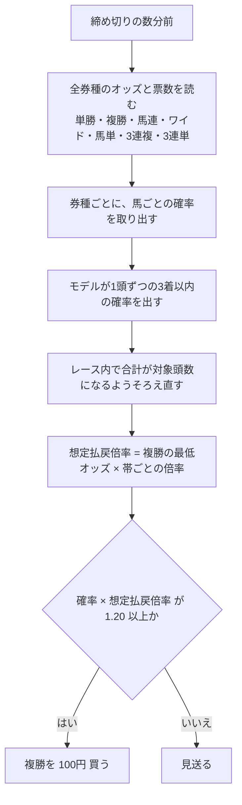

# 04. 買い方

**この文書は、モデルの確率から何をどう買うかを書く。** 実測の回収率は
`reports/回収率100超/検証の結果.md` と `reports/回収率100超/線の決め方を分けた確認.txt` にある。

## 1. 買う手順

## 2. なぜ複勝なのか

| 券種 | 控除率 | プールの大きさ | この研究での扱い |
|---|---|---|---|
| 複勝 | 20% | 小さい | **買う。** 控除率がいちばん低く、情報もいちばん薄い |
| 単勝 | 20% | いちばん小さい | 買わない。同じ確率で買っても回収率が 100% に届かなかった |
| 馬連・ワイド | 22.5% | 中 | 買わない。確率を取り出す材料として使う |
| 馬単 | 22.5% | 中 | 同上 |
| 3連複 | 25% | 大 | 同上 |
| 3連単 | 27.5% | いちばん大 | 同上。いちばん情報が多い |

**情報を取り出す場所（大きいプール）と、賭ける場所（小さいプール）を分ける。**
これがこの買い方の中心にある考えである。

単勝を買わないのは、同じモデルの確率で期待値を計算しても回収率が 100% に届かなかったからである。
1着に絞ると的中がごくわずかしかなく、確率の小さな誤差が回収率に大きく響く。
3着以内なら的中する回数が桁ひとつ増え、誤差が平均されて上乗せだけが残る。

## 3. 確率をレース内でそろえ直す

1頭ずつ独立に「3着以内に入るか」を学習すると、同じレースの確率を足しても 3（5〜7頭立てなら 2）にならない。
足して 3 になるようそろえ直すと、同じレースの馬どうしの相対が正しくなり、
期待値で選んだ買い目の回収率が上がった（`reports/回収率100超/検証の結果.md` の §2 で、そろえ直す前と後を比べている）。

## 4. 期待値の線をどこに引くか

**線は、前半の期間（2019〜2021年）の回収率だけを見て決めた。** 後半（2022〜2026年）の結果を見てから
線を動かすと、線の選び方そのものが過剰適合になる。

前半では、線を上げるほど回収率が上がり、1.30 のあたりで頭打ちになった。線を上げると買い目は減る。
**1.20 を採用する。** 前半で 100% を超え、かつ年に数百点の買い目が残る値だからである。

線を 1 ちょうどにしないのは、確率にも払戻倍率の見積もりにも誤差があるためで、その誤差のぶんの余裕を取る。

## 5. 賭け金と、実際の運用の規模

**1点 100円の均等**にする。期待値の大きさに応じて賭け金を変える（Kelly 基準）と、
見かけの回収率は上がるが、それは賭け金の配分を結果に合わせただけで、当たる力が上がったわけではない。
まず均等で 100% を超えることを確かめ、そのあとで配分を考える。

**券種は複勝だけ**なので、1レースの金額 = 複勝に賭ける金額 = 100円 × その レースの点数になる。
券種を分けたり、1レースに複数の券種を重ねたりはしない。

「この買い方に従うと、実際に何をどれだけ買うことになるか」は
`reports/回収率100超/運用の目安.md` にある。出しているのは次の6つ。

| 出すもの | なぜ要るか |
|---|---|
| 参加するレースの数と割合（年間・1日あたり） | 全レース買うのか、たまにしか買わないのかで、運用の手間が変わる |
| 1レースあたりの点数の分布 | 平均だけでは足りない。1点で済むのか、10点になることがあるのか |
| 1レース・1日・1年あたりの金額 | 用意する金額が決まる |
| 通算の損益と、いちばん深い落ち込み（ドローダウン）・最大の連敗 | 「いくら用意すれば途中でやめずに済むか」の答え |
| 結果としてどんな馬を買うことになるか（頭数・人気帯・オッズ帯） | レースを先に選ぶのではなく全レース計算するので、偏りは結果として出る |
| 金額を上げるときの上限 | 複勝プールは小さいので、大きく張ると自分でオッズを下げる（§6-2） |

**レースを先に選ばない。** 「このレースは買い」という条件は作っていない。全レースについて確率と期待値を
計算し、線を超えた馬がいるレースだけ買う。結果として多頭数・人気薄寄りに偏るが、それは条件ではなく結果である。

## 6. 残っている課題

### 6-1. 締め切り前のオッズで同じことができるか（いちばん大きい課題）

この検証で使ったオッズは、すべて**確定オッズ**である。元DB に残っているのが確定オッズだけだからである。
実際に買うときは、締め切り前のオッズしか見られない。

JV-Data には締め切り前のオッズを取る口がある（速報系。`0B30` が全賭式、`0B31`〜`0B36` が券種ごと。どちらもレースごと）。
ただし **jvdata-store が今取っているのは `0B31`（単勝・複勝・枠連）だけ**で、
この買い方が要る馬連・ワイド・馬単・3連複・3連単のオッズを取っていない。

やること（jvdata-store 側）:

1. `src/jvstore/realtime.py` の `RACE_DATASPECS` に `0B30`（全賭式）を足す。
2. 毎週の開催日に取って貯める。発走の数分前の断面が要る。
3. 溜まったら、「締め切り前の断面で同じ計算をしたときの回収率」を測り直す。

**この確認が済むまで、この買い方が実際に使えるとは言えない。**
確定オッズでの回収率は、上限の見積もりである。締め切り直前のオッズは確定値にかなり近いが、
どれだけ近いかはまだ測っていない。

### 6-2. 自分の投票がオッズを動かす

複勝プールは小さい。薄い馬に大きく張ると、自分の投票でオッズが下がる。
1点 100円なら影響は無視できるが、金額を上げるときは、プールの大きさに対する上限を置く。

### 6-3. 2026年は手つかずではない

期間の使い分けとして、2026年は既存の研究ですでに2回見ている。この研究でも評価に使っているので、
「手つかずのデータでの確認」にはなっていない。本当の確認は、仕様を固めたあとの**これからのレース**で行う。

## 7. 大穴について

**大穴の単勝を買っても回収率は上がらない。** 単勝オッズが 100倍を超える帯は、
モデルで選んでも回収率が控除率の水準を大きく下回る。人気薄は買われすぎているので、
当たったときの配当が、当たる確率に見合っていない。

**大穴の複勝なら上がる。** 同じ買い方を単勝オッズ 50倍以上の馬だけに絞っても、回収率は 100% を超えた。
直近の年ほど良くなっている（数値は `reports/回収率100超/線の決め方を分けた確認.txt`）。
穴馬の複勝は、単勝ほど買われすぎていない。

つまり「大穴を当てる」のではなく、**「大穴が3着に来るのを当てる」**のが、この買い方の穴の使い方である。
