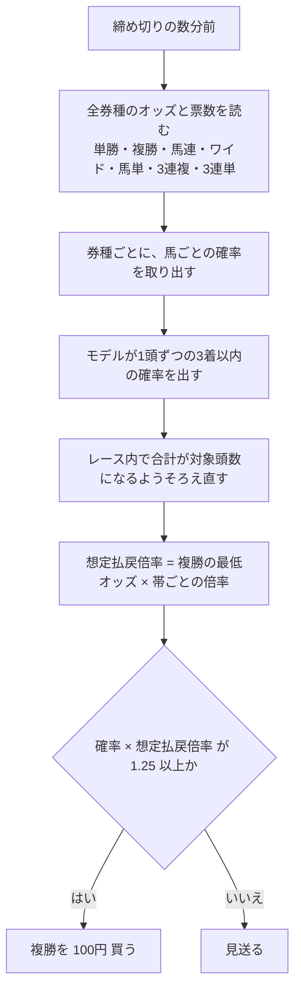

# 04. 買い方

**この文書は、モデルの確率から何をどう買うかを書く。** 実測の回収率は
`reports/回収率100超/検証の結果.md`（`backtest.py` が1回の実行で全部の表を書く）にある。

## 1. 買う手順

```mermaid
flowchart TD
    A[締め切りの数分前] --> B[全券種のオッズと票数を読む<br/>単勝・複勝・馬連・ワイド・馬単・3連複・3連単]
    B --> C[券種ごとに、馬ごとの確率を取り出す]
    C --> D[モデルが1頭ずつの3着以内の確率を出す]
    D --> E[レース内で合計が対象頭数になるようそろえ直す]
    E --> F[想定払戻倍率 = 複勝の最低オッズ × 帯ごとの倍率]
    F --> G{確率 × 想定払戻倍率 が 1.25 以上か}
    G -- はい --> H[複勝を 100円 買う]
    G -- いいえ --> I[見送る]
```

## 2. なぜ複勝なのか

| 券種 | 控除率 | プールの大きさ | この研究での扱い |
|---|---|---|---|
| 複勝 | 20% | 小さい | **買う。** 控除率がいちばん低く、情報もいちばん薄い |
| 単勝 | 20% | いちばん小さい | 買わない。同じ確率で買っても回収率が 100% に届かなかった |
| 馬連・ワイド | 22.5% | 中 | 買わない。確率を取り出す材料として使う |
| 馬単 | 22.5% | 中 | 同上 |
| 3連複 | 25% | 大 | 同上 |
| 3連単 | 27.5% | いちばん大 | 同上。いちばん情報が多い |

**情報を取り出す場所（大きいプール）と、賭ける場所（小さいプール）を分ける。**
これがこの買い方の中心にある考えである。

単勝を買わないのは、同じモデルの確率で期待値を計算しても回収率が 100% に届かなかったからである。
1着に絞ると的中がごくわずかしかなく、確率の小さな誤差が回収率に大きく響く。
3着以内なら的中する回数が桁ひとつ増え、誤差が平均されて上乗せだけが残る。

## 3. 確率をレース内でそろえ直す

1頭ずつ独立に「3着以内に入るか」を学習すると、同じレースの確率を足しても 3（5〜7頭立てなら 2）にならない。
足して 3 になるようそろえ直すと、同じレースの馬どうしの相対が正しくなり、
期待値で選んだ買い目の回収率が上がった（研究の途中で、そろえ直す前と後を比べて確かめた）。

## 4. 期待値の線をどこに引くか

**線は、前半の期間（2019〜2021年）の回収率だけを見て決める。** 後半（2022〜2026年）の結果を見てから
線を動かすと、線の選び方そのものが過剰適合になる。

**決まり: 前半で回収率が 100% を超え、前半の1年あたりの買い目が 300 点以上残る線のうち、前半の回収率がいちばん高い線。**
候補は 1.00・1.05・1.10・1.15・1.20・1.25・1.30・1.40 で、決まりはコードにしてある
（`analysis/backtest/place_line_choice.py`）。`backtest.py` は線ごとの前半・後半の成績と決まりで選んだ線を
`reports/回収率100超/検証の結果.md` の「2. 線の選び方」に書き、採用している線（`analysis/bet_rule.py` の `PLACE_RULE`）と
食い違えば知らせる。

前半では、線を上げるほど回収率が上がり、買い目は減る。点数の条件を置くのは、少ない買い目で出た高い回収率は
偶然の分が大きいためである。**この決まりで選ばれた 1.25 を採用する**（2026-09-28。それまでは 1.20）。

以前の 1.20 は、線ごとの表を見ながら「前半で 100% を超え、年に数百点残る」値として選んだもので、決まりを厳密に当てはめたものではなかった。決まりをコードにして当てはめると、1.25 も条件を満たし、前半の回収率は 1.20 より高かった。後半の成績を見て線を動かしたのではなく、前半だけで決まりどおりに選び直した結果である。

線を 1 ちょうどにしないのは、確率にも払戻倍率の見積もりにも誤差があるためで、その誤差のぶんの余裕を取る。

### 線の値が場所によって違って見えた理由（2026-09-28 に整理）

以前は、線の値が次の3か所で違って見えた（issue #29）。

| 場所 | 書かれていた線 | 何だったか |
|---|---|---|
| この文書と `bet_rule.py` | 1.20 | 採用していた線。決まりをコードにして当てはめ直したところ 1.25 が選ばれたので、1.25 に改めた（上の段落） |
| `reports/` の「線の決め方を分けた確認」 | 「採用する線（1.10 以上）」 | リポジトリに無い一時的な手順で作った表。Git の履歴で `PLACE_RULE` が 1.10 だったことは一度も無く、見出しの 1.10 はその手順の中だけの値で、採用した線ではない。今は `backtest.py` が同じ表を書くので、その表は `reports/回収率100超/古い版-20260923/` に移した |
| `reports/` の「券種ごとの検証」の複勝の行 | 1.3 | 複勝以外の券種と同じ物差しで比べるための、別の決まり（前半の当たりが 30 回以上ある線のうち、前半の回収率がいちばん高い線。点数の条件なし）で選んだ値。比べる目安で、買う線ではない（[05-券種ごとの検証.md](05-券種ごとの検証.md)） |

「検証の結果」「詳しい表」「運用の目安」の買い目の数が合わなかったのも、別々の時点のコードで作っていたためである。
今は1回の実行で全部を書くので、同じ実行の中では数字が合う。

## 5. 賭け金

**1点 100円の均等**にする。期待値の大きさに応じて賭け金を変える（Kelly 基準）と、
見かけの回収率は上がるが、それは賭け金の配分を結果に合わせただけで、当たる力が上がったわけではない。
まず均等で 100% を超えることを確かめ、そのあとで配分を考える。

## 6. 残っている課題

### 6-1. 締め切り前のオッズで同じことができるか（いちばん大きい課題。2026-09-28 に確かめた）

**分かったこと: 発走の10分前のオッズで買うと、回収率は 100% を大きく割る。発走の1分前のオッズなら、確定オッズとほぼ同じになる。**
この買い方の上乗せは、締め切り直前の数分に入るお金の情報から来ている。

ここまでの検証で使ったオッズは、すべて確定オッズだった。実際に買うときは、締め切り前のオッズしか見られない。
過去のレースの締め切り前のオッズは、JV-Data の時系列オッズ（単複枠 `0B41`・馬連 `0B42`。提供期間1年）で取れる。
ワイド・馬単・3連複・3連単の時系列は無い。そこで次のように確かめた（`check_pre_deadline.py`、入口⑥）。

- **期間:** 2025年9月〜2026年9月の、締め切り前の断面がそろう 3,469 レース
  （jvdata-store の `jvstore timeseries` で取り、`jvstore merge-odds` で元DB に入れた）。
- **モデル:** 締め切り前に手に入る材料だけで作り直したもの。
  - 使う材料: 単勝・複勝・馬連のオッズ、マイニング予想、騎手などの超過成績、馬の実力。
  - 外した材料: 3連単・馬単・3連複・ワイド・票数から作る材料。
  - 学習は確定オッズで、予測するときだけ材料を締め切り前のオッズで作り直す。
- **比べ方:** 同じレースで、期待値と買い目を「確定オッズで計算した場合」と「発走の N 分前までに発表された、いちばん新しい断面で計算した場合」で比べる。
  - 払戻は、どちらも実際の確定払戻を使う。
  - 断面は5分おきで、最後の中間の断面は発走の1分前にある。

採用した線（1.25）での結果（締め切り前に手に入る材料だけのモデル。数値は Git の対象外の
`reports/回収率100超/締め切り前のオッズでの確認（N分前）.md` にある。10分前・5分前・1分前の3つ）:

| 期待値を計算したオッズ | 回収率 | 何が起きているか |
|---|---|---|
| 確定オッズ | 100% を超える | ここまでの検証と同じ条件（上限の見積もり） |
| 発走の10分前 | 100% を大きく割る | 複勝オッズの多くが、締め切りまでに1割以上動く。期待値が高く見えた馬の多くは、そのあと人気が上がって値段が下がる |
| 発走の6分前ごろ（`--minutes 5`） | 100% を大きく割る | 同じ |
| 発走の1分前 | 確定オッズとほぼ同じ | 締め切りまでに1割以上動く複勝オッズは、ごくわずかになる |

全部の材料のモデル（3連単などを使う本来のモデル）の確率に、締め切り前の複勝オッズを掛けた場合も、
締め切りに近いほど良くなる向きは同じだった。ただし、この確率は確定の3連単などを使っているので、上限の見積もりである。

**この結果から言えること。**

1. **発走の10分前に予想して買う使い方では、この買い方は勝てない見込みが高い。**
   利用者の決まりにある「締め切り10分前のオッズでのフォワードテスト」（`tools/フォワードテスト/`）は、この見込みを、これからのレースで確かめることになる。
2. **勝てるとすれば、締め切りの直前（発走の1〜2分前）のオッズで予想して、そのまま買う使い方だけ**である。
   そのためには、次の3つを1〜2分でこなす必要がある。人が画面を見て買う使い方では難しい。
   - 直前のオッズの取り込み（`0B30`）
   - 予想
   - 投票
3. 3連単などを使う本来のモデルが直前のオッズでどうなるかは、過去のデータでは確かめられない（3連単の時系列が無い）。
   これからのレースで、速報オッズ（`0B30`）を発走の直前に貯めて確かめるしかない。

**この確認が済むまで、この買い方が実際に使えるとは言えない。** 確定オッズでの回収率は、上限の見積もりである。

### 6-2. 自分の投票がオッズを動かす

複勝プールは小さい。薄い馬に大きく張ると、自分の投票でオッズが下がる。
1点 100円なら影響は無視できるが、金額を上げるときは、プールの大きさに対する上限を置く。

### 6-3. 2026年は手つかずではない

期間の使い分けとして、2026年は既存の研究ですでに2回見ている。この研究でも評価に使っているので、
「手つかずのデータでの確認」にはなっていない。本当の確認は、仕様を固めたあとの**これからのレース**で行う。

## 7. 大穴について

**大穴の単勝を買っても回収率は上がらない。** 単勝オッズが 100倍を超える帯は、
モデルで選んでも回収率が控除率の水準を大きく下回る。人気薄は買われすぎているので、
当たったときの配当が、当たる確率に見合っていない。

**大穴の複勝なら上がる。** 同じ買い方を単勝オッズ 50倍以上の馬だけに絞っても、回収率は 100% を超えた。
数値は `reports/回収率100超/検証の結果.md` の「3. 同じ線で、大穴に絞ったとき」にある。
穴馬の複勝は、単勝ほど買われすぎていない。

つまり「大穴を当てる」のではなく、**「大穴が3着に来るのを当てる」**のが、この買い方の穴の使い方である。

## 8. 確率の出どころを替えたとき（新しい当日の予想モデルの確率で買うと良いか。2026-10-02）

### 8-1. 何を確かめるか

研究「馬の力と展開でオッズに勝つ」の「次にできること 3」は、「券種ごとの市場の歪み（この研究の複勝）と組み合わせる」だった。
その後、予想「近走と適性から3着以内を予想」（`src/yosou/form_aptitude_top3`）の当日のモデルに、券種ごとのオッズから見た支持
（まとまり N）と馬柱の材料が入り、◎が7つの区切りすべてで1番人気を上回った（研究「一番人気を疑う」の docs/02-結果.md の 6）。
つまり「組み合わせ」の材料はそろっている。残っているのは、**その当日のモデルの3着以内の確率で、この研究と同じ複勝の買い方をしたとき、
回収率が元の方法より良いか**（100% を超え、下限も届くか）である。

### 8-2. 比べ方（確率の出どころだけを替える）

| 出どころ | 何か |
|---|---|
| 元 | この研究の確率（全券種のオッズから取り出した確率と馬の実力で学んだモデル。`backtest.py` が残した予測） |
| 新 | 当日のモデル（今の材料 ＋ N）の3着以内の確率。**本番の保存済みモデルは使わず、その年より前だけで学習し直す**（直前の1年で木の本数を決める）。作り方は研究「一番人気を疑う」の「移したあとの確かめ」で採用した当日のモデル（`pool-race_day`）と同じで、予想のパッケージの部品を呼ぶだけ |
| 平均 | 上の2つ（レース内でそろえ直したあと）の算術平均 |

同じにするもの: レースと馬（元と新の両方の予測にある馬だけ）、レース内で合計を対象着順の数にそろえ直すこと、想定払戻倍率（元のもの。評価する年より前の払戻から見積もった値で、出どころによらない）、
期待値の線の候補（1.00〜1.40）と線の選び方（前半 2019〜2021年だけで決まりどおり。4）、1点 100円、開催日単位のブートストラップの 90% の幅。

**区切りは、この研究の年ごとの区切り（2019〜2026年の8回）にそろえる。** 研究「既存モデルの改善」の7つの区切り（2023年前半〜2026年）にしないのは、
線を前半（2019〜2021年）だけで選ぶ決まりを元と同じに保つためである（7つの区切りには前半の年の予測が無い）。
新のモデルの学習データの表は 2017年から（移したあとの確かめで作った表をそのまま使い、元DB は開かない）なので、2019年の区切りの学習は 2017年の1年だけになる（元は 2016〜2017年）。

元の成績も、両方にある馬だけで出し直す。そのため `検証の結果.md` の数値とはわずかに違いうる。

### 8-3. 採用の基準（結果を見る前に決めた）

新しい出どころ（新・平均）は、次の順に見る。基準はコードにしてある（`analysis/probability_source/source_adoption_rule.py`）。

1. 元と同じ決まりで線が選べる（前半で回収率が 100% を超え、1年あたり 300 点以上残る線がある）。
2. 選んだ線で、全期間（2019〜2026年）の回収率が 100% を超え、開催日単位の 90% の下限も 100% を上回る。ここまで満たせば**「使える」**。
3. 選んだ線で、後半（2022〜2026年。線を選ぶのに使っていない期間）の回収率が元（元の線）より高く、後半の 90% の下限も 100% を上回る。ここまで満たせば**「元より良い」**。

1〜2 だけなら「100% は超えるが、元より良いとは言えない」、1 か 2 を満たさなければ「採用できない」で、元の確率のまま。
比べる指標は元と同じ（回収率・点数・90% の下限・年ごとの内訳）。横に、確率そのものの当たり具合（ログ損失）と、元と同じ買い目をどれだけ買ったかも置く。

入口は `compare_probability_sources.py`（入口⑦）。数値は `reports/回収率100超/確率の出どころの比べ.md`（Git 対象外）にある。

### 8-4. 結果

（実行したあとに書く）
