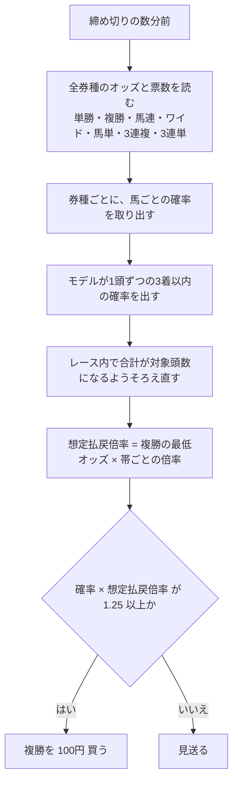

# 04. 買い方

**この文書は、モデルの確率から何をどう買うかを書く。** 実測の回収率は
`reports/回収率100超/検証の結果.md`（`backtest.py` が1回の実行で全部の表を書く）にある。

## 1. 買う手順

```mermaid
flowchart TD
    A[締め切りの数分前] --> B[全券種のオッズと票数を読む<br/>単勝・複勝・馬連・ワイド・馬単・3連複・3連単]
    B --> C[券種ごとに、馬ごとの確率を取り出す]
    C --> D[モデルが1頭ずつの3着以内の確率を出す]
    D --> E[レース内で合計が対象頭数になるようそろえ直す]
    E --> F[想定払戻倍率 = 複勝の最低オッズ × 帯ごとの倍率]
    F --> G{確率 × 想定払戻倍率 が 1.25 以上か}
    G -- はい --> H[複勝を 100円 買う]
    G -- いいえ --> I[見送る]
```

## 2. なぜ複勝なのか

| 券種 | 控除率 | プールの大きさ | この研究での扱い |
|---|---|---|---|
| 複勝 | 20% | 小さい | **買う。** 控除率がいちばん低く、情報もいちばん薄い |
| 単勝 | 20% | いちばん小さい | 買わない。同じ確率で買っても回収率が 100% に届かなかった |
| 馬連・ワイド | 22.5% | 中 | 買わない。確率を取り出す材料として使う |
| 馬単 | 22.5% | 中 | 同上 |
| 3連複 | 25% | 大 | 同上 |
| 3連単 | 27.5% | いちばん大 | 同上。いちばん情報が多い |

**情報を取り出す場所（大きいプール）と、賭ける場所（小さいプール）を分ける。**
これがこの買い方の中心にある考えである。

単勝を買わないのは、同じモデルの確率で期待値を計算しても回収率が 100% に届かなかったからである。
1着に絞ると的中がごくわずかしかなく、確率の小さな誤差が回収率に大きく響く。
3着以内なら的中する回数が桁ひとつ増え、誤差が平均されて上乗せだけが残る。

## 3. 確率をレース内でそろえ直す

1頭ずつ独立に「3着以内に入るか」を学習すると、同じレースの確率を足しても 3（5〜7頭立てなら 2）にならない。
足して 3 になるようそろえ直すと、同じレースの馬どうしの相対が正しくなり、
期待値で選んだ買い目の回収率が上がった（研究の途中で、そろえ直す前と後を比べて確かめた）。

## 4. 期待値の線をどこに引くか

**線は、前半の期間（2019〜2021年）の回収率だけを見て決める。** 後半（2022〜2026年）の結果を見てから
線を動かすと、線の選び方そのものが過剰適合になる。

**決まり: 前半で回収率が 100% を超え、前半の1年あたりの買い目が 300 点以上残る線のうち、前半の回収率がいちばん高い線。**
候補は 1.00・1.05・1.10・1.15・1.20・1.25・1.30・1.40 で、決まりはコードにしてある
（`analysis/backtest/place_line_choice.py`）。`backtest.py` は線ごとの前半・後半の成績と決まりで選んだ線を
`reports/回収率100超/検証の結果.md` の「2. 線の選び方」に書き、採用している線（`analysis/bet_rule.py` の `PLACE_RULE`）と
食い違えば知らせる。

前半では、線を上げるほど回収率が上がり、買い目は減る。点数の条件を置くのは、少ない買い目で出た高い回収率は
偶然の分が大きいためである。**この決まりで選ばれた 1.25 を採用する**（2026-09-28。それまでは 1.20）。

以前の 1.20 は、線ごとの表を見ながら「前半で 100% を超え、年に数百点残る」値として選んだもので、決まりを厳密に当てはめたものではなかった。決まりをコードにして当てはめると、1.25 も条件を満たし、前半の回収率は 1.20 より高かった。後半の成績を見て線を動かしたのではなく、前半だけで決まりどおりに選び直した結果である。

線を 1 ちょうどにしないのは、確率にも払戻倍率の見積もりにも誤差があるためで、その誤差のぶんの余裕を取る。

### 線の値が場所によって違って見えた理由（2026-09-28 に整理）

以前は、線の値が次の3か所で違って見えた（issue #29）。

| 場所 | 書かれていた線 | 何だったか |
|---|---|---|
| この文書と `bet_rule.py` | 1.20 | 採用していた線。決まりをコードにして当てはめ直したところ 1.25 が選ばれたので、1.25 に改めた（上の段落） |
| `reports/` の「線の決め方を分けた確認」 | 「採用する線（1.10 以上）」 | リポジトリに無い一時的な手順で作った表。Git の履歴で `PLACE_RULE` が 1.10 だったことは一度も無く、見出しの 1.10 はその手順の中だけの値で、採用した線ではない。今は `backtest.py` が同じ表を書くので、その表は `reports/回収率100超/古い版-20260923/` に移した |
| `reports/` の「券種ごとの検証」の複勝の行 | 1.3 | 複勝以外の券種と同じ物差しで比べるための、別の決まり（前半の当たりが 30 回以上ある線のうち、前半の回収率がいちばん高い線。点数の条件なし）で選んだ値。比べる目安で、買う線ではない（[05-券種ごとの検証.md](05-券種ごとの検証.md)） |

「検証の結果」「詳しい表」「運用の目安」の買い目の数が合わなかったのも、別々の時点のコードで作っていたためである。
今は1回の実行で全部を書くので、同じ実行の中では数字が合う。

## 5. 賭け金

**1点 100円の均等**にする。期待値の大きさに応じて賭け金を変える（Kelly 基準）と、
見かけの回収率は上がるが、それは賭け金の配分を結果に合わせただけで、当たる力が上がったわけではない。
まず均等で 100% を超えることを確かめ、そのあとで配分を考える。

## 6. 残っている課題

### 6-1. 締め切り前のオッズで同じことができるか（いちばん大きい課題）

この検証で使ったオッズは、すべて**確定オッズ**である。元DB に残っているのが確定オッズだけだからである。
実際に買うときは、締め切り前のオッズしか見られない。

JV-Data には締め切り前のオッズを取る口がある（速報系。`0B30` が全賭式、`0B31`〜`0B36` が券種ごと。どちらもレースごと）。
ただし **jvdata-store が今取っているのは `0B31`（単勝・複勝・枠連）だけ**で、
この買い方が要る馬連・ワイド・馬単・3連複・3連単のオッズを取っていない。

やること（jvdata-store 側）:

1. `src/jvstore/realtime.py` の `RACE_DATASPECS` に `0B30`（全賭式）を足す。
2. 毎週の開催日に取って貯める。発走の数分前の断面が要る。
3. 溜まったら、「締め切り前の断面で同じ計算をしたときの回収率」を測り直す。

**この確認が済むまで、この買い方が実際に使えるとは言えない。**
確定オッズでの回収率は、上限の見積もりである。締め切り直前のオッズは確定値にかなり近いが、
どれだけ近いかはまだ測っていない。

### 6-2. 自分の投票がオッズを動かす

複勝プールは小さい。薄い馬に大きく張ると、自分の投票でオッズが下がる。
1点 100円なら影響は無視できるが、金額を上げるときは、プールの大きさに対する上限を置く。

### 6-3. 2026年は手つかずではない

期間の使い分けとして、2026年は既存の研究ですでに2回見ている。この研究でも評価に使っているので、
「手つかずのデータでの確認」にはなっていない。本当の確認は、仕様を固めたあとの**これからのレース**で行う。

## 7. 大穴について

**大穴の単勝を買っても回収率は上がらない。** 単勝オッズが 100倍を超える帯は、
モデルで選んでも回収率が控除率の水準を大きく下回る。人気薄は買われすぎているので、
当たったときの配当が、当たる確率に見合っていない。

**大穴の複勝なら上がる。** 同じ買い方を単勝オッズ 50倍以上の馬だけに絞っても、回収率は 100% を超えた。
数値は `reports/回収率100超/検証の結果.md` の「3. 同じ線で、大穴に絞ったとき」にある。
穴馬の複勝は、単勝ほど買われすぎていない。

つまり「大穴を当てる」のではなく、**「大穴が3着に来るのを当てる」**のが、この買い方の穴の使い方である。
